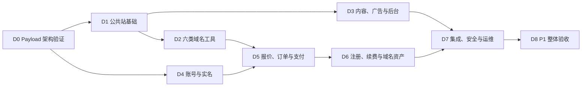

# Wanmi.AI P1 开发计划

> 文档版本：v2.5（D0 条件通过执行版）
>
> 更新日期：2026-08-04
>
> 冻结基线：`P1-BASELINE-2026-08-04.1`；批准标签 `p1-docs-approved-2026-08-04-1` 待本次批准变更提交后建立
>
> 状态：已批准作为 P1 开发执行计划；生产上线仍需通过独立门槛
>
> 执行主体：项目负责人一人 + ChatGPT/Codex
>
> 目标周期：12～16 周，全量一次交付
>
> 产品范围：Wanmi.net 中文域名工具与站内代理注册平台；Wanmi.ai 仅做 HTTPS 永久跳转
>
> 关联文档：[产品规划与商业评估](./Wanmi.AI-产品规划与商业评估.md) · [产品需求文档](./Wanmi.AI-产品需求文档-PRD.md) · [技术栈与工程规范](./Wanmi.AI-技术栈.md) · [现有阿里云资源](./Wanmi.AI-现有阿里云资源.md) · [App 技术规划](./Wanmi.AI-App技术规划.md)

本文是 Codex 执行 P1 开发时的任务顺序、交付标准和进度依据。它不重新定义产品范围：产品行为以 PRD 为准，工程实现以技术栈文档为准，部署条件以资源清单为准，商业优先级以产品规划与商业评估为准。

## 0. Codex 执行规则

### 0.1 文档优先级

遇到描述差异时按以下顺序处理：

1. 项目负责人当前明确指令；
2. 《产品需求文档》决定功能、状态、用户流程和验收；
3. 《技术栈与工程规范》决定架构、依赖、安全和工程边界；
4. 本计划决定开发顺序和阶段交付物；
5. 《现有阿里云资源》决定生产资源现状和上线门槛；
6. 《产品规划与商业评估》决定定位、商业优先级和阶段边界；
7. 《App 技术规划》只约束未来 App，不得据此扩大 Web P1。

如仍存在会改变产品范围、资金处理、实名责任或外部资源的冲突，Codex 必须暂停该项并询问项目负责人；不影响其他工作的任务继续推进。

### 0.2 每次开始开发前

Codex 必须：

- 阅读本计划及当前里程碑引用的批准文档章节；
- 检查 Git 状态、现有代码、测试、环境示例和未提交修改；
- 保留项目负责人已有修改，不覆盖无关内容；
- 确认当前最靠前且未完成的里程碑；
- 先列出本次准备完成的可验证任务，再开始修改；
- 缺少外部凭据时使用接口适配器、mock 和脱敏 fixture 继续开发，不把凭据写入仓库；
- 只有在项目负责人明确授权时，才执行生产部署、真实扣款、资源采购、备案申请或外部写接口操作。

### 0.3 每次开发结束前

Codex 必须：

- 运行与修改风险相匹配的格式化、静态检查、单元、集成或 E2E 测试；
- 说明完成内容、验证结果、未完成项和外部阻塞；
- 更新本文件第 12 节的进度；只有满足退出条件，或项目负责人明确批准条件通过并完整转移剩余门槛后，才能勾选整个里程碑；
- 新增架构决策时写入 `docs/adr/`，不得仅存在于聊天记录；
- 新增运行操作时同步更新 `infra/runbooks/`；
- 不因为测试环境缺少真实凭据而删除安全校验或绕过服务端确认。

### 0.4 完成定义

“代码已写”不等于完成。单项任务至少同时满足：

- 行为符合 PRD；
- Zod 接口 schema、Payload migrations 和生成类型保持同步；
- 正常、失败、越权、重试和降级路径有测试；
- 日志、埋点和错误不泄露敏感数据；
- 用户可见状态和后台人工处理入口完整；
- 文档、配置示例和 Runbook 已同步；
- `make check` 通过。

### 0.5 冻结与变更控制

`P1-BASELINE-2026-08-04.1` 冻结 P1 产品范围、固定架构、订单状态与合法迁移、退款规则、实名归属、12～16 周工期口径和生产上线门槛。开发过程中可以更新本计划的任务勾选、验证证据、阻塞、ADR 和 Runbook；不得借进度更新改变冻结基线。

需要改变冻结内容时，必须取得项目负责人明确指令，更新受影响文档版本与变更记录，完成跨文档一致性检查，并建立新的批准标签。D0 验证失败只触发延长、修正假设或重新提交架构决策，不自动解除冻结。

## 1. P1 开发基线

### 1.1 P1 必须交付

- M01～M12：公共站、六类域名工具、内容与 SEO、本地历史、广告导购、运营后台、分析反馈；
- M13：手机验证码登录、安全 Cookie Session、实名模板、私有证件存储；
- M14：价格报价、订单、微信支付 API v3 Native/H5、退款和对账；
- M15：西部数码代理注册、主动续费、异步履约和人工复核；
- M16：域名资产、到期提醒和 Name Server 修改；
- 小流量单 ECS 可部署方案、日志监控、备份恢复和必要 Runbook。

### 1.2 P1 明确不做

- 支付宝和微信 JSAPI；
- 域名转入转出、过户和完整 DNS 记录管理；
- 默认自动续费、余额钱包、充值账户和自动开票；
- 免费 SSL 签发、私钥托管；
- 社区、评论、会员、付费 API、企业监控和 AI 域名生成；
- iOS/Android App；
- Redis/Tair、独立消息队列、微服务、Kubernetes 和提前建设多节点架构；
- 未经批准的云资源采购和生产环境变更。

### 1.3 固定业务契约

核心链路：

```text
查询域名 → 获取价格报价 → 手机登录 → 选择已验证实名模板
→ 创建订单 → 微信支付 → 服务端确认到账 → 西部数码异步注册
→ 生成域名资产 → 短信通知
```

订单状态：

| 中文状态 | 内部状态 | 进入条件 |
| --- | --- | --- |
| 待支付 | `pending_payment` | 订单已创建，微信尚未确认到账 |
| 已支付 | `paid` | 微信服务端确认到账 |
| 履约中 | `fulfilling` | Payload `commerce` Job 已接管注册或续费任务 |
| 成功 | `succeeded` | 西部数码确认成功且资产已生成或更新 |
| 失败待退款 | `refund_pending` | 上游明确失败，需要原路全额退款 |
| 退款中 | `refunding` | 已向微信提交退款 |
| 已退款 | `refunded` | 微信确认退款成功 |
| 待人工处理 | `manual_review` | 上游状态不明、余额不足、退款失败或争议 |
| 已取消 | `cancelled` | 未支付超时或用户取消，且未进入履约 |

固定规则：

- 报价使用西部数码实时成本快照 + 后台按 TLD 配置的固定金额或比例，默认有效 5 分钟；
- 未配置加价规则或未通过能力验证的 TLD 不开放购买；
- 用户域名必须注册在用户选择并验证通过的实名模板名下，不得使用 Wanmi 公司模板；
- 注册成功不可退款；明确失败自动原路全额退款；状态不明禁止自动重复注册；
- 续费由用户主动付款，不默认自动续费；
- 发票和特殊退款由项目负责人通过现有财务流程处理，系统保存状态与处理备注；
- 微信支付资金、西部数码预充值余额和内部订单分别记录并进行三方对账。
- 合法订单状态迁移以《技术栈与工程规范》第 6.1 节矩阵为唯一工程基线；`manual_review` 只可按有证据、可审计的出口处理。

## 2. 交付路线与关键路径

P1 只在全部功能完成后做整体验收。下列里程碑是内部开发顺序，不代表批准分批生产上线。



| 里程碑 | 参考周期 | 主要范围 | 完成标志 |
| --- | ---: | --- | --- |
| D0 Payload 架构验证 | 第 1 周（建议 3～5 天，可延长） | Payload、认证、Jobs、OSS 和单 ECS 验证 | 核心退出条件通过；ECS 门槛经负责人批准转入 D7 |
| D1 公共站基础 | 第 2～3 周 | Web 外壳、通用状态、管理基础 | 首页与后台骨架可运行 |
| D2 六类域名工具 | 第 3～5 周 | M02～M07、M09 | 工具正常/失败/降级测试通过 |
| D3 内容、广告与后台 | 第 5～7 周 | M08、M10～M12、M11 相关能力 | 内容与商业组件不影响工具 |
| D4 账号与实名 | 第 7～9 周 | M13 | 登录、模板、加密与删除闭环通过 |
| D5 报价、订单与支付 | 第 9～11 周 | M14 | 支付状态机和退款测试通过 |
| D6 注册、续费与资产 | 第 11～13 周 | M15、M16 | 幂等履约和资产闭环通过 |
| D7 集成、安全与运维 | 第 13～15 周 | 全链路、监控、恢复、Runbook | 关键故障演练通过 |
| D8 P1 整体验收 | 第 15～16 周 | M01～M16、上线门槛核对 | 开发验收通过；上线条件单列 |

外部权限确认、备案和生产资源核验从 D0 开始并行进行。它们不阻塞 mock 环境开发，但会阻塞真实收款上线。

## 3. 全局工程约束

### 3.1 固定技术栈

- 单一 TypeScript 代码库，Node.js 24 LTS；
- Next.js 16.2.11、React、TypeScript strict、Tailwind CSS、shadcn/ui；
- Payload 3.86.0；全部 `payload` 与 `@payloadcms/*` 包锁定同一精确版本；
- Payload 官方插件：`@payloadcms/plugin-seo`、`@payloadcms/plugin-redirects`、`@payloadcms/plugin-form-builder`，全部锁定 `3.86.0`；
- PostgreSQL Adapter、Payload migrations、`push: false`；
- Payload Jobs：`publishing`、`background`、`commerce`，独立 Worker；
- Payload `payload-types.ts` + 共享 Zod request/response schemas；
- 部署：Nginx + Next.js/Payload Web/Admin/API + Payload Jobs Worker + Who-Dat；
- 存储：RDS、OSS/CDN、KMS/Secrets Manager；公共媒体使用 `@payloadcms/storage-s3`，私有实名文件使用 `ali-oss`；
- 阿里云短信与 KMS 使用 Alibaba Cloud TypeScript SDK，不自行实现阿里云 API 签名；
- 不引入第二套业务后端、Redis、独立消息队列或微服务。

### 3.2 目标仓库结构

```text
wanmi/
├── apps/web/
│   ├── src/app/
│   ├── src/collections/
│   ├── src/access/
│   ├── src/services/
│   ├── src/jobs/
│   ├── src/providers/
│   ├── src/schemas/
│   └── src/payload.config.ts
├── infra/inventory/
├── infra/compose.prod.yml
├── infra/third-party/
├── infra/runbooks/
├── docs/adr/
├── docs/security/
├── docs/content/
├── docs/operations/
├── docker-compose.yml
├── Makefile
└── README.md
```

如现有仓库已经存在不同但合理的结构，Codex 应优先渐进适配，不为匹配示意图进行无价值的大规模移动。

### 3.3 稳定工程命令

D0 必须建立并维护以下命令；后续里程碑不得绕过：

| 命令 | 作用 |
| --- | --- |
| `make bootstrap` | 检查开发依赖并初始化本地配置，不写入真实密钥 |
| `make dev` | 启动本地 Web/Payload、PostgreSQL 和 Who-Dat |
| `make worker` | 启动独立 Payload Jobs Worker |
| `make generate` | 生成 Payload 类型并检查迁移 |
| `make verify-generated` | 检查生成类型和迁移没有漂移 |
| `make fmt` | 格式化 TypeScript、YAML、Markdown 等受控文件 |
| `make lint` | TypeScript、Payload 和配置静态检查 |
| `make test` | 单元和组件测试 |
| `make test-integration` | PostgreSQL、Payload Jobs 和 provider adapter 集成测试 |
| `make test-e2e` | Playwright 核心用户流程测试 |
| `make security` | Gitleaks、依赖与基础安全检查 |
| `make build` | 构建 Next.js/Payload 和容器产物 |
| `make smoke` | 对运行环境执行健康和核心路径冒烟测试 |
| `make check` | 汇总生成物检查、lint、测试、安全和构建的合适子集 |

若受本地环境限制无法运行某项，Codex 必须说明原因和替代验证，不得把“未运行”写成“通过”。

### 3.4 Provider 适配器

所有外部能力必须经过 `apps/web/src/providers` 接口适配器：

- `westdigital`：查询、价格、实名、注册、续费、资产同步、Name Server；
- `wechatpay`：Native/H5 下单、通知验签、主动查单、关单、退款、退款查询；
- `aliyunsms`：通过 Alibaba Cloud TypeScript SDK 发送验证码、重要订单状态和到期提醒；
- `oss-public`：通过 `@payloadcms/storage-s3` 管理内容图片与广告素材；
- `oss-realname`：通过 `ali-oss` 管理私有实名文件的上传、短时签名和删除；
- `kms`：通过 Alibaba Cloud TypeScript SDK 完成信封加密与密钥引用；
- `whodat`：RDAP/WHOIS。

每个适配器必须提供：

- 清晰的请求/响应领域模型，不向业务层泄漏未经处理的 provider 原始结构；
- 超时、限流、错误分类和脱敏日志；
- mock、fixture 和 contract test；
- 明确的读操作重试策略；
- 写操作幂等键和状态查询能力；
- 配置缺失时安全失败，不使用隐式默认生产凭据。

高风险业务逻辑放在 `src/services`，Hooks 只做规范化、审计和入队，禁止直接调用外部写接口。代表用户使用 Payload Local API 时必须传 `user` 和 `overrideAccess: false`；嵌套数据库操作传递同一个 `req`。

### 3.5 数据与安全底线

- 所有资金、履约、域名和实名状态由服务端决定；
- 浏览器不得直连西部数码、微信支付、RDS、私有 OSS 或 KMS；
- 手机号、验证码、证件、Cookie、支付密钥、provider token 不进入普通日志；
- 查询结果页默认 noindex，不长期保存不必要的完整查询域名；
- 实名证件进入私有 OSS，使用 KMS 加密、短时签名访问、最小权限和操作审计；
- 删除模板或注销账号后立即禁止继续使用，并在 30 天内清理主存储和备份；
- DNS/TLS 工具必须防 SSRF、内网探测和 DNS rebinding；
- 所有人工状态修改记录操作者、原状态、新状态、原因和时间；
- 数据库迁移向前兼容，生产发布不得依赖破坏性即时迁移；
- ECS 不保存唯一业务数据，节点必须可重建。

## 4. D0：Payload 架构验证（建议 3～5 天）

### 4.1 目标

验证单一 Next.js + Payload 主架构可以承担 CMS、认证、权限、业务数据和后台任务，再进入 M01～M16。3～5 天是架构决策时间盒；任一退出条件未满足时通常延长 D0 并记录原因。项目负责人于 2026-08-04 明确批准 D0 条件通过：只将共享 ECS 上无法安全执行的资源、重启、Jobs 恢复、重建和 RTO 验证转入 D7，其他 D0 门槛不得跳过。该决定不提前缩短 12～16 周对外承诺。

### 4.2 任务

- [x] 建立或核对第 3.2 节仓库结构；
- [x] 锁定 Node.js 24 LTS、Next.js 16.2.11、Payload 3.86.0 和全部 Payload 包精确版本；
- [x] 安装并锁定 `@payloadcms/plugin-seo`、`@payloadcms/plugin-redirects`、`@payloadcms/plugin-form-builder` 为 `3.86.0`，验证启动、迁移和类型生成；
- [x] 创建 Next.js/Payload Web、Admin、API 和独立 Jobs Worker 基线；
- [x] 建立本地 Docker Compose：PostgreSQL、Who-Dat；
- [x] 建立 `/healthz`、`/readyz`、请求 ID、结构化日志和统一错误格式；
- [x] 建立 PostgreSQL Adapter、Payload migrations、`push: false` 和 `payload-types.ts` 漂移检查；
- [x] 验证内容草稿、版本、定时发布和管理员角色权限；
- [x] 验证管理员密码 + TOTP 原型；
- [x] 验证普通用户短信 OTP mock、opaque Session 和全部会话撤销；
- [x] 建立 `publishing`、`background`、`commerce` 队列，验证 commerce concurrency key、事务和订单事件；
- [x] 验证代表用户的 Local API 全部使用 `overrideAccess: false`；
- [x] 定义内容、广告、身份、实名、报价、订单、支付、退款、provider 操作、域名资产和审计 Collections；
- [x] 通过 `@payloadcms/storage-s3` 验证公共媒体的 OSS 上传、读取、删除、签名地址和 ETag；
- [x] 验证私有实名文件与公共 Media Collection 分离，并用 `ali-oss` 完成私有对象上传、读取、短时签名和删除原型；
- [x] 使用 Alibaba Cloud TypeScript SDK 建立短信与 KMS adapters 的 mock、错误映射和最小权限配置边界；
- [x] 建立 provider 接口、mock 和脱敏 fixture 目录；
- [x] 建立 `.env.example`，只写变量名、用途和安全说明；
- [x] 建立 Makefile 稳定命令和 CI；
- [x] 建立测试框架：Vitest、React Testing Library、MSW、Playwright 和 PostgreSQL 集成测试；
- [x] 建立 Gitleaks 和依赖扫描；
- [ ] 在单 ECS 规格下验证 Web/Worker 内存、独立重启、Jobs 恢复和节点重建；
- [x] 编写首批 ADR：Payload 主架构、Local API 权限、opaque Session、commerce 幂等、OSS/KMS、单 ECS 可重建策略。
- [x] 在 commerce ADR 中固化《技术栈与工程规范》第 6.1 节合法迁移矩阵，并测试全部 `manual_review` 出口。

### 4.3 退出条件

- 新环境按 README 能完成 `make bootstrap`、`make dev` 和 `make worker`；
- Next.js/Payload、PostgreSQL 和 Who-Dat 健康检查正常；
- 一次 Payload schema 变更可以生成类型、创建迁移并通过漂移检查；
- 一次 commerce Job 可在重复执行和 Worker 重启后保持幂等；
- 管理员 TOTP、customer OTP/session、权限矩阵和 Local API 防绕过原型通过；
- OSS S3 兼容性和单 ECS 资源验证有记录；
- `make check` 通过；
- 仓库中不存在真实密钥、手机号、证件或支付数据。

### 4.4 条件通过决定（2026-08-04）

D0 的架构、权限、认证、迁移、Jobs 幂等、真实 OSS、隔离 RDS、安全扫描与同镜像本地验证已经通过。由于目标 ECS 仍承载其他项目，项目负责人批准进入 D1，并将以下未完成项原样转入 D7：

- 2 vCPU/4 GiB 生产 Linux 环境下的 Web、Worker、Who-Dat 内存测量；
- Web/Worker 独立重启及 ECS 与 RDS 同 VPC 的 `commerce` Job 中断恢复；
- 空节点重建与两小时 RTO。

这些任务仍是开发整体验收和生产上线硬门槛。现有项目迁出前不得在共享 ECS 部署 Wanmi、压测、重启现有服务或执行节点重建；D1 若暴露主架构、权限、迁移或 Jobs 假设失败，立即返回 D0 修正。

## 5. D1：公共站与管理基础（第 2～3 周）

### 5.1 目标

交付 M01 基础页面和后续模块共用的 Web、错误、权限与可观测能力。

### 5.2 任务

- [x] 建立 Wanmi.net 主站布局、响应式导航、页脚、帮助和合规入口；
- [x] 建立首页主查询、工具导航、内容入口和数据来源说明；
- [x] 建立通用表单、加载、空状态、部分成功、失败、限流和降级组件；
- [x] 建立统一 Result、Problem Details 和请求 ID 展示；
- [x] 建立 canonical、robots、sitemap、Open Graph 和 noindex 基础能力；
- [x] 配置 `@payloadcms/plugin-seo` 的共享字段与预览规则，并验证只读取已发布内容；
- [x] 配置 `@payloadcms/plugin-redirects`，重定向写入受 RBAC 和审计保护，目标拒绝开放跳转；
- [x] 建立 Wanmi.ai/www 只跳转的 Nginx 配置，不创建第二套页面；
- [x] 完善管理员独立 Auth Collection、Payload Session、密码 + TOTP MFA 和 RBAC；
- [x] 建立内容编辑、广告运营、分析、系统管理员角色边界；
- [x] 建立审计事件公共组件和后台导航骨架；
- [x] 建立第一方事件入口，默认不采集完整查询域名。

D1-01 验证记录（2026-08-04）：已建立响应式主站外壳、六类工具与内容入口、`GET /tools/domain-search?q=` 查询骨架、帮助和四类合规说明入口；公共 Payload Local API 读取固定 `overrideAccess: false`，草稿隔离、栏目独立降级、桌面/移动端与未知路由均有自动化测试。本切片未调用 provider、未新增 API、未修改 Payload schema 或迁移。

D1-02 验证记录（2026-08-04）：已建立共享 Zod `Result<T>` 六状态契约、兼容 RFC 9457 的 Problem Details、集中请求 ID 校验和安全 provider 映射；现有 API 错误保留 `code/message/traceId`，增加标准字段、重试信息和建议动作，成功响应保持不变。公共站已接入可访问查询表单、空态/部分成功/失败/限流/降级面板、栏目级加载 Skeleton、错误边界和保留真实 404 的品牌化未找到页；请求 ID 上下文按导航更新。41 个单元测试、9 个 PostgreSQL/MinIO 集成测试、6 个 Playwright 场景、生产构建、linux/amd64 同镜像构建、安全扫描及桌面/390px 视觉检查通过。本切片未调用真实 provider，未修改 Payload schema、迁移或生成类型。

D1-03 验证记录（2026-08-04）：已建立以配置 origin 为唯一主机的公共 canonical、路由级 Open Graph/Twitter、查询参数结果 `noindex, nofollow`、`robots.txt`、仅包含现有稳定页面的静态 sitemap 和 1200×630 品牌分享图；Payload 官方 SEO 插件共享 `WanmiSeoMeta`，新增同源 canonical 与默认关闭的 `noIndex`，搜索预览 URL 固定映射到批准的信息架构。新增 migration 与生成类型，空库和现有两迁移基线升级均得到预期 12 个 SEO 列；46 个单元测试、9 个 PostgreSQL/MinIO 集成测试、8 个 Playwright 场景、生产构建、linux/amd64 同镜像构建和安全扫描通过。动态内容详情、动态 sitemap、草稿实时预览、Redirects 与 Nginx 主机跳转仍按计划留在后续切片。

D1-04 验证记录（2026-08-04）：Payload Redirects 已收敛为永久 301；自定义目标只接受规范化站内路径，文章、专题和 TLD 引用必须已发布，并拒绝保留路径、开放跳转、直接/多跳循环和超过 10 跳的链路。`content_editor`/`system_admin` 可创建更新，只有 `system_admin` 可删除；创建、更新、删除通过同一 `req` 写入脱敏审计。公共 GET/HEAD 以 `overrideAccess: false` 分页读取并使用 30 秒进程缓存、并发刷新去重、stale-on-error 与冷启动失败放行，命中后折叠最终目标并保留查询参数与请求 ID。迁移在收窄 enum 前将遗留 302 规范化为 301；空库和 D1-03 遗留 302 升级路径均通过。固定 digest Nginx 镜像通过 `nginx -t`，4 个 HTTP 和 3 个 HTTPS 别名入口均保留路径/查询并跳至 `https://wanmi.net`；配置不含别名 `proxy_pass`。65 个单元测试、12 个 PostgreSQL 集成测试和 9 个 Playwright 场景通过；生产构建、linux/amd64 镜像和安全扫描结果随本切片最终门禁记录。本切片未部署、未修改共享 ECS、未申请证书或切换流量。

D1-05 验证记录（2026-08-04）：独立 `admins` Auth Collection 已生产化为固定 12 小时且不自动刷新的 Payload Session，并以 `active/disabled`、14～128 字符密码、SHA-1/6 位/30 秒/±1 窗口 TOTP、一次性恢复码和 5 次失败锁定 10 分钟形成管理员身份边界。MFA 密文与恢复码哈希迁入拒绝通用 API 的隐藏 Collection；角色、状态、密码或 MFA 变化撤销全部 Session，数据库约束和服务层共同阻止删除、停用或降级最后一个 active `system_admin`。后续管理员和 MFA 重置通过 24 小时、256-bit、仅存 HMAC 的一次性 fragment 邀请完成，原始 token、秘密与恢复码不落库；最小安全设置页支持邀请和 Session 管理。统一 `/api/v1/admin/auth` 登录不返回 JWT，默认 Payload 登录、首用户注册、忘记/重置密码、解锁、refresh-token 与 GraphQL 均关闭。81 个单元测试、17 个 PostgreSQL 集成测试和 12 个 Playwright 场景通过；空库、D1-03 Redirect、D1-05 遗留管理员 MFA 升级及最后系统管理员并发约束验证通过；生产构建、linux/amd64 镜像、依赖 high 门禁和 Gitleaks 通过。依赖审计保留既有 2 个低危和 2 个中危，无 high/critical。本切片只完成管理员身份层 RBAC，业务 Collection 完整角色矩阵、通用审计后台和第一方事件仍属于 D1-06/D1-07；未部署或修改共享 ECS。

D1-05 审核修正记录（2026-08-05）：确认 Next.js Proxy 中对 Payload 默认认证路径的原始精确字符串匹配可被 percent-encoding 绕过，其中 `forgot-password` 会抵达 Payload 并写入重置 token。入口现对 pathname 做有界重复解码、分隔符规范化和畸形路径拒绝，再匹配禁用表面；`admins` Collection 同时新增 `beforeOperation` 后备保护，在 Payload 写入前拒绝默认 login、forgot/reset-password、unlock 和 refresh，仅允许携带服务端 MFA 上下文的统一登录服务调用。单元测试覆盖单层/双层编码、编码斜杠、替代分隔符、畸形转义、编码 GraphQL 及必要 REST 放行；PostgreSQL 集成测试确认 `forgotPassword` 被拒绝且管理员 reset token/expiration 不变；真实 HTTP 测试确认编码变体均为 404。最终 `make check` 的 92 个单元测试、18 个 PostgreSQL 集成测试、完整 migration、生产构建、linux/amd64 镜像、依赖 high 门禁和 Gitleaks，以及 `make test-e2e` 的 12 个 Playwright 场景全部通过；未修改 Nginx、未部署或修改共享 ECS。

D1-06 验证记录（2026-08-05）：已将匿名、customer、禁用管理员与 `content_editor`、`ad_operator`、`analyst`、`system_admin` 的 Collection CRUD、内容版本和 Payload Admin 可见性收敛为完整矩阵；内容与广告写权限相互隔离，广告运营可读安全运营数据和本人审计，分析角色只读脱敏广告参考、反馈摘要与聚合/对账结果，系统管理员获得全局读取但不能通过通用 Payload CRUD 修改实名、价格、commerce、provider、对账或人工复核状态。客户读取继续按本人行级约束，并隐藏上游成本、报价规则快照、内部订单证据和操作者标识；官方 Redirects、Form Builder Collections 使用相同后台可见性与服务端权限。共享 Media 不提前增加广告分类，第一方事件、通用审计组件和自定义后台导航仍属于 D1-07/D1-08/D3。`make check` 通过生成类型/schema 漂移、空库及遗留 migration、Nginx、lint、TypeScript strict、144 个单元测试、23 个 PostgreSQL 集成测试、生产构建、linux/amd64 同镜像、依赖 high 门禁和 Gitleaks；`make test-e2e` 的 15 个 Playwright 场景通过，覆盖三类非系统角色导航、未授权后台路由 404 与 REST 越权写入 403。依赖审计仍为既有 2 个低危和 2 个中危，无 high/critical；本切片无 schema、migration 或公开 API 变更，未部署或调用真实 provider。

D1-07 验证记录（2026-08-05）：已将 Redirect、管理员账号与邀请、TOTP/MFA、管理员登录、Session 撤销和系统 Local API 的审计写入收敛到强类型公共服务；现有 action 标识保持兼容，事件目录统一派生 actor 约束和 `targetType`，metadata 在唯一写入边界递归替换手机号、证件号、Cookie、OTP、token、密码、密钥和 provider secret，安全 Hash/Digest/Masked 派生值保留，Session 仅记录 `sessionIdHash`。Payload Admin 按内容、广告、身份、实名、交易、履约、运营七域分组，仍以 D1-06 服务端 access 为授权基线；审计原生列表支持时间倒序、默认列和安全搜索，`system_admin` 全量读取、`ad_operator` 仅本人 admin 事件且看不到 metadata、`analyst` 无入口和读取权限。新增命名 migration 为 `actorType + actorId + createdAt` 建复合索引，不重写历史审计；空库及 D1-03/D1-05 遗留升级路径均验证索引。`make check` 通过生成类型/schema 漂移、迁移、Nginx、lint、TypeScript strict、154 个单元测试、24 个 PostgreSQL/MinIO 集成测试、生产构建、linux/amd64 同镜像、依赖 high 门禁和 Gitleaks；`make test-e2e` 的 15 个 Playwright 场景通过，覆盖七域分组、广告运营本人审计、分析角色拒绝和直接路由保护。依赖审计仍为既有 2 个低危和 2 个中危，无 high/critical；本切片无公开 API 变更，未实现 D1-08、未部署或调用真实 provider。

D1-08 验证记录（2026-08-05）：已建立严格 Zod 判别联合保护的 `POST /api/v1/events` 第一方入口和 `firstPartyEvents` Collection，仅允许页面类别、来源类别、设备类别、固定工具、输入类型、单标签 TLD、标准结果、数据源和耗时桶等聚合维度；不存在 domain、query、URL、原始 referrer、IP、User-Agent、Cookie、客户端/Session 标识或自由 metadata 字段。客户端只自动发送 `page_viewed` 与 `tool_submitted`，查询 `wanmi.net` 仅发送 `tld: net`；请求使用 `credentials: omit`、origin-only referrer 和 best-effort keepalive，DNT/GPC 在客户端和服务端均停止写入，不设置分析 Cookie 或 Web Storage。D1-07 递归脱敏规则已抽为共享隐私组件并在事件唯一写入服务复用；原始事件仅 `system_admin` 可读，`analyst` 继续只读 D1-06 规定的安全聚合结果。新增可配置的每分钟 1000 条无标识全局限流、命名 migration、生成类型及事件/工具时间索引；空库、D1-03/D1-05 遗留升级和 migration down/up 往返均通过，并验证事件表无禁止列。`make check` 通过生成/schema 漂移、迁移、Nginx、lint、TypeScript strict、167 个单元测试、26 个 PostgreSQL/MinIO 集成测试、生产构建、linux/amd64 同镜像、依赖 high 门禁和 Gitleaks；`make test-e2e` 的 16 个 Playwright 场景通过，覆盖请求最小化、Cookie/referrer 隔离、DNT/GPC、采集失败不阻塞查询和 analyst 直接路由拒绝。依赖审计仍为既有 2 个低危和 2 个中危，无 high/critical；工具完成/失败发送由 D2 接入，广告事件、聚合、留存清理和 analyst 仪表盘仍属于 D3。本切片未部署、未调用真实 provider，也不作为资金、广告结算或交易状态依据。

### 5.3 退出条件

- 首页和后台骨架在桌面、移动端可用；
- 无广告、无分析和 provider 失败时首页仍可使用；
- 未登录或权限不足不能访问后台；
- canonical、noindex 和错误页面有自动化测试；
- 管理员登录、MFA、Session 轮换和越权测试通过。

## 6. D2：六类域名工具（第 3～5 周）

### 6.1 目标

完成 M02～M07 和 M09，建立 Wanmi 的免费工具获客核心。

### 6.2 任务

- [x] 实现域名标准化、Unicode/Punycode、长度和字符校验；
- [x] 实现西部数码查询/价格适配器、限频、请求合并和有界缓存；
- [x] 实现域名可注册查询，默认最多 10 个 TLD，支持部分成功和六种标准状态；
- [x] 实现 Who-Dat/RDAP/WHOIS 查询与降级，和可售状态严格分离；
- [x] 实现 A、AAAA、CNAME、MX、TXT、NS、SOA、CAA 只读查询；
- [x] 实现 TLS/SSL/CAA 检查，固定 443 端口并阻断私有、保留和本地地址；
- [x] 实现 TLD 注册价、续费价、1 年/3 年成本和快照追溯；
- [x] 实现 IDN 双向转换、非法输入和同形异义风险提示；
- [x] 实现浏览器本地历史与收藏：最多 30 条、90 天、可单项删除和全部清空；
- [x] 建立工具间跳转、复制和分享入口，不默认分享完整查询结果；
- [x] 建立工具请求量、成功率、P50/P95、provider 错误和限频监控；
- [x] 为西部数码 429、队列满、Who-Dat 失败、DNS/TLS 超时建立降级测试。

D2-01 验证记录（2026-08-05）：新增浏览器/服务端可复用的纯函数域名标准化模块，固定使用 Unicode 17、UTS-46 非过渡处理和 IDNA2008 允许/上下文规则；统一处理大小写、首尾空白、全角字符、等价点和单个根尾点，输出 ASCII/Punycode、显式 Unicode 转换值及固定为 ASCII 的公开展示值。标签 63 字节、总长 253 字节、字符、连字符、空标签、纯数字 TLD、无效/双重 `xn--` 均有稳定错误码并适配 D1-02 `Result`/Problem Details；UTS-39 按标签检测混合书写系统并返回非阻断风险提示。`make check` 的 178 个单元测试、26 个 PostgreSQL/MinIO 集成测试、迁移/类型漂移、生产构建、linux/amd64 同镜像和安全门禁通过；`make test-e2e` 冷启动首次因 Next 开发服务器仍在编译导致 2 个既有管理员场景超时、其余 14 个通过，未改代码直接完整复跑后 16 个场景全部通过。未新增公开 API、工具页、Payload schema、迁移或 provider 调用；后续 IDN 工具页任务保持未完成。

D2-02 验证记录（2026-08-05）：新增通过接口注入的 `WestDigitalReadProvider`、fixture transport 和本地文档查询/普通价格样例，两个入口复用 D2-01 `normalizeDomain`，Unicode/Punycode、大小写和等价点输入共享同一缓存及 in-flight key。适配器使用每秒 2 次、突发 4 的进程内 token bucket，最多排队 32 个不同请求、最长等待 5 秒、单次 transport 超时 5 秒；相同进行中请求只消耗一个限流槽。可注册性成功结果使用 45 秒/5,000 项 LRU，普通价格使用 1 小时/512 项 LRU，失败不缓存且不返回 stale；上游整数人民币严格换算为整数分。429、队列满、排队超时、上游超时、连接失败、畸形数据和业务拒绝均返回稳定错误码、中文信息、重试属性与可审计请求标识，结构化日志不记录完整域名、请求表单、响应正文或上游错误详情。最终 `make check` 通过生成类型/import map/schema 漂移、空库及遗留 migration、Nginx、lint、TypeScript strict、190 个单元测试、26 个 PostgreSQL/MinIO 集成测试、Next.js 生产构建、linux/amd64 同镜像、依赖 high 门禁和 Gitleaks；`make test-e2e` 的 16 个 Playwright 场景一次通过。未新增公开 API、Payload schema、migration、真实鉴权、凭据或网络 transport；包含 Who-Dat/DNS/TLS 的综合降级任务继续保持未完成。

D2-03 验证记录（2026-08-05）：新增严格 Zod 保护的 `POST /api/v1/tools/domain-search`、服务端多 TLD 编排和公开结果页；完整域名只查询自身后缀，关键词默认按 `com`、`cn`、`net`、`org`、`top`、`xyz`、`vip`、`cc`、`tv`、`com.cn` 十项 fixture 目录查询，显式输入超过 10 项返回稳定 `DOMAIN_SEARCH_TLD_LIMIT_EXCEEDED`，规范化重复项明确拒绝。每项使用 `available`、`premium`、`registered`、`restricted`、`unsupported`、`query_failed` 六种 PRD 状态并显示来源、查询时间和缓存状态；`Promise.allSettled` 保证单项失败不拖垮其他 TLD，聚合结果使用 D1-02 `ready`、`empty`、`partial`、`degraded`、`error`、`rate_limited` 契约。`avail=0` 只有 fixture 目录存在明确证据时才区分已注册或保留/限制，否则返回状态不明确，未调用或推断 WHOIS。浏览器查询请求固定 `no-store`、`credentials: omit` 和 origin-only referrer，完成/失败事件只发送聚合维度；结果参数页保持干净 canonical 与 `noindex, nofollow`，未新增 Payload Collection、migration、长期查询存储、真实 provider 网络调用或购买入口。`make check` 通过生成类型/import map/schema 漂移、空库及遗留 migration 往返、Nginx、lint、TypeScript strict、200 个单元测试、26 个 PostgreSQL/MinIO 集成测试、Next.js 生产构建、linux/amd64 同镜像、依赖 high 门禁和 Gitleaks；依赖审计仍为既有 2 个 low 和 2 个 moderate，无 high/critical。`make test-e2e` 的 17 个 Playwright 场景通过，覆盖默认 10 TLD、部分成功、超限拒绝、缓存命中、来源/时间/缓存展示、查询页 noindex/canonical 及 Cookie/referrer/分析事件最小化。普通/续费价格、经批准购买入口、真实西部数码联调、Who-Dat、DNS 和 TLS/CAA 继续留在后续切片。

D2-04 验证记录（2026-08-05）：将公开注册信息抽为独立 `PublicRegistrationProvider`，从西部数码域名写操作接口移除旧 `queryRegistration` 混合语义；固定 Who-Dat v2.0.0 通过严格 Zod 和 64 KiB 有界流读取完成 RDAP 优先、内部 WHOIS 覆盖，使用 5.5 秒超时、进程内 token bucket、有界 FIFO 和相同规范化域名 in-flight 合并，不在 Web 层缓存结果。`isRegistered=false` 只映射 `empty/no_public_record` 并明确“不代表可注册”；Who-Dat 429 不触发降级，501/502/504、连接/超时、重定向、响应过大、Content-Type/JSON/schema 异常可在显式启用且凭据完整时降级到西部数码文档确认的 `POST v2/domain/`、`act=whois`，成功固定为 `degraded`，两个来源都失败则返回安全聚合错误。西部数码 transport 固定 HTTPS origin、13 位毫秒时间戳和 `md5(username + api_password + time)`，以 GB18030 有界解码，只公开注册商、原始日期安全字符串、状态和 Name Server；联系人、邮箱、电话、地址、原始 body、上游 URL/request ID/clientid 均不进入公共响应或日志。新增严格 4 KiB JSON 的 `POST /api/v1/tools/whois`、共享 Zod、完整域名/受限 IP/本地与元数据目标前置拒绝、全部 Result 可见状态和公开结果页；页面没有 D2-03 可售 schema/provider/购买入口，参数结果保持干净 canonical/OG 与 `noindex, nofollow`，请求使用 `no-store`、`credentials: omit` 和 origin-only referrer，分析事件只含工具、TLD、来源、结果类别和耗时桶。Who-Dat 缓存显式固定 1 小时且无持久卷，容器访问日志使用有界轮转。`make check` 通过生成类型/import map/schema 漂移、空库及遗留 migration 往返、Nginx、lint、TypeScript strict、247 个单元测试、26 个 PostgreSQL/MinIO 集成测试、安全门禁、Next.js 生产构建和 linux/amd64 同镜像构建；依赖审计仍为既有 2 low、2 moderate，无 high/critical，Gitleaks 无泄漏。`make test-e2e` 的 17 个 Playwright 场景通过，覆盖 WHOIS 移动端结果、来源/时间/缓存、可售分离、noindex/canonical/OG、Cookie/referrer 和聚合事件隐私。未新增 Payload Collection、migration 或长期查询存储；西部数码 fallback 默认关闭，全部测试使用 fixture，未发送真实西部数码请求，未部署或调用外部写接口。DNS、TLS/SSL/CAA、价格与浏览器历史继续留在后续切片。

D2-05 验证记录（2026-08-05）：新增严格共享 Zod、`POST /api/v1/tools/dns`、Node runtime 只读查询服务和公开结果页，一次并发查询 A、AAAA、CNAME、MX、TXT、NS、SOA、CAA 并保留每条 TTL；复用 D2-01 `normalizeDomain` 返回 Unicode/Punycode 与风险提示，按 D1-02 六状态区分记录、NODATA、NXDOMAIN、SERVFAIL、超时、安全阻断、失败和队列受限，NXDOMAIN 页面明确不代表可注册。解析器只允许代码内硬编码的阿里公共 DNS `223.5.5.5`/`223.6.6.6` 标准 DoH，不接受请求、环境变量或系统 DNS；`dns-packet` 严格校验事务 ID、单 Question、名称/类型/CLASS、响应/递归/截断标志、RCODE 和 CNAME 回答链。A/AAAA 结果通过 `ipaddr.js` 只允许公网单播；CNAME、MX、NS、SOA 目标再次使用同一受控解析器查询 A/AAAA，loopback、私网、CGNAT、link-local、保留/文档、组播、IPv4-mapped 与云元数据地址均失败关闭并隐藏整个相关记录集。默认限制为 3 秒、64 KiB、每类型 32 条/总计 128 条、16 个目标、8 个并发、20 次/秒/突发 40、有界 64 队列/2 秒等待；相同域名/类型 in-flight 合并，成功与负结果按自身和目标验证 TTL 的最小值使用 60/30 秒上限及 4,096 项 LRU，失败、安全阻断和 stale 不缓存。页面展示来源、节点、查询时间、缓存状态和 Unicode/Punycode，参数页保持干净 canonical/OG 与 `noindex, nofollow`，不提供购买或 DNS 管理入口；CAA 只展示原始 flags/tag/value。`make check` 通过生成物/schema 漂移、空库及遗留 migration、Nginx、lint、TypeScript strict、325 个单元测试、26 个 PostgreSQL/MinIO 集成测试、安全门禁、Next.js 生产构建和 linux/amd64 同镜像；依赖审计仍为既有 2 low、2 moderate，无 high/critical，Gitleaks 无泄漏。`make test-e2e` 最终 18 个 Playwright 场景通过；首次两次完整运行分别有 1/2 个既有 Admin 首编译登录断言命中固定 5 秒上限，相关两条断言调整为 15 秒后并行定向 2 项及完整 18 项通过。自动化 DNS 测试全部使用注入 fixture，未访问真实 DNS，未新增 Payload schema、migration、SSL 连接、CAA 策略判断、DNS 写入或托管。

D2-06 验证记录（2026-08-05）：新增严格共享 Zod、`POST /api/v1/tools/ssl-check`、可注入 Node TLS provider、服务编排和公开结果页；请求只接受完整域名，固定端口为代码常量 443，不接受 IP、URL、端口、地址、解析器或其他控制字段。服务复用 D2-05 AliDNS provider、主备节点、TTL/LRU 缓存与 `isPublicDnsAddress`，只查询 A、AAAA、CAA；任何地址属于 loopback、私网、link-local、CGNAT、云元数据、保留/文档、组播或 IPv4-mapped 范围时整体失败关闭且不披露地址。最多接受 8 个已验证地址并按 IPv6/IPv4 稳定交错尝试 4 个，TCP `host` 直接使用已验证 IP、`autoSelectFamily: false`、端口固定 443，连接后再次核对远端 IP/端口；域名只用于 SNI 和 Node 原生主机名校验，不触发第二次 DNS 解析。原始 TCP 入站握手数据由 Duplex 包装硬限制 256 KiB，总连接/握手 5 秒；读取证书后立即禁用 renegotiation 并销毁连接，不发送应用数据、不执行 HTTP、重定向或 OCSP。证书诊断覆盖有效期、剩余天数、域名匹配、主题、签发者、系统信任/自签名/无效链，证书链最多 10 层、SAN 最多 128 项。CAA 按 RFC 8659 从当前域逐层查找首个 RRset、最多 16 层，当前层超时、SERVFAIL、畸形或受限即停止；`issue`、`issuewild`、`iodef`、空 `issue` 和 critical flag 提供中文解释，`iodef` 不访问，也不按签发者品牌推断现有证书合规。结果聚合为既有六状态并展示 TLS/CAA 各自与聚合的来源、时间、缓存和请求 ID；成功/证书诊断缓存最长 60 秒、无地址最长 30 秒、LRU 2,048 项，安全阻断/运行失败不缓存或返回 stale；TLS 默认 10 次/秒、突发 20、并发 4、队列 32/等待 2 秒，同域名 in-flight 合并。参数页保持干净 canonical/OG 与 `noindex, nofollow`，请求不带 Cookie、只发送 origin referrer，分析只含 TLD、状态、耗时桶和 `tls` 来源。最终 `make check` 通过生成物/schema 漂移、空库及遗留 migration、Nginx、lint、TypeScript strict、365 个单元测试、26 个 PostgreSQL/MinIO 集成测试、安全门禁、Next.js 生产构建和 linux/amd64 同镜像；依赖审计维持既有 2 low、2 moderate，无 high/critical，Gitleaks 无泄漏。`make test-e2e` 的 19 个 Playwright 场景通过，覆盖 390px 证书/链/CAA、来源/时间/缓存、noindex/canonical/OG、Cookie/referrer 与分析隐私。全部自动化 DNS 使用注入 fixture，TLS 测试只使用运行时生成证书和本机临时 TLS/raw server，未访问真实公网；未新增 Payload schema、migration、查询数据库或长期存储，未部署、签发证书、处理私钥或执行真实 provider 写操作。

D2-07 验证记录（2026-08-06）：在 D2-02 `WestDigitalReadProvider.queryPrice({ years: 1 })` 之上新增默认 10 TLD 普通域名价格目录，配置项每次只调用一次既有适配器；`com/cn/net/org/top` 使用每项 500 分固定加价，`xyz/vip/cc/com.cn` 使用 1000 basis points，`tv` 故意不配置规则并在 provider 前失败关闭。全部金额、规则和中间结果使用非负安全整数分及 BigInt 比例计算、半入到分；`1 年=注册终价`、`3 年=注册终价+2×续费终价`，溢出或快照写入失败不公开终价。新增系统内部不可变 `priceSnapshots` Collection、命名 migration 和生成类型，保存 schema/计算版本、随机引用、稳定唯一 calculation hash、代表域名、普通价格类别、provider 请求与产品标识、上游注册/续费成本、完整规则与舍入快照、四项终价、取价/缓存时间和创建 trace ID；浏览器仅得到终价与不透明 `snapshotRef`，不暴露成本、加价或毛利。缓存命中复用相同快照；最新 provider 失败时仅按同 TLD、规则版本、schema/计算版本回退最近成功快照并标为 stale，未配置规则不查询、不显示金额且明确禁止购买。新增严格 4 KiB JSON、共享 Zod 的 `POST /api/v1/tools/pricing`，覆盖 `ready/empty/partial/degraded/error/rate_limited` 及五种逐项状态；`/pricing` 展示注册/续费、1/3 年成本、最低年限、来源、取价时间、缓存和快照引用，明确 fixture 非实时、普通域名范围、溢价排除及交易未开放。请求固定 `no-store`、`credentials: omit`、origin-only referrer，分析只发送工具、聚合状态、来源和耗时桶。`make check` 最终通过生成/schema 漂移、空库/升级及 D2-07 down/up 往返、Nginx、lint、TypeScript strict、378 个单元测试、28 个 PostgreSQL/MinIO 集成测试、安全门禁、Next.js 生产构建和 linux/amd64 同镜像；首次全量单元运行发现并补齐新增 Collection 的后台分组预期，随后完整门禁通过。`make test-e2e` 新增价格场景定向通过；两次四 worker 全量运行分别因既有 Admin 固定 5 秒首编译断言及第一方 endpoint 单次 `ECONNRESET` 得到 18/20、19/20，PostgreSQL 始终 healthy、无重启/OOM，最终 `CI=1 make test-e2e` 全量 20/20 通过。依赖审计仍为既有 2 low、2 moderate，无 high/critical，Gitleaks 无泄漏。全部价格测试仅使用 fixture，未调用真实西部数码、未新增 `quotes`、报价锁定、登录、购买、订单或订单状态机；D5 的 5 分钟客户报价快照仍保持未完成。

D2-08 验证记录（2026-08-06）：在 D2-01 的同一 `normalizeDomain`、TR46/IDNA2008 数据和 UTS-39 检测上补充一基 `labelPosition` 及标签级中文原因，覆盖空标签、非法字符、首尾/三四位连字符、坏 Punycode、上下文字符、63 字节标签、253 字节域名和纯数字 TLD；混合书写系统风险按标签列出实际脚本中文名与 Unicode 英文名，并固定提示“转换成功不代表可注册或商标安全”，`display` 继续固定等于 ASCII/Punycode。新增严格共享 Zod 与 4 KiB `POST /api/v1/tools/idn` 公共六状态契约，纯转换只产生 `ready/error`，语义错误使用 HTTP 200 Result error，Content-Type、JSON、字段和体积错误使用稳定 Problem Details，响应固定 `no-store` 与安全请求 ID。`/tools/idn` 使用单输入 Client Component 自动识别并在浏览器本地双向转换，不调用该 API、不改写普通转换 URL；Punycode 是主结果、默认复制值及域名查询/WHOIS/DNS/SSL 跨工具参数，Unicode 只作显式预览。干净工具页可收录，直接 `?q=` 参数页本地转换且保持 `noindex, nofollow`、干净 canonical/OG；分析只发送 `idn/local`、结果类别和耗时桶等聚合字段，不发送 TLD、输入、Unicode 或 Punycode。22 项 IDN 纯函数/schema/route/组件测试与 1 项 390px Playwright 场景覆盖双向回转、错误定位、六状态可解析、严格请求、复制反馈、混合脚本、免责声明、ASCII 链接、参数页 SEO 及零 IDN API/输入泄漏。最终 `make check` 通过生成/schema 漂移、空库/升级 migration、Nginx、lint、TypeScript strict、389 个单元测试、28 个 PostgreSQL/MinIO 集成测试、安全门禁、Next.js 生产构建和 linux/amd64 同镜像；依赖审计仍为既有 2 low、2 moderate，无 high/critical，Gitleaks 无泄漏。`make test-e2e` 定向 IDN 与既有 DNT/GPC 场景均通过；前两次四 worker 全量分别出现既有事件 endpoint 单次 `ECONNRESET` 和价格页冷编译超过固定 5 秒等待，失败快照已显示完整价格页且未修改断言，隐私收口前后两次同一完整命令均全量 21/21 通过。全部转换为纯函数，未访问外网、provider 或数据库，未新增 Payload schema、migration、生成类型、域名查询、WHOIS、DNS、价格、购买或商标判断。

D2-09 验证记录（2026-08-06）：新增版本化浏览器本地工具库，历史与收藏分别使用独立 v1 `localStorage` 键和严格运行时校验；每次读写清理损坏、过期和超限数据，各自最多保留 30 条、90 天，按最近操作排序并淘汰最旧项。完整域名复用 D2-01 规范化结果，以 ASCII/Punycode 去重并保留 Unicode 展示；历史按工具与规范化查询去重，工具收藏与域名收藏分别使用固定安全路由。只有用户主动提交的非空域名查询、WHOIS、DNS、SSL/CAA 和 IDN 写历史，直接访问或刷新 `?q=`、无输入价格页均不写入；DNT/GPC 阻止新增和刷新历史，但不阻止用户主动收藏、删除与清空。`/tools` 新增本地管理面板、空态、隐私/存储异常提示、再次查询、单项删除、分项清空和全部清空；全部清空直接删除两个键，不留 tombstone。工具卡、有效完整域名查询、域名搜索结果和 IDN 有效结果提供收藏入口；同页自定义事件与跨标签 `storage` 事件保持入口同步，所有浏览器 API 收敛在小型 Client Provider/组件，App Router 页面继续为 Server Component。管理操作不调用第一方事件接口，重新查询仅保留既有且不含完整查询值的聚合完成/失败事件。最终 `make check` 通过生成/schema 漂移、空库/升级 migration、Nginx、lint、TypeScript strict、396 个单元测试、28 个 PostgreSQL/MinIO 集成测试、安全门禁、Next.js 生产构建和 linux/amd64 同镜像；依赖审计维持既有 2 low、2 moderate，无 high/critical，Gitleaks 无泄漏。新增本地库与管理面板定向测试 7/7、相关五文件测试 19/19，新增 Playwright 场景 2/2；完整 `make test-e2e` 为 22/23，唯一失败是既有 Admin 一次性邀请场景在并发冷启动中首次登录跳转超过固定 5 秒，重试因邀请已消费无法重新绑定，未放宽断言，随后同一 Admin 文件以 CI 配置单 worker 隔离复核 3/3 通过。未新增或调用任何本地历史/收藏 API、Payload schema、migration、服务端同步或查询内容事件字段；未部署、未上传本地记录。

D2-10 验证记录（2026-08-06）：集中定义域名查询、WHOIS、DNS、价格、IDN 和 SSL/CAA 六类工具及安全路由生成器；每个工具页展示其余五类入口，只有有效完整域名会以规范化 ASCII/Punycode `q` 传给五类查询工具，关键词不透传，价格入口始终为干净 `/pricing`。域名候选结果提供独立跨工具操作；可售状态、WHOIS 标准字段/状态/NS、DNS zone 单条、单个 TLD 公开价格、IDN Punycode、TLS/证书/SAN/证书链/CAA 均可按确定性格式单条复制，域名型字段统一为 Punycode，IDN 不再提供 Unicode 复制；复用按钮对剪贴板成功和失败给出可访问反馈。新增 Radix 可访问分享确认弹层，每次打开默认“仅分享工具入口”，用户主动选择并再次确认后才生成含 `q=Punycode` 的域名链接；链接只由当前 HTTP(S) origin、固定工具路径和可选 `q` 白名单构造，不读取当前 URL 其他参数，不含完整结果、`traceId`、请求 ID、缓存键或快照引用，不使用 Web Share、第三方 SDK、网络接口或分析事件。带参数结果页继续输出 `noindex, nofollow` 和干净 canonical。最终 `make check` 通过生成类型/schema 漂移、空库/升级 migration、Nginx、lint、TypeScript strict、403 个单元测试、28 个 PostgreSQL/MinIO 集成测试、安全门禁、Next.js 生产构建和 linux/amd64 同镜像；Gitleaks 无泄漏，依赖审计维持既有 2 low、2 moderate，无 high/critical。定向四项 Playwright 核心交互 4/4，完整 `make test-e2e` 23/23 通过，覆盖 390px WHOIS 跨工具跳转、候选操作、DNS 单条复制、IDN 仅复制 Punycode、默认/确认后分享和参数页 noindex。未新增或修改 `/api/v1` endpoint、Payload schema、migration、生成类型或事件 schema，未调用 provider、未部署、未执行外部写操作。

D2-11 验证记录（2026-08-06）：复用 D1-07 结构化脱敏日志和 D1-08 第一方事件/六档延迟分桶，新增只由系统服务写入的 Payload 小时聚合桶；六类工具按固定工具枚举统计终态请求量、成功/失败数、整数基点成功率及分桶 P50/P95，provider 按 `westdigital`、`whodat`、`alidns`、`node_tls` 与固定操作枚举统计完成请求、同一延迟分桶、超时/限频/上游错误/无效响应四类错误、最后/最大小时队列深度和被拒次数。provider 适配器继续写既有结构化日志，观测包装器只白名单提取聚合维度，持久化失败不会阻断工具；聚合 Collection 不包含完整域名、查询值、TLD、IP、Cookie、URL、User-Agent、`traceId`、request/session/client ID，且所有通用 create/update/delete 均关闭。按 D1-06 矩阵，仅 active `analyst` 与 `system_admin` 可读取聚合桶；原始第一方事件继续仅 `system_admin` 可见，匿名、customer、content editor、ad operator 和 disabled admin 均被拒绝。新增命名 migration、snapshot、生成类型与空库/遗留升级/down-up/隐私列/索引/无文档锁关系门禁。最终 `make check` 通过生成物/schema 漂移、完整 migration、Nginx、lint、TypeScript strict、416 个单元测试、30 个 PostgreSQL/MinIO 集成测试、安全门禁、Next.js 生产构建和 linux/amd64 同镜像；Gitleaks 无泄漏，依赖审计维持既有 2 low、2 moderate，无 high/critical。完整 `make test-e2e` 最终 23/23 通过，覆盖 analyst 聚合只读、非授权角色隐藏/拒绝及测试聚合数据回收；此前两轮分别受本地 dev 冷编译/瞬时 500 和复用 dev server 缓存状态影响，未放宽断言，清理状态并完成最终同命令全量通过。未引入第三方 APM、Prometheus、Grafana、告警通知、额外业务后端或完整查询持久化；未部署、未调用真实 provider 或执行外部写操作。

D2-12 验证记录（2026-08-06）：新增跨层综合降级矩阵，并仅修正一处既有契约映射，使域名可售和价格服务与 Who-Dat、DNS、TLS 一致，将西部数码 `WESTDIGITAL_QUEUE_FULL`、`WESTDIGITAL_QUEUE_TIMEOUT` 及显式限流统一归入 `rate_limited`/HTTP 429 语义。西部数码全量失败保留 `retryAfterSeconds` 且无伪造数据，单个 TLD 失败返回 `partial` 并保留其余结果；价格历史快照在队列失败时保持 `degraded`、stale 且禁止购买。Who-Dat 主源失败而 fallback 成功为 `degraded`，无 fallback 或双源失败为 `error`，均不推断可注册且不影响独立可售查询；DNS 单记录类型超时为 `partial` 并保留其他记录，全量超时为 `error`，队列满为 `rate_limited`；TLS 超时或握手失败且 CAA 可用时为 `partial` 并保留 CAA，两者均失败为 `error`，队列满为 `rate_limited`。新增 Playwright 逐页断言明确中文状态、可读原因、建议动作/请求 ID、部分成功隔离，以及不存在白屏、静默失败、购买入口或错误“可注册”结论。定向 Vitest 120/120、定向 Playwright 4/4 通过；最终 `make check` 通过生成物/schema 漂移、完整 migration、Nginx、lint、TypeScript strict、423 个单元测试、30 个 PostgreSQL/MinIO 集成测试、安全门禁、Next.js 生产构建和 linux/amd64 同镜像，Gitleaks 无泄漏，依赖审计维持既有 2 low、2 moderate，无 high/critical；完整 `make test-e2e` 27/27 通过。全部自动化场景复用 fixture、可注入 mock 和路由拦截，未调用真实西部数码、Who-Dat、DNS 或公网 TLS，未新增 Payload schema、Collection、migration 或生成类型，未部署或执行外部写操作。D2 十二项任务及退出条件据此完成，生产联调与上线门槛仍按后续阶段执行。

### 6.3 退出条件

- M02～M07、M09 的 PRD 验收场景全部有自动化测试；
- 一个 TLD 或 provider 失败不会导致其他独立结果失败；
- WHOIS 不存在不会被包装为“可注册”；
- 工具不能用于 SSRF、内网扫描或任意端口探测；
- 结果显示来源、查询时间、缓存状态和明确错误；
- 工具页可收录，用户参数结果页默认 noindex；
- 公开工具无需登录即可完成核心任务。

## 7. D3：内容、广告、分析与运营后台（第 5～7 周）

### 7.1 目标

完成 M08、M10～M12 和相关 M11 后台能力，让内容和商业组件服务于工具增长且不破坏核心体验。

### 7.2 任务

- [x] 建立轻量 CMS：文章、专题、分类、标签、TLD 页面、帮助页；
- [x] 实现草稿、待审核、定时发布、发布、下线、归档和修订记录；
- [x] 实现受控 Markdown/富文本清洗、OSS 图片、预览和来源字段；
- [x] 实现 TLD 页面、工具与内容双向关联；
- [x] 使用 `@payloadcms/plugin-seo` 实现 SEO 标题、描述和 Open Graph，并完成 canonical、收录开关和 sitemap 集成；
- [x] 使用 `@payloadcms/plugin-redirects` 管理内容、工具和 TLD 页面改址后的 301，并验证循环和开放跳转防护；
- [x] 建立广告主、素材、广告位、排期、状态和受控跳转；
- [x] 所有商业内容显著显示“广告”，外部链接设置 `sponsored`、`nofollow`、`noopener`；
- [x] 广告只在核心结果之后或内容自然位置展示，失败时折叠或显示自有内容；
- [x] 实现广告请求、有效曝光、可见曝光、点击和基础转化事件；
- [x] 建立广告到期自动下线和目标链接安全检查；
- [x] 使用 `@payloadcms/plugin-form-builder` 建立联系、反馈和需求收集入口；只启用批准字段，不接订单、支付、实名或文件上传；
- [x] 建立工具状态、内容、广告、TLD/价格、反馈和审计后台；
- [x] 建立第一方事件聚合与基础运营仪表盘；
- [x] 准备首批内容模板和发布 Runbook，内容本身由项目负责人持续补充。

D3-01 验证记录（2026-08-06）：在 D0 `articles`、`topics`、`tldPages` 基础上新增 `helpPages`、`categories`、`tags`，四类内容统一使用 Payload drafts/autosave/50 版本与 `draft → in_review → published → unpublished → archived` 单向状态机；已发布内容可保存草稿修订并通过 `publish_revision` 替换线上版本。管理端工作流 API 仅接受完成 TOTP 的 active `content_editor`/`system_admin`，直接 REST、Local API、Admin 字段修改均不能绕过状态机；每次状态动作记录操作者、前后状态和调度信息，版本快照保留 `revisionBy`。自定义 `publishing` Job 以内容文档为并发键，定时、替换、取消、旧任务重放、重复执行和调度人权限失效均安全，Payload 原生 `schedulePublish` 已关闭。内容只持久化受控 Lexical JSON，创建、更新、autosave 与发布前服务端递归重建白名单树；拒绝 HTML/脚本/嵌入/未知节点、事件属性、样式、危险协议、协议相对链接及外链/data 图片，图片只解析 `media` ID，外部 HTTP(S) 链接统一输出 `nofollow noopener`，公开渲染不使用 `dangerouslySetInnerHTML`。新增四类公开详情与受 TOTP/内容角色保护的私有预览；匿名读取同时要求 Payload `_status=published` 和 `workflowStatus=published`，Proxy 发布门禁保证未发布内容返回真实 404，预览输出 `noindex, nofollow` 与私有禁缓存策略，分类/标签不能被匿名直接枚举。命名 migration `20260806_141657_d3_content_cms_workflow` 已覆盖新表、版本、关系、索引、Job 枚举与旧内容回填：有来源的旧发布内容保留发布，缺来源内容回退待审核；生成类型和 import map 已同步。最终 `make check` 通过生成物/schema 漂移、空库/当前升级/down-up migration、Nginx、lint、TypeScript strict、460 个单元测试、32 个 PostgreSQL/MinIO 集成测试、安全门禁、Next.js 生产构建与 linux/amd64 同镜像；Gitleaks 无泄漏，依赖审计维持既有 2 low、2 moderate，无 high/critical。最终 `make test-e2e` 29/29 通过，覆盖创建、审核、私有预览、即时发布、公开访问、下线、归档、四类详情、匿名预览拒绝与 XSS 不落库/不渲染。本切片未实现广告、仪表盘、交易、完整 SEO/Redirect/Sitemap，未部署或执行真实 OSS/其他外部写操作。

D3-02 验证记录（2026-08-06）：新增固定工具目录与内容侧 `relatedTools`、`relatedTldPages` 关系，并在工具/TLD/文章/专题/帮助页后台提供可维护的正向关系和分类型反向 Join；匿名关系读取重新查询目标且同时要求 `_status=published` 与 `workflowStatus=published`，草稿、下线和归档不能经关系旁路公开。复用官方 SEO 插件，将文章、专题、TLD、帮助页、分类和标签统一接入 SEO 标题、描述、Open Graph、同源 canonical 与 `noIndex`；分类/标签只有存在已发布文章时才公开。sitemap 每次请求动态生成并要求零 freshness/重新验证，每页读取 200 条、最多 5,000 条动态内容，只输出双重发布、未 `noIndex` 且 canonical 指向自身的详情和有效分类/标签，跨页 canonical 由公开目标自身入图；读取失败保留受控静态基线。复用 D1-04 Redirects guard/runtime，将帮助、分类、标签和固定工具纳入永久 301，目标仍受站内同源、发布门禁、循环、最大链长与开放跳转防护。命名 migration `20260807_004430_d3_content_relations_seo` 包含关系表、版本关系、SEO 字段扩展、redirect 枚举和六个固定工具种子；生成类型同步。最终 `make check` 覆盖生成物/schema 漂移、空库/当前升级/down-up migration、Nginx、lint、TypeScript strict、471 个单元测试、33 个 PostgreSQL/MinIO 集成测试、安全门禁、Next.js 生产构建与 linux/amd64 同镜像；最终 `make test-e2e` 30/30 通过。Playwright 固定为 2 workers、15 秒断言和 120 秒多步骤场景预算，避免资源紧张的 Next 开发冷编译触发系统 I/O 暂停；价格快照集成 fixture 改用每次运行唯一 TLD/规则，消除 E2E 留存数据对 D2“最新快照”断言的污染。本切片不含广告、仪表盘、交易或部署，也未调用任何真实外部写接口。

D3-03 验证记录（2026-08-06）：广告主扩展法定名称、联系人、合同引用、外链主机白名单及 `draft/active/paused/disabled` 状态；素材使用独立 `adMedia` Upload Collection，支持图片/文字素材、审核字段及 `draft/pending_review/approved/rejected/disabled` 状态；广告位固定页面类型、结果后/内容位、设备范围和尺寸；排期使用服务端随机 UUID 公开 ID、优先级、起止时间及 `draft/scheduled/active/paused/ended/disabled` 状态。`ad_operator` 与 `system_admin` 可按状态机管理，`analyst` 仅能只读且合同、联系人、目标 URL、白名单、审核备注和排期备注均由字段 access 脱敏；全部变更复用统一审计且不记录目标 URL。素材内链直接复用 D1-04 `normalizeRedirectPath`，拒绝协议相对、反斜杠、查询/片段和 `/admin`、`/api`、`/go`、`/_next` 等保留路径；外链只接受广告主预先配置的精确主机、HTTPS、默认端口和无凭据/片段/动态占位符 URL。浏览器只获得 `/go/ad/<随机 UUID>`，跳转端点不接受 URL 参数，重新校验广告主、素材、广告位、排期、时间和目标后才 302，并忽略请求 query，因而不传递完整查询域名。工具/价格页只在核心结果后通过独立 Suspense 广告槽渲染；关闭、过期、关系无效、媒体缺失或读取异常均返回空槽，不影响工具；商业位使用独立 `aside`、显著“广告”和“不影响工具结果排序”说明，外链统一 `rel="sponsored nofollow noopener"`、安全新窗口及 origin referrer policy。命名 migration `20260807_025608_d3_advertising_controlled_delivery` 已覆盖独立广告媒体、关系/索引/状态扩展及遗留数据安全回填：旧外链和 `//`、反斜杠等不安全内链默认禁用；生成类型和 schema snapshot 同步。最终 `make check` 通过生成物/schema 漂移、空库/遗留升级/D3-03 down-up migration、Nginx、lint、TypeScript strict、483 个单元测试、35 个 PostgreSQL/MinIO 集成测试、安全门禁、Next.js 生产构建与 linux/amd64 同镜像；最终 `make test-e2e` 32/32 通过。本切片不实现广告曝光/点击/转化事件、到期自动下线 Job、后台仪表盘或真实广告投放，也未部署或调用任何真实外部写接口。

D3-04 验证记录（2026-08-07）：公开广告读取新增页面类型到位置的一一映射，工具广告只允许 `after_core_result`，文章/专题/帮助与 TLD 详情分别只允许内容自然位；内容位位于正文之后，工具位继续位于完整核心结果之后，素材缺失、检查异常或读取失败均折叠且不遮挡输入。复用 D1-08 `POST /api/v1/events` 与 `firstPartyEvents`，以 `z.strictObject` 判别联合封闭 `ad_requested`、进入视口的 `ad_served`、连续 1 秒达到 50% 可见的 `ad_viewable`、`ad_clicked` 和一次性站内落地页 `ad_converted`；只保存随机活动 UUID、广告位、页面类型及固定转化类型，`credentials: omit`、origin-only referrer、DNT/GPC 双端门禁继续生效，不含完整查询域名、用户/会话/设备或跨站 ID。新增每分钟运行且 exclusive/supersedes 的 Payload `background` Job：到期 `active/scheduled` 排期以并发版本守卫原子收敛为 `ended`，重复执行不再写入；已批准素材在首次/每 24 小时按 50 条批次和并发 4 复检，重新规范化广告主精确白名单，外链 DNS 最多 16 个地址且任一非公网即失败关闭，请求固定 HTTPS、3 秒、固定到已验证 IP 防重绑定、HEAD 不支持时才退回有界 GET。只有 `reachable` 素材可投放，白名单、目标或审核变化会回到 `pending`；维护状态变化使用 system 审计且不记录 URL。命名 migration `20260807_042030_d3_ad_events_maintenance`、schema snapshot、Payload 类型和空库/遗留/D1-08/D3-03/D3-04 down-up verifier 已同步，旧已批准站内安全目标回填为可达，外链默认待检。最终 `make check` 通过生成物/schema 漂移、迁移往返、Nginx、lint、TypeScript strict、494 个单元测试、36 个 PostgreSQL/MinIO 集成测试、安全门禁、Next.js 生产构建和 linux/amd64 同镜像；依赖审计维持既有 2 low、2 moderate，无 high/critical，Gitleaks 无泄漏。最终原样 `make test-e2e` 32/32 通过，覆盖广告位在输入/结果之后、五类最小事件、连续可见阈值、无查询/用户/跨站字段、受控跳转和失效关闭。本切片不实现第 12 项 Form Builder、第 13～14 项后台/聚合仪表盘，不部署、不发送真实广告/provider 请求或修改生产数据。

D3-05 验证记录（2026-08-07）：复用 D0 已配置的 `@payloadcms/plugin-form-builder`，以命名 migration 固定建立联系、反馈和需求收集三类表单及 `/contact`、`/feedback`、`/requests` 页面，不改写插件字段开关；公开端只读取经批准的精确字段矩阵，禁用插件邮件和提交后跳转，通用 REST/Local API 不能直接创建提交。`POST /api/v1/forms/submissions` 使用 strict Zod、16 KiB 请求上限和 D1-02 六状态契约，浏览器固定 `credentials: omit` 与 origin-only referrer；服务入口和 Collection hook 双重执行 NFKC 纯文本规范化、控制字符清理、HTML 拒绝、完整域名隐藏、页面 query/fragment 丢弃和请求 ID 校验，联系原值只进入系统管理员可读字段，运营摘要额外掩码正文中的邮箱、手机号和身份证样式值且不暴露邮箱域名，客户端标识仅保存加盐 HMAC。复用 OTP 的数据库时间窗思路，按客户端和全局小时计数限流并返回稳定 429/`Retry-After`。`ad_operator` 与 `analyst` 只能只读用途、清洗摘要、联系掩码和处理状态，原始提交、客户端哈希及处理人仅 `system_admin` 可读；只有 `system_admin` 可执行 `new → reviewed/closed`、`reviewed → closed` 状态迁移，提交正文不可改写，状态变化写入脱敏审计，删除继续关闭。命名 migration `20260807_061433_d3_form_builder_entries`、schema snapshot、生成类型和空库/升级/down-up verifier 已同步；遗留 HTML 或域名字段会在升级时隐藏，批准矩阵、唯一用途、无邮件/跳转和限流索引均受迁移门禁。最终 `make check` 通过生成物/schema 漂移、全部迁移往返、Nginx、lint、TypeScript strict、501 个单元测试、40 个 PostgreSQL/MinIO 集成测试、安全门禁、Next.js 生产构建和 linux/amd64 同镜像；依赖审计维持既有 2 low、2 moderate，无 high/critical，Gitleaks 无泄漏。最终原样 `make test-e2e` 33/33 通过，覆盖三类可达页面、真实反馈提交、Cookie/referrer 隔离、成功/失败/限流可见状态、canonical 与 sitemap。本切片不实现后续运营后台、事件聚合/基础仪表盘或内容模板 Runbook，不部署、不发送真实邮件/provider 请求或修改生产数据。

D3-06 验证记录（2026-08-07）：在 D1-07 既有 Payload Admin 导航骨架内新增工具状态、内容、广告、TLD/价格、反馈和审计六个运营视图，并建立基础运营仪表盘；全部入口按 D1-06 角色矩阵服务端判定，未授权直达返回 404，数据读取统一传入当前管理员并设置 `overrideAccess: false`，后台隐藏不作为权限边界。仪表盘只读取 D2-11 `toolObservabilityBuckets` 最近 24 小时聚合桶，合并已有延迟分桶计算请求量、成功率、P50/P95、provider 错误、队列深度/拒绝量，不读取 `firstPartyEvents`、完整查询域名、用户/会话/设备标识或原始事件；所有查询使用字段白名单。`analyst` 可读工具聚合、广告汇总和脱敏反馈，不得查看原始事件、审计或敏感字段；内容编辑只能查看内容与 TLD 汇总，价格快照仅 `system_admin` 可见；审计继续沿用 D1-07 行级边界，`system_admin` 全量、`ad_operator` 仅本人、`analyst` 拒绝，运营视图不显示审计 metadata。新增 Local API count 防护、视图角色矩阵、聚合分位数/队列/RBAC 集成测试及四角色 Playwright 导航与直达测试；一次完整 E2E 首轮为 33/34，原因是新增系统管理员场景复用了既有登录场景已经消费的一次性恢复码，改用夹具预置的第二枚恢复码后最终原样 `make test-e2e` 34/34 通过。最终 `make check` 通过生成物/schema 漂移、全部 migration 往返、Nginx、lint、TypeScript strict、507 个单元测试、41 个 PostgreSQL/MinIO 集成测试、依赖/秘密门禁、Next.js 生产构建和 linux/amd64 同镜像；依赖审计维持既有 2 low、2 moderate，无 high/critical，Gitleaks 无泄漏。本切片不新增 Collection、指标体系、导航体系或 migration，不实现告警通知、内容模板或发布 Runbook，不部署、不调用真实外部写接口或修改生产数据。

D3-07 验证记录（2026-08-07）：建立文章、专题、TLD 页面和帮助页四套可直接复制填写的首批内容模板，按现有 Payload 字段区分 schema 硬要求与发布运营门槛，统一覆盖正文结构、作者/编辑/修订说明、相关工具与 TLD、SEO 标题/描述/Open Graph/canonical/noIndex、站内 Media、原创/引用/转载/赞助来源及图片授权；模板不包含具体业务内容或数据库种子。新增内容发布 Runbook，精确记录 `draft → in_review → published → unpublished → archived` 单向状态机、published 草稿修订、浏览器本地时间转 ISO 的定时发布、直接改期、取消后遗留 Job 安全失效、匿名发布核验、下线/归档对公开 404、动态 sitemap、taxonomy、关系和 Redirect 引用的影响、受控 301 操作与禁止事项，以及草稿、计划、错误修订、紧急下线和错误 301 的回滚路径；特别明确 `unpublished`/`archived` 不可重新发布，紧急下线后必须建立替代记录并重新审核。模板结构、字段名、五个工作流状态、四类来源格式和内部链接经脚本检查，Markdown Prettier 与 `git diff --check` 通过；最终原样 `make check` 以退出码 0 通过生成物/schema 漂移、全部 migration 往返、Nginx、lint、TypeScript strict、507 个单元测试、41 个 PostgreSQL/MinIO 集成测试、依赖/秘密门禁、Next.js 生产构建和 linux/amd64 同镜像，依赖审计维持既有 2 low、2 moderate，无 high/critical，Gitleaks 无泄漏。构建临时改写的 `next-env.d.ts` 已恢复，最终无代码、Collection、schema、migration 或生成物变更；D3 第 7.2 节 15 项全部完成。本切片未撰写或发布具体业务内容，未部署、未修改共享 ECS、未调用 provider/资金/短信/域名写接口或修改生产数据。

### 7.3 退出条件

- 未发布内容不进入公开页面、搜索结果或 sitemap；
- 内容发布、修改、下线及来源可追溯；
- 广告关闭、过期或加载失败不影响工具；
- 广告不得伪装成工具结果或自然排序；
- 跳转不接受用户提供的任意 URL，不传递完整查询域名；
- 页面布局稳定，广告不遮挡输入或核心结果；
- M08、M10～M12 的关键验收测试通过。

## 8. D4：账号与实名（第 7～9 周）

### 8.1 目标

完成 M13，为购买、订单和域名资产建立安全用户身份与实名基础。

### 8.2 任务

- [x] 使用 Alibaba Cloud TypeScript SDK 实现阿里云短信验证码申请、验证、回执和失败分类；
- [x] 按手机号、IP、设备和全局额度限频，防短信轰炸与验证码重放；
- [x] 实现普通用户短信 OTP、自定义 Payload Strategy、opaque PostgreSQL Session、退出全部会话和注销申请；
- [x] 普通用户登录与管理员认证完全分离；
- [x] 实现个人/组织实名模板领域模型和西部数码实名适配器；
- [x] 模板状态至少支持未提交、审核中、已通过、未通过、待人工处理和已停用；
- [x] 使用 `ali-oss` 实现私有 OSS 上传，并完成文件类型/大小检查和恶意文件检查；使用 Alibaba Cloud TypeScript SDK 调用 KMS 完成信封加密；
- [x] 实现短时签名访问、最小权限和证件查看/下载/提交/删除审计；
- [x] 后台列表、日志和错误不得显示证件内容；
- [x] 只有西部数码确认通过的模板可用于注册；
- [x] 实现模板删除与账号注销后的立即停用及 30 天清理任务；
- [x] 建立实名失败、状态不明、修改重提和项目负责人人工复核路径。

D4-01 验证记录（2026-08-07）：在 ADR-0003 原型上完成可运营的客户认证切片，没有另建认证系统。短信 live 模式使用 Alibaba Cloud TypeScript SDK 的发送与回执查询接口，mock 模式保留；发送和回执统一归类为余额不足、模板未审、号码无效、限流和未知失败，provider 标识与投递状态进入受限字段并由 `background` Job 有界核对。`ALLOW_REAL_PROVIDER_WRITES=false` 全程保持关闭，测试没有发送真实短信。手机号、IP、设备和全局四维额度以仅含 HMAC 标识的 PostgreSQL 原子计数分别执行，OTP 仅保存哈希、5 分钟失效、限制错误次数并通过条件更新一次性消费；请求响应保持统一，不泄露手机号是否注册，日志和错误不包含完整手机号或验证码。沿用 `customers` 自定义 Strategy 和随机 opaque Session，登录时轮换会话，补齐退出全部会话与确认式注销申请，注销后进入 `deletion_requested` 并立即撤销全部会话；30 天账号/实名文件清理由第 8.2 节第 11 项后续实现。客户与管理员继续使用独立 Auth Collection、Strategy 和不同 Cookie，双向凭据均不能互用。新增命名 migration `20260807_095514_d4_customer_auth_sms`、Payload 类型、运维 Runbook、provider/隔离单元测试、四维并发限额及回执/注销 PostgreSQL 集成测试和完整 HTTP E2E。最终原样 `make check` 通过生成物/schema 漂移、全部 migration 往返、Nginx、lint、TypeScript strict、520 个单元测试、44 个 PostgreSQL/MinIO 集成测试、依赖/秘密门禁、Next.js 生产构建和 linux/amd64 同镜像；依赖审计维持既有 2 low、2 moderate，无 high/critical，Gitleaks 无泄漏。最终原样 `make test-e2e` 35/35 通过。本切片未实现实名模板或证件，未触碰订单、支付、部署、共享 ECS、生产数据或真实 provider 写操作。

D4-02 验证记录（2026-08-07）：按仓库本地《西部数码业务 API 接口文档（v2）》的 `auditsub` 字段建立个人/组织实名模板模型，并在 adapter 内完成语义字段到 `c_*` 请求字段的精确映射；本切片只提供 deterministic mock/fixture，不包含 live transport，也未调用真实西部数码接口。模板状态固定为 `draft`、`pending_review`、`approved`、`rejected`、`manual_review` 和 `disabled`，非法迁移与绕过服务直接写状态均拒绝，每次合法状态变化沿用同一 `req` 写入不含证件、完整手机号或原始 provider 错误的审计。模板读取按 customer 行级隔离，后台默认列表只显示模板别名、类型、状态、安全失败分类和更新时间；provider 创建/查询不可用或返回未知状态时进入 `manual_review + unknown`，绝不映射为通过。注册前服务端门禁同时核对 customer 归属、`approved`、provider `approved`、provider 模板 ID 和确认时间；草稿、审核中、未通过、待人工处理、已停用及他人模板均拒绝。新增 migration `20260807_114644_d4_realname_templates` 和历史升级保护，旧占位模板统一安全停用，不继承旧 `verified` 可用性或任意失败文本。最终原样 `make check` 通过生成物/schema 漂移、空库/历史升级及全部 migration 往返、Nginx、lint、TypeScript strict、524 个单元测试、46 个 PostgreSQL/MinIO 集成测试、依赖/秘密门禁、Next.js 生产构建和 linux/amd64 同镜像；依赖审计维持既有 2 low、2 moderate，无 high/critical，Gitleaks 无泄漏。最终原样 `make test-e2e` 35/35 通过。本切片未实现证件文件上传、OSS/KMS、短时访问、30 天清理或人工复核恢复路径，未触碰订单、支付、部署、共享 ECS 或生产数据。

D4-03 验证记录（2026-08-07）：在 ADR-0005 已冻结的公共/私有存储分离架构上完成私有证件可运营切片，没有把证件接入公共 Media Collection 或公共前缀。上传服务按魔术字节识别 JPEG、PNG 和 PDF，执行大小上限、图片结构解码与重新编码、尾随载荷、可执行文件头、EICAR 和 PDF 主动内容检查；扩展名与浏览器 `Content-Type` 不参与信任决策，错误只返回稳定的通用分类。每个对象通过 Alibaba Cloud KMS TypeScript SDK `GenerateDataKey` 取得独立 AES-256 数据密钥，使用 AES-256-GCM 和认证头完成信封加密，把加密数据密钥随密文对象保存并在使用后清零明文数据密钥；mock KMS 同样不持久化明文密钥。私有 OSS 对象名由随机 UUID 与额外随机字节构成并强制限定在独立 Bucket/前缀，live provider 的 RAM 最小权限边界收敛到该前缀的 Put/Get/Delete，KMS 收敛到指定 key 的 GenerateDataKey/Decrypt。访问端点只返回带 actor、action、nonce 和不超过 120 秒有效期的应用层签名票据，兑换时再次校验 customer 所有权或 system_admin 密码/TOTP Session；对象键不进入 URL，查看与下载票据不可互换。查看、下载、提交、删除均写脱敏审计；删除先进入阻断访问的 `deleting` 状态，失败回滚，成功后标记 `deleted`。Payload Admin 隐藏证件 Collection，默认列表、日志、错误和审计均不包含文件内容、对象键、明文/加密数据密钥、IV 或认证标签。`ALLOW_REAL_PROVIDER_WRITES=false` 时 live factory 在构造 OSS/KMS 客户端前即拒绝，完整验证没有连接真实 OSS/KMS。新增 migration `20260807_125811_d4_private_realname_documents`，历史占位记录升级为不可访问的 `upload_failed`，以及专用 Runbook、单元/集成/HTTP E2E 覆盖。最终原样 `make check` 通过生成物/schema 漂移、空库/历史升级及全部 migration 往返、Nginx、lint、TypeScript strict、529 个单元测试、47 个 PostgreSQL/MinIO 集成测试、依赖/秘密门禁、Next.js 生产构建和 linux/amd64 同镜像；依赖审计维持既有 2 low、2 moderate，无 high/critical，Gitleaks 无泄漏。最终原样 `make test-e2e` 36/36 通过。本切片未实现第 11 项 30 天清理任务，未触碰订单、支付、部署、共享 ECS、生产数据或真实 provider 写操作。

D4-04 验证记录（2026-08-07）：模板删除端点与账号注销事务会立即把所属模板置为 `disabled`，并以可审计的 `disabledAt` 作为精确 30 天倒计时起点写入 `cleanupDueAt`；此后注册门禁立即拒绝。新增隔离的 Payload `background` 清理 Job，逐个删除私有 OSS 主对象和备份对象、记录对象级完成进度，并在对象全部删除后删除证件数据库行；重放时不会重复删除对象或重复写完成审计。无历史订单引用的模板随后物理删除；受既有必需外键保护且被历史订单引用的模板不修改订单，只保留清空全部身份和 provider 信息的不可用审计骨架并标记清理完成。被拒模板可修改回草稿再重新提交；provider 明确拒绝保持 `rejected`，异常、不可用或未知结果统一进入 `manual_review`。人工出口仅允许有效密码/TOTP Session 下的 `system_admin`，必须同时提供处理备注、外部证据来源、引用和观察时间，结果与复核记录在同一事务落库。新增两个命名 migration、Payload 类型、生命周期 Runbook 以及单元/集成覆盖。最终原样 `make check` 通过生成物/schema 漂移、空库/历史升级及全部 migration 往返、Nginx、lint、TypeScript strict、530 个单元测试、48 个 PostgreSQL/MinIO 集成测试、依赖/秘密门禁、Next.js 生产构建和 linux/amd64 同镜像；依赖审计维持既有 2 low、2 moderate，无 high/critical，Gitleaks 无泄漏。最终原样 `make test-e2e` 36/36 通过。全部测试保持 provider mock，未连接真实 OSS/KMS/西部数码，未触碰订单、支付、部署、共享 ECS 或生产数据。

### 8.3 退出条件

- 短信轰炸、验证码重放、会话固定、撤销和注销测试通过；
- 用户不能读取或使用他人实名模板；
- 未验证模板不能进入购买流程；
- OSS、日志、错误和后台列表不暴露证件或完整手机号；
- 删除任务和审计记录可复核；
- provider 不可用时保持明确状态，不误标为已通过。

## 9. D5：报价、订单与微信支付（第 9～11 周）

### 9.1 目标

完成 M14，以服务端确认和幂等状态机安全处理报价、订单、付款与退款。

### 9.2 任务

- [ ] 建立按 TLD 配置的固定金额/比例加价规则和发布审计；
- [x] 建立 5 分钟报价快照：域名、年限、上游成本、规则、用户价、币种和失效时间；
- [x] 未配置加价、能力未验证、价格异常或报价过期时禁止下单；
- [x] 建立订单状态机和追加式 `order_events`；
- [ ] 实现微信 API v3 Native 下单与桌面二维码；
- [ ] 实现微信 API v3 H5 下单与移动浏览器流程；
- [ ] 发起支付前重新校验报价有效期，并使微信支付单失效时间不晚于报价失效时间；
- [ ] 实现支付通知验签、幂等入库、防重放、主动查单和超时关单；
- [ ] 前端只轮询/展示服务端订单状态，不以跳转结果标记支付成功；
- [ ] 实现退款任务、退款查询和失败告警；
- [ ] 建立支付通知重放与补单工具；
- [ ] 建立微信支付、内部订单和后续西部数码成本的对账数据结构；
- [ ] 建立特殊退款、发票备注和人工操作审计；
- [ ] 使用微信官方 fixture 和 mock 完成自动化测试；具备测试商户配置后再做小额联调。

D5-01 验证记录（2026-08-07）：在 D2-07 的整数分、BigInt、舍入模式、计算链和 `priceSnapshots` 基础上新增客户报价服务，没有重写价格计算。认证客户可通过严格 4 KiB JSON 和共享 Zod 的 `POST /api/v1/quotes` 按规范化域名及 1～10 年创建报价；服务先复用既有 TLD 支持与加价配置门禁，再查询普通域名可售性和价格，并保存客户、域名、TLD、年限、币种、上游注册/续费/总成本、完整规则与舍入快照、最终注册/续费/总价、provider 取价请求与观察时间、来源价格快照引用及计算哈希、报价完整性哈希、创建时间和精确 5 分钟失效时间。公开响应仅包含客户所需价格与不透明报价引用，不暴露上游成本、加价规则或 provider 请求；报价 Collection 禁止通用创建、修改和删除，读取按 customer 行级隔离。新增的下单前复用服务先以 `user + overrideAccess: false` 验证归属，再校验失效时间和完整性哈希；他人报价、已过期报价及被篡改快照均 fail-closed，为 D5-02 创建订单重新验证预留稳定入口。未配置加价、未支持 TLD、不可注册和溢价域名不会生成报价，且未配置规则会在 provider 调用前关闭。endpoint 保持 `ready/empty/partial/degraded/error/rate_limited` 六状态契约及 `no-store`。新增命名 migration 和历史占位报价 fail-closed 升级：保留旧行但强制过期并标记为不可受信，禁止成为可用订单依据。最终原样 `make check` 通过生成物/schema 漂移、空库/升级及全部 migration 往返、Nginx、lint、TypeScript strict、537/537 单元测试、49/49 PostgreSQL/MinIO 集成测试、依赖/秘密门禁、Next.js 生产构建和 linux/amd64 同镜像；最终原样 `make test-e2e` 36/36 通过。全部 provider 查询使用本地 fixture，未调用真实西部数码接口。第 9.2 节第 1 项后台可发布加价规则及审计仍未完成；第 3 项的报价侧门禁和 D5-02 复用入口已建立，但实际下单校验须随订单创建落地后方可勾选。

D5-02 验证记录（2026-08-07）：新增认证客户 `POST /api/v1/orders` 与事务化 commerce 订单创建服务；请求只接受报价引用和实名模板 ID，域名、金额、币种、年限及起始状态全部取自服务端可信报价，不接受客户端金额。创建事务先调用 D5-01 `getUsableCustomerQuote` 校验报价归属、精确有效期和完整性哈希，再调用 D4-02 `assertRealnameTemplateUsableForRegistration` 校验模板归属、平台及 provider 双重批准和 provider 模板标识；随后重新核对支持 TLD、当前加价规则与报价规则完全一致，以当前规则重算注册/续费及多年总价并与报价金额一致，最后重新调用可售查询确认同一域名仍为普通可注册状态。任一门禁失败均不创建订单或事件。成功时原子写入客户、报价、实名模板、域名、服务端金额、`CNY`、完整 `quoteSnapshot` 和唯一订单号，起始状态固定为 `pending_payment`，并追加 `order.created` 事件及报价/实名/重新查询证据；客户读取不暴露内部快照，Orders 与 OrderEvents 的通用 create/update/delete 继续关闭。状态迁移未另写实现，继续唯一复用 D0 `transitionOrder` 的 ADR-0004 矩阵、事务、CAS 并发保护和追加事件；测试显式锁定完整矩阵、拒绝所有未定义迁移并保留 `manual_review` 出口证据门禁。本切片未改 Payload schema，因此没有新增 migration 或生成类型漂移。最终原样 `make check` 以退出码 0 通过生成物/schema 漂移、空库/历史升级及全部 migration 往返、Nginx、lint、TypeScript strict、544/544 单元测试、50/50 PostgreSQL/MinIO 集成测试、依赖/秘密门禁、Next.js 生产构建和 linux/amd64 同镜像；最终原样 `make test-e2e` 36/36 通过。依赖门禁发现 `nanoid` 可升级高危项及 `image-size@2.0.2` 尚无上游修复版本的 ICNS、JXL/HEIF 无限循环高危项；前者锁定到修复版，后者以最小本地补丁和恶意零尺寸输入回归测试关闭，并仅对这两个已补丁 GHSA 作精确 audit 例外。全部西部数码查询仍使用本地 fixture，未调用真实接口；微信支付和履约未实现。

### 9.3 退出条件

- 报价过期、成本变化和未配置加价不能按旧价下单；
- 重复、乱序、伪造和延迟支付通知不会重复推进状态；
- 未确认到账保持待支付，超时后进入已取消且不触发履约；
- 已取消订单收到迟到支付时进入人工复核，不直接履约；
- 微信服务端确认是进入已支付的唯一依据；
- 明确履约失败可进入自动全额退款路径；
- 退款失败进入待人工处理并告警；
- 订单状态迁移、金额计算和人工修改均有测试和审计。

## 10. D6：注册、续费与域名资产（第 11～13 周）

### 10.1 目标

完成 M15、M16，打通支付后的西部数码履约、域名资产和主动续费闭环。

### 10.2 任务

- [ ] 实现西部数码实名、注册、续费、资产查询和 Name Server 写适配器；
- [ ] 注册、续费和退款全部通过 Payload `commerce` 队列执行；
- [ ] provider 写操作建立唯一操作键、审计、有限重试和状态查询；
- [ ] 履约前重新核对已支付状态、冻结报价快照完整性、实名模板、域名状态和西部数码余额；支付确认后不得因报价时间过去而重新计价；
- [ ] 上游明确失败进入失败待退款；
- [ ] 超时、重复响应或状态不明进入待人工处理，只允许查状态，不自动重复提交；
- [ ] 余额不足时暂停受影响 TLD 新下单；已支付订单由项目负责人恢复履约或退款；
- [ ] 注册成功后查询确认并创建域名资产；
- [ ] 域名资产至少保存域名、所有者模板、注册商、注册时间、到期时间、状态、Name Server 和最后同步时间；
- [ ] 实现域名资产列表、详情和上游同步；
- [ ] 实现主动续费，沿用报价、支付、履约、退款和人工处理流程；
- [ ] 实现本人域名 Name Server 修改和变更审计；
- [ ] 实现站内与短信到期提醒，提醒失败不改变资产事实；
- [ ] 建立用户/订单/域名越权测试和项目负责人人工处理后台；
- [ ] 建立西部数码余额监控、阈值告警和紧急停售开关。

### 10.3 退出条件

- 支付后服务重启、任务重复执行和上游超时不会造成重复注册或续费；
- 用户域名始终注册在用户选择的已验证模板名下；
- 注册成功不可退款，明确失败自动退款，状态不明进入人工处理；
- 用户只能查看和操作本人域名资产；
- 主动续费和 Name Server 修改的成功、失败、超时、越权场景通过；
- 余额不足时安全停售，已支付订单不丢失；
- 注册、续费、退款、资产变更和人工处理可从审计记录还原。

## 11. D7～D8：集成、运维与整体验收（第 13～16 周）

### 11.1 D7 集成与硬化

- [ ] 对 M01～M16 执行全链路 E2E 和回归测试；
- [ ] 完成短信、微信支付、西部数码、OSS/KMS 的 staging contract test；
- [ ] 完成 DNS/TLS SSRF、开放跳转、CSRF、CORS、CSP、上传和越权安全测试；
- [ ] 完成 Gitleaks、Trivy 和 Node 依赖安全检查；
- [ ] 完成 k6/Lighthouse 或等价性能基线；
- [ ] 建立工具、短信、支付、订单、履约、退款、余额、证件访问和对账监控；
- [ ] 建立异常订单、退款失败、余额不足、实名泄露、provider 故障和紧急停售 Runbook；
- [ ] 完成静态资源先上传后发布、镜像 digest、数据库兼容迁移和回滚流程；
- [ ] 验证支付通知重放、ECS 重建、RDS 恢复、OSS 误删恢复和密钥轮换；
- [ ] 在 2 vCPU/4 GiB 生产 Linux 环境验证 Web、Worker、Who-Dat 内存、日志轮转和 2 小时重建目标；
- [ ] 验证 Web/Worker 独立重启，以及 ECS 与 RDS 同 VPC 的 `commerce` Job 强制中断恢复；
- [ ] 验证广告关闭、分析失败或 CMS 故障时工具仍完整可用；
- [ ] 完成微信、西部数码和内部订单三方对账演练。

### 11.2 D8 P1 开发验收

开发完成必须满足：

- [ ] M01～M16 全部实现并通过 PRD 验收；
- [ ] 六类工具、内容、广告、后台、账号、实名、支付、注册、续费和资产可在 staging 完成闭环；
- [ ] 所有关键状态都有用户展示、后台处理和审计；
- [ ] `make check`、`make test-integration`、`make test-e2e`、`make security`、`make build`、`make smoke` 通过；
- [ ] D0 条件通过转入 D7 的全部 ECS 运行环境门槛有完整证据；
- [ ] Zod schemas、Payload 生成类型、数据库迁移、配置示例、ADR 和 Runbook 同步；
- [ ] 不存在 P1.5/P2/P3 空模块、未使用基础设施或越界功能；
- [ ] 项目负责人完成产品、交易、安全和运营走查。

### 11.3 生产上线硬门槛

以下未完成时，可以判定“P1 开发完成”，但不得判定“可以生产上线”：

- [ ] 西部数码实名、注册、续费、Name Server 写接口及售后责任获得书面确认；
- [ ] 域名代理资质、Wanmi 与西部数码责任边界和页面披露方式经外部专业人员复核，页面显著标明所代理的域名注册服务机构；
- [ ] 西部数码生产账号余额、阈值告警和紧急停售可用；
- [ ] 微信支付 Native/H5、平台证书、API v3 密钥、退款和通知重放通过小额联调；
- [ ] Wanmi.net ICP 备案与公安联网备案完成；
- [ ] 隐私、实名、支付、Cookie、广告和使用条款完成审核；
- [ ] RDS 高可用、自动备份、PITR 和恢复演练通过；
- [ ] OSS 私有访问、KMS 加密、版本控制、30 天删除和误删恢复通过；
- [ ] 密钥最小权限、轮换和紧急恢复通过；
- [ ] 支付、退款、订单、余额、证件访问和对账告警可用；
- [ ] 生产 ECS 可重建，支付通知可重放，订单数据全部位于 RDS；
- [ ] 项目负责人明确批准真实收款和小流量上线。

## 12. 进度记录

Codex 在每个开发回合结束时更新本节。外部阻塞写在“阻塞/备注”，不要为了展示进度提前勾选。

### 12.1 总体里程碑

- [x] 文档与 P1 范围批准
- [x] D0 Payload 架构验证（条件通过；ECS 门槛转入 D7）
- [x] D1 公共站与管理基础
- [x] D2 六类域名工具
- [ ] D3 内容、广告、分析与运营后台
- [x] D4 账号与实名
- [ ] D5 报价、订单与微信支付
- [ ] D6 注册、续费与域名资产
- [ ] D7 集成、安全与运维
- [ ] D8 P1 开发整体验收
- [ ] 生产上线硬门槛

### 12.2 当前执行记录

| 日期 | 里程碑 | 已完成 | 验证 | 阻塞/备注 |
| --- | --- | --- | --- | --- |
| 2026-08-02 | 计划建立 | 五份批准文档已统一，创建 P1 开发计划 | Markdown 标题、表格、代码围栏和本地链接检查通过 | 开发尚未开始 |
| 2026-08-02 | Payload 架构批准 | 七份文档统一为 Next.js + Payload + PostgreSQL + Payload Jobs；补充 D0 3～5 天验证 | 术语、版本、范围、状态和链接一致性检查 | 仅更新文档，D0 代码尚未开始 |
| 2026-08-03 | 通用能力选型批准 | 固定 Payload SEO/Redirects/Form Builder、ali-oss 和 Alibaba Cloud TypeScript SDK；同步技术、计划、PRD、资源与代理规范 | Markdown 结构、术语和本地链接一致性检查 | 仅更新方案文档，开发尚未开始 |
| 2026-08-03 | P1 文档基线冻结 | 修正 PRD 版本/广告表述和收入公式；补全订单迁移矩阵；明确 D0 可延长及代理合规上线门槛 | 跨文档、Markdown、本地链接与 Git 基线检查 | 文档审核通过；D0 尚未开始；生产上线仍附条件 |
| 2026-08-03 | D0 本地架构切片 | 建立 Next.js/Payload/PostgreSQL/Who-Dat/MinIO 基线、全部最小 Collections 与 RBAC、TOTP/OTP/opaque Session、三队列与 commerce 幂等、provider mocks、迁移/类型漂移门禁、CI、六份 ADR 与 Runbook | lint、typecheck、25 个单元测试、5 个 PostgreSQL/MinIO 集成测试、2 个 Playwright 场景、Gitleaks 和生产/同镜像构建通过；本地 Worker 可独立启动 | D0 保持未完成：真实 OSS 与 2 vCPU/4 GiB ECS 验证待完成；ECS 仍承载其他项目，不执行会影响现有服务的压测、重启或重建 |
| 2026-08-03 | D0 安全基线更新 | 项目负责人批准 Next.js 16.2.11，并批准受控使用现有 OSS/RDS/ECS；Payload 与官方插件保持 3.86.0 | `make check`、2 个 Playwright E2E、Next.js 16.2.11 本地生产构建及 linux/amd64 同镜像构建通过；高危依赖审计清零，剩余 2 low、2 moderate | 当前 Aliyun CLI 身份看不到文档所列 ECS/RDS；3 个可见 OSS Bucket 均无法明确识别为 D0 测试目标；真实云验证仍未完成，批准标签须在获提交授权后建立 |
| 2026-08-04 | D0 阿里云隔离验证 | 核对正确云资源；创建上海私有 D0 Bucket；在隔离 RDS 数据库执行 migration；未修改现有业务库和 ECS 工作负载 | 公共 `storage-s3` 与私有 `ali-oss` 均通过真实 OSS 上传、读取、ETag、60 秒签名和删除；PostgreSQL 16.10 初始 migration 成功且二次执行无变更；隧道中断后的 processing lock 已恢复，最终无可运行测试 Job | commerce 长任务经 SSH 隧道超时/断连，必须在同 VPC ECS Worker 复测；ECS 压测、重启、重建延期到部署阶段；RDS SSL 未启用；本轮披露的云凭据必须轮换；批准标签仍待提交授权 |
| 2026-08-04 | D0 条件通过 | 项目负责人批准进入 D1；仅将共享 ECS 无法安全执行的内存、独立重启、同 VPC Jobs 恢复、节点重建和 RTO 原样转入 D7 | D0 其他任务、真实 OSS/隔离 RDS 证据、`make check`、2 个 Playwright 场景和秘密扫描均通过 | D7/生产上线前必须补齐 ECS 门槛；现有项目迁出前不得在共享 ECS 部署或压测 Wanmi；云凭据必须轮换；新批准标签待提交授权 |
| 2026-08-07 | D4-01 客户认证与短信 | 完成 SDK 短信发送/回执/失败分类、四维原子限频、OTP/opaque Session、全部会话退出、注销申请及客户/管理员认证隔离 | `make check`：520 个单元测试、44 个 PostgreSQL/MinIO 集成测试及完整构建/安全门禁通过；`make test-e2e` 35/35 通过；未发送真实短信 | D4 仍进行中；实名模板、私有证件、30 天清理和人工复核留给 D4-02 及后续切片，生产上线门槛不变 |
| 2026-08-07 | D4-03 私有证件 | 完成魔术字节/结构/恶意内容检查、独立数据密钥信封加密、私有 OSS 生命周期、短时签名访问和查看/下载/提交/删除审计 | `make check`：529 个单元测试、47 个 PostgreSQL/MinIO 集成测试及完整构建/安全门禁通过；`make test-e2e` 36/36 通过；`ALLOW_REAL_PROVIDER_WRITES=false`，未连接真实 OSS/KMS | D4 仍进行中；30 天清理任务留给 D4-04，staging 最小权限与真实 provider contract test 仍须另行授权，生产上线门槛不变 |
| 2026-08-07 | D4-04 实名生命周期 | 完成立即停用、精确 30 天 Payload Job 清理、OSS 主/备份与数据库删除幂等、拒绝修改重提、未知状态 fail-closed 和带证据的 system_admin 人工复核 | `make check`：530 个单元测试、48 个 PostgreSQL/MinIO 集成测试及完整构建/安全门禁通过；`make test-e2e` 36/36 通过；未连接真实 provider | D4 完成；live OSS/KMS 与西部数码 contract test、备份恢复和生产环境门槛仍须在 D7 另行授权验证 |
| 2026-08-07 | D5-01 客户报价 | 复用 D2-07 整数分计算与价格快照，完成客户归属的域名/年限报价、完整成本与规则快照、精确 5 分钟有效期、完整性校验、六状态 API 和订单复用校验入口 | `make check`：537 个单元测试、49 个 PostgreSQL/MinIO 集成测试及完整迁移/构建/安全门禁通过；`make test-e2e` 36/36 通过；未连接真实西部数码 | D5 进行中；后台可发布加价规则与审计、实际订单创建及报价重新验证留给后续切片，真实 provider 联调与生产门槛不变 |
| 2026-08-07 | D5-02 订单创建与状态机 | 完成服务端金额订单创建、报价/实名/TLD/规则/金额/可售状态完整重新验证、`pending_payment` 起始状态、完整报价快照和追加事件；复用既有 CAS 状态机 | `make check`：544 个单元测试、50 个 PostgreSQL/MinIO 集成测试及完整迁移/构建/安全门禁通过；`make test-e2e` 36/36 通过；未连接真实西部数码 | D5 进行中；后台可发布加价规则与审计、微信支付、退款和对账留给后续切片，真实 provider 联调与生产门槛不变 |

## 13. 范围追踪矩阵

| PRD 模块 | 开发里程碑 | 核心验收焦点 |
| --- | --- | --- |
| M01 公共站与首页 | D1 | 主查询、响应式、单 canonical host |
| M02 域名可注册查询 | D2 | 六种状态、最多 10 TLD、部分成功 |
| M03 RDAP/WHOIS | D2 | 与可售状态分离、脱敏、降级 |
| M04 DNS/NS 查询 | D2 | 常见记录、错误解释、只读与防滥用 |
| M05 TLD 价格与成本 | D2、D5 | 快照、1/3 年成本、5 分钟报价 |
| M06 IDN/Punycode | D2 | 双向转换、非法输入、风险提示 |
| M07 SSL/CAA | D2 | 固定端口、证书状态、防 SSRF |
| M08 内容与 SEO | D3 | CMS、发布状态、来源、收录控制 |
| M09 本地历史与收藏 | D2 | 30 条、90 天、浏览器本地与可清除 |
| M10 广告与导购 | D3 | “广告”标识、受控跳转、不影响工具 |
| M11 运营后台 | D1、D3～D7 | 权限、配置、异常处理和审计 |
| M12 数据分析与反馈 | D3、D7 | 第一方事件、隐私、基础报表与告警 |
| M13 账号与实名 | D4 | 短信登录、模板归属、加密、删除 |
| M14 订单与微信支付 | D5 | 状态机、验签、幂等、退款、对账 |
| M15 代理注册与续费 | D6 | Payload commerce Jobs、写操作幂等、状态不明不重试 |
| M16 域名资产 | D6 | 资产字段、主动续费、NS、越权保护 |

## 14. 核心测试清单

### 14.1 工具与页面

- [ ] 多 TLD 查询部分失败；
- [x] WHOIS 与可售状态独立；
- [x] DNS 常见记录、NXDOMAIN、SERVFAIL、超时和无记录；
- [x] TLS 有效、过期、不匹配、自签名、内网地址和 DNS rebinding；
- [x] IDN 中文、混合字符、非法长度和非法标签；
- [ ] 西部数码限频、429、队列满和缓存降级；
- [ ] 查询结果 noindex、canonical、sitemap 和结构化数据；
- [ ] SEO 字段生成、草稿隔离、301 生效、重定向循环和开放跳转；
- [ ] 反馈表单字段白名单、限频、敏感信息拒绝和未授权导出；
- [ ] 广告关闭、过期、错误素材、恶意链接和布局稳定。

### 14.2 账号与实名

- [x] 短信轰炸、验证码重放、错误次数和全局额度；
- [x] Session 固定、轮换、撤销、退出全部会话和注销；
- [x] 实名模板越权、审核失败、状态不明和修改重提；
- [x] `ali-oss` 证件上传、恶意文件、KMS 加密、短时访问和审计；
- [x] 模板删除、账号注销和 30 天清理。

### 14.3 交易与履约

- [ ] 报价过期、价格变化、溢价域名和未配置加价；
- [ ] 支付失败、页面中断、重复/乱序通知、伪造签名和主动查单；
- [ ] 支付成功后服务重启、Payload Job 重复执行和通知重放；
- [ ] 西部数码明确失败、超时、状态不明和重复响应；
- [ ] 余额不足、新订单停售和已支付订单人工处理；
- [ ] 注册成功不可退款、明确失败自动退款和退款失败；
- [ ] 域名资产越权、主动续费和 Name Server 修改；
- [ ] 微信、西部数码和内部订单三方对账。

### 14.4 发布与恢复

- [ ] ECS 重建；
- [ ] RDS PITR/恢复；
- [ ] OSS 版本与误删恢复；
- [ ] 支付通知重放与订单恢复；
- [ ] 静态资源回滚和镜像回滚；
- [ ] 密钥轮换与失效；
- [ ] provider、广告、分析、CMS 故障不拖垮公开工具。

## 15. 建议给 Codex 的启动指令

后续开始开发时，可以直接向 Codex 提交：

```text
请先完整阅读 Wanmi.AI-P1开发计划.md 以及其中引用的五份批准文档，
然后从最靠前且未完成的里程碑开始开发。

本次先完成该里程碑内能够安全完成的任务，使用 mock/fixture 处理缺少的外部凭据，
不要执行生产部署、真实扣款、资源采购、备案申请或未经授权的外部写操作。

开发前检查现有代码和 Git 状态；开发后运行计划要求的验证，
更新开发计划第 12 节进度，并报告完成项、测试结果、剩余项和外部阻塞。
满足里程碑退出条件前不要将整个里程碑标记完成；唯一例外是项目负责人明确批准条件通过，并将每个剩余门槛转入后续里程碑且保留上线阻塞状态。本基线仅对 D0 的 ECS 运行环境门槛使用该例外。
```
