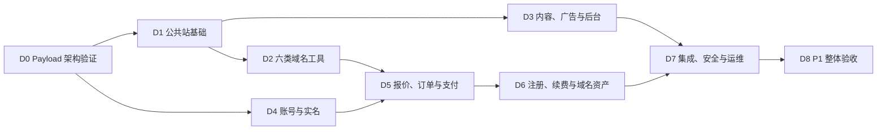

# Wanmi.AI P1 开发计划

> 文档版本：v2.7（D7-06 应用主密钥冻结项变更）
>
> 更新日期：2026-08-10
>
> 冻结基线：`P1-BASELINE-2026-08-10.1`；批准标签 `p1-docs-approved-2026-08-10-1`
>
> 状态：已批准作为 P1 开发执行计划；生产上线仍需通过独立门槛
>
> 执行主体：项目负责人一人 + ChatGPT/Codex
>
> 目标周期：12～16 周，全量一次交付
>
> 产品范围：Wanmi.net 中文域名工具与站内代理注册平台；Wanmi.ai 仅做 HTTPS 永久跳转
>
> 关联文档：[产品规划与商业评估](./Wanmi.AI-产品规划与商业评估.md) · [产品需求文档](./Wanmi.AI-产品需求文档-PRD.md) · [技术栈与工程规范](./Wanmi.AI-技术栈.md) · [现有阿里云资源](./Wanmi.AI-现有阿里云资源.md) · [App 技术规划](./Wanmi.AI-App技术规划.md)

本文是 Codex 执行 P1 开发时的任务顺序、交付标准和进度依据。它不重新定义产品范围：产品行为以 PRD 为准，工程实现以技术栈文档为准，部署条件以资源清单为准，商业优先级以产品规划与商业评估为准。

## 0. Codex 执行规则

### 0.1 文档优先级

遇到描述差异时按以下顺序处理：

1. 项目负责人当前明确指令；
2. 《产品需求文档》决定功能、状态、用户流程和验收；
3. 《技术栈与工程规范》决定架构、依赖、安全和工程边界；
4. 本计划决定开发顺序和阶段交付物；
5. 《现有阿里云资源》决定生产资源现状和上线门槛；
6. 《产品规划与商业评估》决定定位、商业优先级和阶段边界；
7. 《App 技术规划》只约束未来 App，不得据此扩大 Web P1。

如仍存在会改变产品范围、资金处理、实名责任或外部资源的冲突，Codex 必须暂停该项并询问项目负责人；不影响其他工作的任务继续推进。

### 0.2 每次开始开发前

Codex 必须：

- 阅读本计划及当前里程碑引用的批准文档章节；
- 检查 Git 状态、现有代码、测试、环境示例和未提交修改；
- 保留项目负责人已有修改，不覆盖无关内容；
- 确认当前最靠前且未完成的里程碑；
- 先列出本次准备完成的可验证任务，再开始修改；
- 缺少外部凭据时使用接口适配器、mock 和脱敏 fixture 继续开发，不把凭据写入仓库；
- 只有在项目负责人明确授权时，才执行生产部署、真实扣款、资源采购、备案申请或外部写接口操作。

### 0.3 每次开发结束前

Codex 必须：

- 运行与修改风险相匹配的格式化、静态检查、单元、集成或 E2E 测试；
- 说明完成内容、验证结果、未完成项和外部阻塞；
- 更新本文件第 12 节的进度；只有满足退出条件，或项目负责人明确批准条件通过并完整转移剩余门槛后，才能勾选整个里程碑；
- 新增架构决策时写入 `docs/adr/`，不得仅存在于聊天记录；
- 新增运行操作时同步更新 `infra/runbooks/`；
- 不因为测试环境缺少真实凭据而删除安全校验或绕过服务端确认。

### 0.4 完成定义

“代码已写”不等于完成。单项任务至少同时满足：

- 行为符合 PRD；
- Zod 接口 schema、Payload migrations 和生成类型保持同步；
- 正常、失败、越权、重试和降级路径有测试；
- 日志、埋点和错误不泄露敏感数据；
- 用户可见状态和后台人工处理入口完整；
- 文档、配置示例和 Runbook 已同步；
- `make check` 通过。

### 0.5 冻结与变更控制

`P1-BASELINE-2026-08-10.1` 冻结 P1 产品范围、固定架构、订单状态与合法迁移、退款规则、实名归属、12～16 周工期口径和生产上线门槛。相对上一基线，本次只按负责人指示将不可用的阿里云 KMS 替换为版本化应用主密钥；证件加密与生产门槛不降低。开发过程中可以更新本计划的任务勾选、验证证据、阻塞、ADR 和 Runbook；不得借进度更新改变冻结基线。

需要改变冻结内容时，必须取得项目负责人明确指令，更新受影响文档版本与变更记录，完成跨文档一致性检查，并建立新的批准标签。D0 验证失败只触发延长、修正假设或重新提交架构决策，不自动解除冻结。

## 1. P1 开发基线

### 1.1 P1 必须交付

- M01～M12：公共站、六类域名工具、内容与 SEO、本地历史、广告导购、运营后台、分析反馈；
- M13：手机验证码登录、安全 Cookie Session、实名模板、私有证件存储；
- M14：价格报价、订单、微信支付 API v3 Native/H5、退款和对账；
- M15：西部数码代理注册、主动续费、异步履约和人工复核；
- M16：域名资产、到期提醒和 Name Server 修改；
- 小流量单 ECS 可部署方案、日志监控、备份恢复和必要 Runbook。

### 1.2 P1 明确不做

- 支付宝和微信 JSAPI；
- 域名转入转出、过户和完整 DNS 记录管理；
- 默认自动续费、余额钱包、充值账户和自动开票；
- 免费 SSL 签发、私钥托管；
- 社区、评论、会员、付费 API、企业监控和 AI 域名生成；
- iOS/Android App；
- Redis/Tair、独立消息队列、微服务、Kubernetes 和提前建设多节点架构；
- 未经批准的云资源采购和生产环境变更。

### 1.3 固定业务契约

核心链路：

```text
查询域名 → 获取价格报价 → 手机登录 → 选择已验证实名模板
→ 创建订单 → 微信支付 → 服务端确认到账 → 西部数码异步注册
→ 生成域名资产 → 短信通知
```

订单状态：

| 中文状态   | 内部状态          | 进入条件                                    |
| ---------- | ----------------- | ------------------------------------------- |
| 待支付     | `pending_payment` | 订单已创建，微信尚未确认到账                |
| 已支付     | `paid`            | 微信服务端确认到账                          |
| 履约中     | `fulfilling`      | Payload `commerce` Job 已接管注册或续费任务 |
| 成功       | `succeeded`       | 西部数码确认成功且资产已生成或更新          |
| 失败待退款 | `refund_pending`  | 上游明确失败，需要原路全额退款              |
| 退款中     | `refunding`       | 已向微信提交退款                            |
| 已退款     | `refunded`        | 微信确认退款成功                            |
| 待人工处理 | `manual_review`   | 上游状态不明、余额不足、退款失败或争议      |
| 已取消     | `cancelled`       | 未支付超时或用户取消，且未进入履约          |

固定规则：

- 报价使用西部数码实时成本快照 + 后台按 TLD 配置的固定金额或比例，默认有效 5 分钟；
- 未配置加价规则或未通过能力验证的 TLD 不开放购买；
- 用户域名必须注册在用户选择并验证通过的实名模板名下，不得使用 Wanmi 公司模板；
- 注册成功不可退款；明确失败自动原路全额退款；状态不明禁止自动重复注册；
- 续费由用户主动付款，不默认自动续费；
- 发票和特殊退款由项目负责人通过现有财务流程处理，系统保存状态与处理备注；
- 微信支付资金、西部数码预充值余额和内部订单分别记录并进行三方对账。
- 合法订单状态迁移以《技术栈与工程规范》第 6.1 节矩阵为唯一工程基线；`manual_review` 只可按有证据、可审计的出口处理。

## 2. 交付路线与关键路径

P1 只在全部功能完成后做整体验收。下列里程碑是内部开发顺序，不代表批准分批生产上线。



| 里程碑              |                        参考周期 | 主要范围                               | 完成标志                                      |
| ------------------- | ------------------------------: | -------------------------------------- | --------------------------------------------- |
| D0 Payload 架构验证 | 第 1 周（建议 3～5 天，可延长） | Payload、认证、Jobs、OSS 和单 ECS 验证 | 核心退出条件通过；ECS 门槛经负责人批准转入 D7 |
| D1 公共站基础       |                      第 2～3 周 | Web 外壳、通用状态、管理基础           | 首页与后台骨架可运行                          |
| D2 六类域名工具     |                      第 3～5 周 | M02～M07、M09                          | 工具正常/失败/降级测试通过                    |
| D3 内容、广告与后台 |                      第 5～7 周 | M08、M10～M12、M11 相关能力            | 内容与商业组件不影响工具                      |
| D4 账号与实名       |                      第 7～9 周 | M13                                    | 登录、模板、加密与删除闭环通过                |
| D5 报价、订单与支付 |                     第 9～11 周 | M14                                    | 支付状态机和退款测试通过                      |
| D6 注册、续费与资产 |                    第 11～13 周 | M15、M16                               | 幂等履约和资产闭环通过                        |
| D7 集成、安全与运维 |                    第 13～15 周 | 全链路、监控、恢复、Runbook            | 关键故障演练通过                              |
| D8 P1 整体验收      |                    第 15～16 周 | M01～M16、上线门槛核对                 | 开发验收通过；上线条件单列                    |

外部权限确认、备案和生产资源核验从 D0 开始并行进行。它们不阻塞 mock 环境开发，但会阻塞真实收款上线。

## 3. 全局工程约束

### 3.1 固定技术栈

- 单一 TypeScript 代码库，Node.js 24 LTS；
- Next.js 16.2.11、React、TypeScript strict、Tailwind CSS、shadcn/ui；
- Payload 3.86.0；全部 `payload` 与 `@payloadcms/*` 包锁定同一精确版本；
- Payload 官方插件：`@payloadcms/plugin-seo`、`@payloadcms/plugin-redirects`、`@payloadcms/plugin-form-builder`，全部锁定 `3.86.0`；
- PostgreSQL Adapter、Payload migrations、`push: false`；
- Payload Jobs：`publishing`、`background`、`commerce`，独立 Worker；
- Payload `payload-types.ts` + 共享 Zod request/response schemas；
- 部署：Nginx + Next.js/Payload Web/Admin/API + Payload Jobs Worker + Who-Dat；
- 存储：RDS、OSS/CDN 与部署 secret；公共媒体使用 `@payloadcms/storage-s3`，私有实名文件使用 `ali-oss`；
- 阿里云短信使用 Alibaba Cloud TypeScript SDK，不自行实现阿里云 API 签名；实名证件使用版本化应用主密钥信封加密；
- 不引入第二套业务后端、Redis、独立消息队列或微服务。

### 3.2 目标仓库结构

```text
wanmi/
├── apps/web/
│   ├── src/app/
│   ├── src/collections/
│   ├── src/access/
│   ├── src/services/
│   ├── src/jobs/
│   ├── src/providers/
│   ├── src/schemas/
│   └── src/payload.config.ts
├── infra/inventory/
├── infra/compose.prod.yml
├── infra/third-party/
├── infra/runbooks/
├── docs/adr/
├── docs/security/
├── docs/content/
├── docs/operations/
├── docker-compose.yml
├── Makefile
└── README.md
```

如现有仓库已经存在不同但合理的结构，Codex 应优先渐进适配，不为匹配示意图进行无价值的大规模移动。

### 3.3 稳定工程命令

D0 必须建立并维护以下命令；后续里程碑不得绕过：

| 命令                    | 作用                                                  |
| ----------------------- | ----------------------------------------------------- |
| `make bootstrap`        | 检查开发依赖并初始化本地配置，不写入真实密钥          |
| `make dev`              | 启动本地 Web/Payload、PostgreSQL 和 Who-Dat           |
| `make worker`           | 启动独立 Payload Jobs Worker                          |
| `make generate`         | 生成 Payload 类型并检查迁移                           |
| `make verify-generated` | 检查生成类型和迁移没有漂移                            |
| `make fmt`              | 格式化 TypeScript、YAML、Markdown 等受控文件          |
| `make lint`             | TypeScript、Payload 和配置静态检查                    |
| `make test`             | 单元和组件测试                                        |
| `make test-integration` | PostgreSQL、Payload Jobs 和 provider adapter 集成测试 |
| `make test-e2e`         | Playwright 核心用户流程测试                           |
| `make security`         | Gitleaks、依赖与基础安全检查                          |
| `make build`            | 构建 Next.js/Payload 和容器产物                       |
| `make smoke`            | 对运行环境执行健康和核心路径冒烟测试                  |
| `make check`            | 汇总生成物检查、lint、测试、安全和构建的合适子集      |

若受本地环境限制无法运行某项，Codex 必须说明原因和替代验证，不得把“未运行”写成“通过”。

### 3.4 Provider 适配器

所有外部能力必须经过 `apps/web/src/providers` 接口适配器：

- `westdigital`：查询、价格、实名、注册、续费、资产同步、Name Server；
- `wechatpay`：Native/H5 下单、通知验签、主动查单、关单、退款、退款查询；
- `aliyunsms`：通过 Alibaba Cloud TypeScript SDK 发送验证码、重要订单状态和到期提醒；
- `oss-public`：通过 `@payloadcms/storage-s3` 管理内容图片与广告素材；
- `oss-realname`：通过 `ali-oss` 管理私有实名文件的上传、短时签名和删除；
- `realname/master-key`：通过环境注入的版本化应用主密钥包裹每对象随机数据密钥；
- `whodat`：RDAP/WHOIS。

每个适配器必须提供：

- 清晰的请求/响应领域模型，不向业务层泄漏未经处理的 provider 原始结构；
- 超时、限流、错误分类和脱敏日志；
- mock、fixture 和 contract test；
- 明确的读操作重试策略；
- 写操作幂等键和状态查询能力；
- 配置缺失时安全失败，不使用隐式默认生产凭据。

高风险业务逻辑放在 `src/services`，Hooks 只做规范化、审计和入队，禁止直接调用外部写接口。代表用户使用 Payload Local API 时必须传 `user` 和 `overrideAccess: false`；嵌套数据库操作传递同一个 `req`。

### 3.5 数据与安全底线

- 所有资金、履约、域名和实名状态由服务端决定；
- 浏览器不得直连西部数码、微信支付、RDS、私有 OSS 或部署 secret；
- 手机号、验证码、证件、Cookie、支付密钥、provider token 不进入普通日志；
- 查询结果页默认 noindex，不长期保存不必要的完整查询域名；
- 实名证件进入私有 OSS，使用每对象数据密钥和版本化应用主密钥信封加密、短时访问、最小权限和操作审计；
- 删除模板或注销账号后立即禁止继续使用，并在 30 天内清理主存储和备份；
- DNS/TLS 工具必须防 SSRF、内网探测和 DNS rebinding；
- 所有人工状态修改记录操作者、原状态、新状态、原因和时间；
- 数据库迁移向前兼容，生产发布不得依赖破坏性即时迁移；
- ECS 不保存唯一业务数据，节点必须可重建。

## 4. D0：Payload 架构验证（建议 3～5 天）

### 4.1 目标

验证单一 Next.js + Payload 主架构可以承担 CMS、认证、权限、业务数据和后台任务，再进入 M01～M16。3～5 天是架构决策时间盒；任一退出条件未满足时通常延长 D0 并记录原因。项目负责人于 2026-08-04 明确批准 D0 条件通过：只将共享 ECS 上无法安全执行的资源、重启、Jobs 恢复、重建和 RTO 验证转入 D7，其他 D0 门槛不得跳过。该决定不提前缩短 12～16 周对外承诺。

### 4.2 任务

- [x] 建立或核对第 3.2 节仓库结构；
- [x] 锁定 Node.js 24 LTS、Next.js 16.2.11、Payload 3.86.0 和全部 Payload 包精确版本；
- [x] 安装并锁定 `@payloadcms/plugin-seo`、`@payloadcms/plugin-redirects`、`@payloadcms/plugin-form-builder` 为 `3.86.0`，验证启动、迁移和类型生成；
- [x] 创建 Next.js/Payload Web、Admin、API 和独立 Jobs Worker 基线；
- [x] 建立本地 Docker Compose：PostgreSQL、Who-Dat；
- [x] 建立 `/healthz`、`/readyz`、请求 ID、结构化日志和统一错误格式；
- [x] 建立 PostgreSQL Adapter、Payload migrations、`push: false` 和 `payload-types.ts` 漂移检查；
- [x] 验证内容草稿、版本、定时发布和管理员角色权限；
- [x] 验证管理员密码 + TOTP 原型；
- [x] 验证普通用户短信 OTP mock、opaque Session 和全部会话撤销；
- [x] 建立 `publishing`、`background`、`commerce` 队列，验证 commerce concurrency key、事务和订单事件；
- [x] 验证代表用户的 Local API 全部使用 `overrideAccess: false`；
- [x] 定义内容、广告、身份、实名、报价、订单、支付、退款、provider 操作、域名资产和审计 Collections；
- [x] 通过 `@payloadcms/storage-s3` 验证公共媒体的 OSS 上传、读取、删除、签名地址和 ETag；
- [x] 验证私有实名文件与公共 Media Collection 分离，并用 `ali-oss` 完成私有对象上传、读取、短时签名和删除原型；
- [x] 使用 Alibaba Cloud TypeScript SDK 建立短信 adapter；实名证件建立版本化应用主密钥的启动校验、轮换读取和失效边界；
- [x] 建立 provider 接口、mock 和脱敏 fixture 目录；
- [x] 建立 `.env.example`，只写变量名、用途和安全说明；
- [x] 建立 Makefile 稳定命令和 CI；
- [x] 建立测试框架：Vitest、React Testing Library、MSW、Playwright 和 PostgreSQL 集成测试；
- [x] 建立 Gitleaks 和依赖扫描；
- [x] 在单 ECS 规格下验证 Web/Worker 内存、独立重启、Jobs 恢复和节点重建；
- [x] 编写首批 ADR：Payload 主架构、Local API 权限、opaque Session、commerce 幂等、公共/私有 OSS 与实名主密钥分离、单 ECS 可重建策略。
- [x] 在 commerce ADR 中固化《技术栈与工程规范》第 6.1 节合法迁移矩阵，并测试全部 `manual_review` 出口。

### 4.3 退出条件

- 新环境按 README 能完成 `make bootstrap`、`make dev` 和 `make worker`；
- Next.js/Payload、PostgreSQL 和 Who-Dat 健康检查正常；
- 一次 Payload schema 变更可以生成类型、创建迁移并通过漂移检查；
- 一次 commerce Job 可在重复执行和 Worker 重启后保持幂等；
- 管理员 TOTP、customer OTP/session、权限矩阵和 Local API 防绕过原型通过；
- OSS S3 兼容性和单 ECS 资源验证有记录；
- `make check` 通过；
- 仓库中不存在真实密钥、手机号、证件或支付数据。

### 4.4 条件通过决定（2026-08-04）

D0 的架构、权限、认证、迁移、Jobs 幂等、真实 OSS、隔离 RDS、安全扫描与同镜像本地验证已经通过。由于目标 ECS 仍承载其他项目，项目负责人批准进入 D1，并将以下未完成项原样转入 D7：

- 2 vCPU/4 GiB 生产 Linux 环境下的 Web、Worker、Who-Dat 内存测量；
- Web/Worker 独立重启及 ECS 与 RDS 同 VPC 的 `commerce` Job 中断恢复；
- 空节点重建与两小时 RTO。

这些任务仍是开发整体验收和生产上线硬门槛。2026-08-10 项目负责人确认现有项目已经迁出、目标 ECS 已成为可重置/重装的专用机器，原共享 ECS 外部阻塞解除；但 D7-07 仍只做本地容器受限等价验证，真实 ECS 执行留到下一授权切片。在真实环境证据完成前，本节单 ECS 项及 11.1 第 10、11 项都保持未勾选。D1 若暴露主架构、权限、迁移或 Jobs 假设失败，立即返回 D0 修正。

## 5. D1：公共站与管理基础（第 2～3 周）

### 5.1 目标

交付 M01 基础页面和后续模块共用的 Web、错误、权限与可观测能力。

### 5.2 任务

- [x] 建立 Wanmi.net 主站布局、响应式导航、页脚、帮助和合规入口；
- [x] 建立首页主查询、工具导航、内容入口和数据来源说明；
- [x] 建立通用表单、加载、空状态、部分成功、失败、限流和降级组件；
- [x] 建立统一 Result、Problem Details 和请求 ID 展示；
- [x] 建立 canonical、robots、sitemap、Open Graph 和 noindex 基础能力；
- [x] 配置 `@payloadcms/plugin-seo` 的共享字段与预览规则，并验证只读取已发布内容；
- [x] 配置 `@payloadcms/plugin-redirects`，重定向写入受 RBAC 和审计保护，目标拒绝开放跳转；
- [x] 建立 Wanmi.ai/www 只跳转的 Nginx 配置，不创建第二套页面；
- [x] 完善管理员独立 Auth Collection、Payload Session、密码 + TOTP MFA 和 RBAC；
- [x] 建立内容编辑、广告运营、分析、系统管理员角色边界；
- [x] 建立审计事件公共组件和后台导航骨架；
- [x] 建立第一方事件入口，默认不采集完整查询域名。

D1-01 验证记录（2026-08-04）：已建立响应式主站外壳、六类工具与内容入口、`GET /tools/domain-search?q=` 查询骨架、帮助和四类合规说明入口；公共 Payload Local API 读取固定 `overrideAccess: false`，草稿隔离、栏目独立降级、桌面/移动端与未知路由均有自动化测试。本切片未调用 provider、未新增 API、未修改 Payload schema 或迁移。

D1-02 验证记录（2026-08-04）：已建立共享 Zod `Result<T>` 六状态契约、兼容 RFC 9457 的 Problem Details、集中请求 ID 校验和安全 provider 映射；现有 API 错误保留 `code/message/traceId`，增加标准字段、重试信息和建议动作，成功响应保持不变。公共站已接入可访问查询表单、空态/部分成功/失败/限流/降级面板、栏目级加载 Skeleton、错误边界和保留真实 404 的品牌化未找到页；请求 ID 上下文按导航更新。41 个单元测试、9 个 PostgreSQL/MinIO 集成测试、6 个 Playwright 场景、生产构建、linux/amd64 同镜像构建、安全扫描及桌面/390px 视觉检查通过。本切片未调用真实 provider，未修改 Payload schema、迁移或生成类型。

D1-03 验证记录（2026-08-04）：已建立以配置 origin 为唯一主机的公共 canonical、路由级 Open Graph/Twitter、查询参数结果 `noindex, nofollow`、`robots.txt`、仅包含现有稳定页面的静态 sitemap 和 1200×630 品牌分享图；Payload 官方 SEO 插件共享 `WanmiSeoMeta`，新增同源 canonical 与默认关闭的 `noIndex`，搜索预览 URL 固定映射到批准的信息架构。新增 migration 与生成类型，空库和现有两迁移基线升级均得到预期 12 个 SEO 列；46 个单元测试、9 个 PostgreSQL/MinIO 集成测试、8 个 Playwright 场景、生产构建、linux/amd64 同镜像构建和安全扫描通过。动态内容详情、动态 sitemap、草稿实时预览、Redirects 与 Nginx 主机跳转仍按计划留在后续切片。

D1-04 验证记录（2026-08-04）：Payload Redirects 已收敛为永久 301；自定义目标只接受规范化站内路径，文章、专题和 TLD 引用必须已发布，并拒绝保留路径、开放跳转、直接/多跳循环和超过 10 跳的链路。`content_editor`/`system_admin` 可创建更新，只有 `system_admin` 可删除；创建、更新、删除通过同一 `req` 写入脱敏审计。公共 GET/HEAD 以 `overrideAccess: false` 分页读取并使用 30 秒进程缓存、并发刷新去重、stale-on-error 与冷启动失败放行，命中后折叠最终目标并保留查询参数与请求 ID。迁移在收窄 enum 前将遗留 302 规范化为 301；空库和 D1-03 遗留 302 升级路径均通过。固定 digest Nginx 镜像通过 `nginx -t`，4 个 HTTP 和 3 个 HTTPS 别名入口均保留路径/查询并跳至 `https://wanmi.net`；配置不含别名 `proxy_pass`。65 个单元测试、12 个 PostgreSQL 集成测试和 9 个 Playwright 场景通过；生产构建、linux/amd64 镜像和安全扫描结果随本切片最终门禁记录。本切片未部署、未修改共享 ECS、未申请证书或切换流量。

D1-05 验证记录（2026-08-04）：独立 `admins` Auth Collection 已生产化为固定 12 小时且不自动刷新的 Payload Session，并以 `active/disabled`、14～128 字符密码、SHA-1/6 位/30 秒/±1 窗口 TOTP、一次性恢复码和 5 次失败锁定 10 分钟形成管理员身份边界。MFA 密文与恢复码哈希迁入拒绝通用 API 的隐藏 Collection；角色、状态、密码或 MFA 变化撤销全部 Session，数据库约束和服务层共同阻止删除、停用或降级最后一个 active `system_admin`。后续管理员和 MFA 重置通过 24 小时、256-bit、仅存 HMAC 的一次性 fragment 邀请完成，原始 token、秘密与恢复码不落库；最小安全设置页支持邀请和 Session 管理。统一 `/api/v1/admin/auth` 登录不返回 JWT，默认 Payload 登录、首用户注册、忘记/重置密码、解锁、refresh-token 与 GraphQL 均关闭。81 个单元测试、17 个 PostgreSQL 集成测试和 12 个 Playwright 场景通过；空库、D1-03 Redirect、D1-05 遗留管理员 MFA 升级及最后系统管理员并发约束验证通过；生产构建、linux/amd64 镜像、依赖 high 门禁和 Gitleaks 通过。依赖审计保留既有 2 个低危和 2 个中危，无 high/critical。本切片只完成管理员身份层 RBAC，业务 Collection 完整角色矩阵、通用审计后台和第一方事件仍属于 D1-06/D1-07；未部署或修改共享 ECS。

D1-05 审核修正记录（2026-08-05）：确认 Next.js Proxy 中对 Payload 默认认证路径的原始精确字符串匹配可被 percent-encoding 绕过，其中 `forgot-password` 会抵达 Payload 并写入重置 token。入口现对 pathname 做有界重复解码、分隔符规范化和畸形路径拒绝，再匹配禁用表面；`admins` Collection 同时新增 `beforeOperation` 后备保护，在 Payload 写入前拒绝默认 login、forgot/reset-password、unlock 和 refresh，仅允许携带服务端 MFA 上下文的统一登录服务调用。单元测试覆盖单层/双层编码、编码斜杠、替代分隔符、畸形转义、编码 GraphQL 及必要 REST 放行；PostgreSQL 集成测试确认 `forgotPassword` 被拒绝且管理员 reset token/expiration 不变；真实 HTTP 测试确认编码变体均为 404。最终 `make check` 的 92 个单元测试、18 个 PostgreSQL 集成测试、完整 migration、生产构建、linux/amd64 镜像、依赖 high 门禁和 Gitleaks，以及 `make test-e2e` 的 12 个 Playwright 场景全部通过；未修改 Nginx、未部署或修改共享 ECS。

D1-06 验证记录（2026-08-05）：已将匿名、customer、禁用管理员与 `content_editor`、`ad_operator`、`analyst`、`system_admin` 的 Collection CRUD、内容版本和 Payload Admin 可见性收敛为完整矩阵；内容与广告写权限相互隔离，广告运营可读安全运营数据和本人审计，分析角色只读脱敏广告参考、反馈摘要与聚合/对账结果，系统管理员获得全局读取但不能通过通用 Payload CRUD 修改实名、价格、commerce、provider、对账或人工复核状态。客户读取继续按本人行级约束，并隐藏上游成本、报价规则快照、内部订单证据和操作者标识；官方 Redirects、Form Builder Collections 使用相同后台可见性与服务端权限。共享 Media 不提前增加广告分类，第一方事件、通用审计组件和自定义后台导航仍属于 D1-07/D1-08/D3。`make check` 通过生成类型/schema 漂移、空库及遗留 migration、Nginx、lint、TypeScript strict、144 个单元测试、23 个 PostgreSQL 集成测试、生产构建、linux/amd64 同镜像、依赖 high 门禁和 Gitleaks；`make test-e2e` 的 15 个 Playwright 场景通过，覆盖三类非系统角色导航、未授权后台路由 404 与 REST 越权写入 403。依赖审计仍为既有 2 个低危和 2 个中危，无 high/critical；本切片无 schema、migration 或公开 API 变更，未部署或调用真实 provider。

D1-07 验证记录（2026-08-05）：已将 Redirect、管理员账号与邀请、TOTP/MFA、管理员登录、Session 撤销和系统 Local API 的审计写入收敛到强类型公共服务；现有 action 标识保持兼容，事件目录统一派生 actor 约束和 `targetType`，metadata 在唯一写入边界递归替换手机号、证件号、Cookie、OTP、token、密码、密钥和 provider secret，安全 Hash/Digest/Masked 派生值保留，Session 仅记录 `sessionIdHash`。Payload Admin 按内容、广告、身份、实名、交易、履约、运营七域分组，仍以 D1-06 服务端 access 为授权基线；审计原生列表支持时间倒序、默认列和安全搜索，`system_admin` 全量读取、`ad_operator` 仅本人 admin 事件且看不到 metadata、`analyst` 无入口和读取权限。新增命名 migration 为 `actorType + actorId + createdAt` 建复合索引，不重写历史审计；空库及 D1-03/D1-05 遗留升级路径均验证索引。`make check` 通过生成类型/schema 漂移、迁移、Nginx、lint、TypeScript strict、154 个单元测试、24 个 PostgreSQL/MinIO 集成测试、生产构建、linux/amd64 同镜像、依赖 high 门禁和 Gitleaks；`make test-e2e` 的 15 个 Playwright 场景通过，覆盖七域分组、广告运营本人审计、分析角色拒绝和直接路由保护。依赖审计仍为既有 2 个低危和 2 个中危，无 high/critical；本切片无公开 API 变更，未实现 D1-08、未部署或调用真实 provider。

D1-08 验证记录（2026-08-05）：已建立严格 Zod 判别联合保护的 `POST /api/v1/events` 第一方入口和 `firstPartyEvents` Collection，仅允许页面类别、来源类别、设备类别、固定工具、输入类型、单标签 TLD、标准结果、数据源和耗时桶等聚合维度；不存在 domain、query、URL、原始 referrer、IP、User-Agent、Cookie、客户端/Session 标识或自由 metadata 字段。客户端只自动发送 `page_viewed` 与 `tool_submitted`，查询 `wanmi.net` 仅发送 `tld: net`；请求使用 `credentials: omit`、origin-only referrer 和 best-effort keepalive，DNT/GPC 在客户端和服务端均停止写入，不设置分析 Cookie 或 Web Storage。D1-07 递归脱敏规则已抽为共享隐私组件并在事件唯一写入服务复用；原始事件仅 `system_admin` 可读，`analyst` 继续只读 D1-06 规定的安全聚合结果。新增可配置的每分钟 1000 条无标识全局限流、命名 migration、生成类型及事件/工具时间索引；空库、D1-03/D1-05 遗留升级和 migration down/up 往返均通过，并验证事件表无禁止列。`make check` 通过生成/schema 漂移、迁移、Nginx、lint、TypeScript strict、167 个单元测试、26 个 PostgreSQL/MinIO 集成测试、生产构建、linux/amd64 同镜像、依赖 high 门禁和 Gitleaks；`make test-e2e` 的 16 个 Playwright 场景通过，覆盖请求最小化、Cookie/referrer 隔离、DNT/GPC、采集失败不阻塞查询和 analyst 直接路由拒绝。依赖审计仍为既有 2 个低危和 2 个中危，无 high/critical；工具完成/失败发送由 D2 接入，广告事件、聚合、留存清理和 analyst 仪表盘仍属于 D3。本切片未部署、未调用真实 provider，也不作为资金、广告结算或交易状态依据。

### 5.3 退出条件

- 首页和后台骨架在桌面、移动端可用；
- 无广告、无分析和 provider 失败时首页仍可使用；
- 未登录或权限不足不能访问后台；
- canonical、noindex 和错误页面有自动化测试；
- 管理员登录、MFA、Session 轮换和越权测试通过。

## 6. D2：六类域名工具（第 3～5 周）

### 6.1 目标

完成 M02～M07 和 M09，建立 Wanmi 的免费工具获客核心。

### 6.2 任务

- [x] 实现域名标准化、Unicode/Punycode、长度和字符校验；
- [x] 实现西部数码查询/价格适配器、限频、请求合并和有界缓存；
- [x] 实现域名可注册查询，默认最多 10 个 TLD，支持部分成功和六种标准状态；
- [x] 实现 Who-Dat/RDAP/WHOIS 查询与降级，和可售状态严格分离；
- [x] 实现 A、AAAA、CNAME、MX、TXT、NS、SOA、CAA 只读查询；
- [x] 实现 TLS/SSL/CAA 检查，固定 443 端口并阻断私有、保留和本地地址；
- [x] 实现 TLD 注册价、续费价、1 年/3 年成本和快照追溯；
- [x] 实现 IDN 双向转换、非法输入和同形异义风险提示；
- [x] 实现浏览器本地历史与收藏：最多 30 条、90 天、可单项删除和全部清空；
- [x] 建立工具间跳转、复制和分享入口，不默认分享完整查询结果；
- [x] 建立工具请求量、成功率、P50/P95、provider 错误和限频监控；
- [x] 为西部数码 429、队列满、Who-Dat 失败、DNS/TLS 超时建立降级测试。

D2-01 验证记录（2026-08-05）：新增浏览器/服务端可复用的纯函数域名标准化模块，固定使用 Unicode 17、UTS-46 非过渡处理和 IDNA2008 允许/上下文规则；统一处理大小写、首尾空白、全角字符、等价点和单个根尾点，输出 ASCII/Punycode、显式 Unicode 转换值及固定为 ASCII 的公开展示值。标签 63 字节、总长 253 字节、字符、连字符、空标签、纯数字 TLD、无效/双重 `xn--` 均有稳定错误码并适配 D1-02 `Result`/Problem Details；UTS-39 按标签检测混合书写系统并返回非阻断风险提示。`make check` 的 178 个单元测试、26 个 PostgreSQL/MinIO 集成测试、迁移/类型漂移、生产构建、linux/amd64 同镜像和安全门禁通过；`make test-e2e` 冷启动首次因 Next 开发服务器仍在编译导致 2 个既有管理员场景超时、其余 14 个通过，未改代码直接完整复跑后 16 个场景全部通过。未新增公开 API、工具页、Payload schema、迁移或 provider 调用；后续 IDN 工具页任务保持未完成。

D2-02 验证记录（2026-08-05）：新增通过接口注入的 `WestDigitalReadProvider`、fixture transport 和本地文档查询/普通价格样例，两个入口复用 D2-01 `normalizeDomain`，Unicode/Punycode、大小写和等价点输入共享同一缓存及 in-flight key。适配器使用每秒 2 次、突发 4 的进程内 token bucket，最多排队 32 个不同请求、最长等待 5 秒、单次 transport 超时 5 秒；相同进行中请求只消耗一个限流槽。可注册性成功结果使用 45 秒/5,000 项 LRU，普通价格使用 1 小时/512 项 LRU，失败不缓存且不返回 stale；上游整数人民币严格换算为整数分。429、队列满、排队超时、上游超时、连接失败、畸形数据和业务拒绝均返回稳定错误码、中文信息、重试属性与可审计请求标识，结构化日志不记录完整域名、请求表单、响应正文或上游错误详情。最终 `make check` 通过生成类型/import map/schema 漂移、空库及遗留 migration、Nginx、lint、TypeScript strict、190 个单元测试、26 个 PostgreSQL/MinIO 集成测试、Next.js 生产构建、linux/amd64 同镜像、依赖 high 门禁和 Gitleaks；`make test-e2e` 的 16 个 Playwright 场景一次通过。未新增公开 API、Payload schema、migration、真实鉴权、凭据或网络 transport；包含 Who-Dat/DNS/TLS 的综合降级任务继续保持未完成。

D2-03 验证记录（2026-08-05）：新增严格 Zod 保护的 `POST /api/v1/tools/domain-search`、服务端多 TLD 编排和公开结果页；完整域名只查询自身后缀，关键词默认按 `com`、`cn`、`net`、`org`、`top`、`xyz`、`vip`、`cc`、`tv`、`com.cn` 十项 fixture 目录查询，显式输入超过 10 项返回稳定 `DOMAIN_SEARCH_TLD_LIMIT_EXCEEDED`，规范化重复项明确拒绝。每项使用 `available`、`premium`、`registered`、`restricted`、`unsupported`、`query_failed` 六种 PRD 状态并显示来源、查询时间和缓存状态；`Promise.allSettled` 保证单项失败不拖垮其他 TLD，聚合结果使用 D1-02 `ready`、`empty`、`partial`、`degraded`、`error`、`rate_limited` 契约。`avail=0` 只有 fixture 目录存在明确证据时才区分已注册或保留/限制，否则返回状态不明确，未调用或推断 WHOIS。浏览器查询请求固定 `no-store`、`credentials: omit` 和 origin-only referrer，完成/失败事件只发送聚合维度；结果参数页保持干净 canonical 与 `noindex, nofollow`，未新增 Payload Collection、migration、长期查询存储、真实 provider 网络调用或购买入口。`make check` 通过生成类型/import map/schema 漂移、空库及遗留 migration 往返、Nginx、lint、TypeScript strict、200 个单元测试、26 个 PostgreSQL/MinIO 集成测试、Next.js 生产构建、linux/amd64 同镜像、依赖 high 门禁和 Gitleaks；依赖审计仍为既有 2 个 low 和 2 个 moderate，无 high/critical。`make test-e2e` 的 17 个 Playwright 场景通过，覆盖默认 10 TLD、部分成功、超限拒绝、缓存命中、来源/时间/缓存展示、查询页 noindex/canonical 及 Cookie/referrer/分析事件最小化。普通/续费价格、经批准购买入口、真实西部数码联调、Who-Dat、DNS 和 TLS/CAA 继续留在后续切片。

D2-04 验证记录（2026-08-05）：将公开注册信息抽为独立 `PublicRegistrationProvider`，从西部数码域名写操作接口移除旧 `queryRegistration` 混合语义；固定 Who-Dat v2.0.0 通过严格 Zod 和 64 KiB 有界流读取完成 RDAP 优先、内部 WHOIS 覆盖，使用 5.5 秒超时、进程内 token bucket、有界 FIFO 和相同规范化域名 in-flight 合并，不在 Web 层缓存结果。`isRegistered=false` 只映射 `empty/no_public_record` 并明确“不代表可注册”；Who-Dat 429 不触发降级，501/502/504、连接/超时、重定向、响应过大、Content-Type/JSON/schema 异常可在显式启用且凭据完整时降级到西部数码文档确认的 `POST v2/domain/`、`act=whois`，成功固定为 `degraded`，两个来源都失败则返回安全聚合错误。西部数码 transport 固定 HTTPS origin、13 位毫秒时间戳和 `md5(username + api_password + time)`，以 GB18030 有界解码，只公开注册商、原始日期安全字符串、状态和 Name Server；联系人、邮箱、电话、地址、原始 body、上游 URL/request ID/clientid 均不进入公共响应或日志。新增严格 4 KiB JSON 的 `POST /api/v1/tools/whois`、共享 Zod、完整域名/受限 IP/本地与元数据目标前置拒绝、全部 Result 可见状态和公开结果页；页面没有 D2-03 可售 schema/provider/购买入口，参数结果保持干净 canonical/OG 与 `noindex, nofollow`，请求使用 `no-store`、`credentials: omit` 和 origin-only referrer，分析事件只含工具、TLD、来源、结果类别和耗时桶。Who-Dat 缓存显式固定 1 小时且无持久卷，容器访问日志使用有界轮转。`make check` 通过生成类型/import map/schema 漂移、空库及遗留 migration 往返、Nginx、lint、TypeScript strict、247 个单元测试、26 个 PostgreSQL/MinIO 集成测试、安全门禁、Next.js 生产构建和 linux/amd64 同镜像构建；依赖审计仍为既有 2 low、2 moderate，无 high/critical，Gitleaks 无泄漏。`make test-e2e` 的 17 个 Playwright 场景通过，覆盖 WHOIS 移动端结果、来源/时间/缓存、可售分离、noindex/canonical/OG、Cookie/referrer 和聚合事件隐私。未新增 Payload Collection、migration 或长期查询存储；西部数码 fallback 默认关闭，全部测试使用 fixture，未发送真实西部数码请求，未部署或调用外部写接口。DNS、TLS/SSL/CAA、价格与浏览器历史继续留在后续切片。

D2-05 验证记录（2026-08-05）：新增严格共享 Zod、`POST /api/v1/tools/dns`、Node runtime 只读查询服务和公开结果页，一次并发查询 A、AAAA、CNAME、MX、TXT、NS、SOA、CAA 并保留每条 TTL；复用 D2-01 `normalizeDomain` 返回 Unicode/Punycode 与风险提示，按 D1-02 六状态区分记录、NODATA、NXDOMAIN、SERVFAIL、超时、安全阻断、失败和队列受限，NXDOMAIN 页面明确不代表可注册。解析器只允许代码内硬编码的阿里公共 DNS `223.5.5.5`/`223.6.6.6` 标准 DoH，不接受请求、环境变量或系统 DNS；`dns-packet` 严格校验事务 ID、单 Question、名称/类型/CLASS、响应/递归/截断标志、RCODE 和 CNAME 回答链。A/AAAA 结果通过 `ipaddr.js` 只允许公网单播；CNAME、MX、NS、SOA 目标再次使用同一受控解析器查询 A/AAAA，loopback、私网、CGNAT、link-local、保留/文档、组播、IPv4-mapped 与云元数据地址均失败关闭并隐藏整个相关记录集。默认限制为 3 秒、64 KiB、每类型 32 条/总计 128 条、16 个目标、8 个并发、20 次/秒/突发 40、有界 64 队列/2 秒等待；相同域名/类型 in-flight 合并，成功与负结果按自身和目标验证 TTL 的最小值使用 60/30 秒上限及 4,096 项 LRU，失败、安全阻断和 stale 不缓存。页面展示来源、节点、查询时间、缓存状态和 Unicode/Punycode，参数页保持干净 canonical/OG 与 `noindex, nofollow`，不提供购买或 DNS 管理入口；CAA 只展示原始 flags/tag/value。`make check` 通过生成物/schema 漂移、空库及遗留 migration、Nginx、lint、TypeScript strict、325 个单元测试、26 个 PostgreSQL/MinIO 集成测试、安全门禁、Next.js 生产构建和 linux/amd64 同镜像；依赖审计仍为既有 2 low、2 moderate，无 high/critical，Gitleaks 无泄漏。`make test-e2e` 最终 18 个 Playwright 场景通过；首次两次完整运行分别有 1/2 个既有 Admin 首编译登录断言命中固定 5 秒上限，相关两条断言调整为 15 秒后并行定向 2 项及完整 18 项通过。自动化 DNS 测试全部使用注入 fixture，未访问真实 DNS，未新增 Payload schema、migration、SSL 连接、CAA 策略判断、DNS 写入或托管。

D2-06 验证记录（2026-08-05）：新增严格共享 Zod、`POST /api/v1/tools/ssl-check`、可注入 Node TLS provider、服务编排和公开结果页；请求只接受完整域名，固定端口为代码常量 443，不接受 IP、URL、端口、地址、解析器或其他控制字段。服务复用 D2-05 AliDNS provider、主备节点、TTL/LRU 缓存与 `isPublicDnsAddress`，只查询 A、AAAA、CAA；任何地址属于 loopback、私网、link-local、CGNAT、云元数据、保留/文档、组播或 IPv4-mapped 范围时整体失败关闭且不披露地址。最多接受 8 个已验证地址并按 IPv6/IPv4 稳定交错尝试 4 个，TCP `host` 直接使用已验证 IP、`autoSelectFamily: false`、端口固定 443，连接后再次核对远端 IP/端口；域名只用于 SNI 和 Node 原生主机名校验，不触发第二次 DNS 解析。原始 TCP 入站握手数据由 Duplex 包装硬限制 256 KiB，总连接/握手 5 秒；读取证书后立即禁用 renegotiation 并销毁连接，不发送应用数据、不执行 HTTP、重定向或 OCSP。证书诊断覆盖有效期、剩余天数、域名匹配、主题、签发者、系统信任/自签名/无效链，证书链最多 10 层、SAN 最多 128 项。CAA 按 RFC 8659 从当前域逐层查找首个 RRset、最多 16 层，当前层超时、SERVFAIL、畸形或受限即停止；`issue`、`issuewild`、`iodef`、空 `issue` 和 critical flag 提供中文解释，`iodef` 不访问，也不按签发者品牌推断现有证书合规。结果聚合为既有六状态并展示 TLS/CAA 各自与聚合的来源、时间、缓存和请求 ID；成功/证书诊断缓存最长 60 秒、无地址最长 30 秒、LRU 2,048 项，安全阻断/运行失败不缓存或返回 stale；TLS 默认 10 次/秒、突发 20、并发 4、队列 32/等待 2 秒，同域名 in-flight 合并。参数页保持干净 canonical/OG 与 `noindex, nofollow`，请求不带 Cookie、只发送 origin referrer，分析只含 TLD、状态、耗时桶和 `tls` 来源。最终 `make check` 通过生成物/schema 漂移、空库及遗留 migration、Nginx、lint、TypeScript strict、365 个单元测试、26 个 PostgreSQL/MinIO 集成测试、安全门禁、Next.js 生产构建和 linux/amd64 同镜像；依赖审计维持既有 2 low、2 moderate，无 high/critical，Gitleaks 无泄漏。`make test-e2e` 的 19 个 Playwright 场景通过，覆盖 390px 证书/链/CAA、来源/时间/缓存、noindex/canonical/OG、Cookie/referrer 与分析隐私。全部自动化 DNS 使用注入 fixture，TLS 测试只使用运行时生成证书和本机临时 TLS/raw server，未访问真实公网；未新增 Payload schema、migration、查询数据库或长期存储，未部署、签发证书、处理私钥或执行真实 provider 写操作。

D2-07 验证记录（2026-08-06）：在 D2-02 `WestDigitalReadProvider.queryPrice({ years: 1 })` 之上新增默认 10 TLD 普通域名价格目录，配置项每次只调用一次既有适配器；`com/cn/net/org/top` 使用每项 500 分固定加价，`xyz/vip/cc/com.cn` 使用 1000 basis points，`tv` 故意不配置规则并在 provider 前失败关闭。全部金额、规则和中间结果使用非负安全整数分及 BigInt 比例计算、半入到分；`1 年=注册终价`、`3 年=注册终价+2×续费终价`，溢出或快照写入失败不公开终价。新增系统内部不可变 `priceSnapshots` Collection、命名 migration 和生成类型，保存 schema/计算版本、随机引用、稳定唯一 calculation hash、代表域名、普通价格类别、provider 请求与产品标识、上游注册/续费成本、完整规则与舍入快照、四项终价、取价/缓存时间和创建 trace ID；浏览器仅得到终价与不透明 `snapshotRef`，不暴露成本、加价或毛利。缓存命中复用相同快照；最新 provider 失败时仅按同 TLD、规则版本、schema/计算版本回退最近成功快照并标为 stale，未配置规则不查询、不显示金额且明确禁止购买。新增严格 4 KiB JSON、共享 Zod 的 `POST /api/v1/tools/pricing`，覆盖 `ready/empty/partial/degraded/error/rate_limited` 及五种逐项状态；`/pricing` 展示注册/续费、1/3 年成本、最低年限、来源、取价时间、缓存和快照引用，明确 fixture 非实时、普通域名范围、溢价排除及交易未开放。请求固定 `no-store`、`credentials: omit`、origin-only referrer，分析只发送工具、聚合状态、来源和耗时桶。`make check` 最终通过生成/schema 漂移、空库/升级及 D2-07 down/up 往返、Nginx、lint、TypeScript strict、378 个单元测试、28 个 PostgreSQL/MinIO 集成测试、安全门禁、Next.js 生产构建和 linux/amd64 同镜像；首次全量单元运行发现并补齐新增 Collection 的后台分组预期，随后完整门禁通过。`make test-e2e` 新增价格场景定向通过；两次四 worker 全量运行分别因既有 Admin 固定 5 秒首编译断言及第一方 endpoint 单次 `ECONNRESET` 得到 18/20、19/20，PostgreSQL 始终 healthy、无重启/OOM，最终 `CI=1 make test-e2e` 全量 20/20 通过。依赖审计仍为既有 2 low、2 moderate，无 high/critical，Gitleaks 无泄漏。全部价格测试仅使用 fixture，未调用真实西部数码、未新增 `quotes`、报价锁定、登录、购买、订单或订单状态机；D5 的 5 分钟客户报价快照仍保持未完成。

D2-08 验证记录（2026-08-06）：在 D2-01 的同一 `normalizeDomain`、TR46/IDNA2008 数据和 UTS-39 检测上补充一基 `labelPosition` 及标签级中文原因，覆盖空标签、非法字符、首尾/三四位连字符、坏 Punycode、上下文字符、63 字节标签、253 字节域名和纯数字 TLD；混合书写系统风险按标签列出实际脚本中文名与 Unicode 英文名，并固定提示“转换成功不代表可注册或商标安全”，`display` 继续固定等于 ASCII/Punycode。新增严格共享 Zod 与 4 KiB `POST /api/v1/tools/idn` 公共六状态契约，纯转换只产生 `ready/error`，语义错误使用 HTTP 200 Result error，Content-Type、JSON、字段和体积错误使用稳定 Problem Details，响应固定 `no-store` 与安全请求 ID。`/tools/idn` 使用单输入 Client Component 自动识别并在浏览器本地双向转换，不调用该 API、不改写普通转换 URL；Punycode 是主结果、默认复制值及域名查询/WHOIS/DNS/SSL 跨工具参数，Unicode 只作显式预览。干净工具页可收录，直接 `?q=` 参数页本地转换且保持 `noindex, nofollow`、干净 canonical/OG；分析只发送 `idn/local`、结果类别和耗时桶等聚合字段，不发送 TLD、输入、Unicode 或 Punycode。22 项 IDN 纯函数/schema/route/组件测试与 1 项 390px Playwright 场景覆盖双向回转、错误定位、六状态可解析、严格请求、复制反馈、混合脚本、免责声明、ASCII 链接、参数页 SEO 及零 IDN API/输入泄漏。最终 `make check` 通过生成/schema 漂移、空库/升级 migration、Nginx、lint、TypeScript strict、389 个单元测试、28 个 PostgreSQL/MinIO 集成测试、安全门禁、Next.js 生产构建和 linux/amd64 同镜像；依赖审计仍为既有 2 low、2 moderate，无 high/critical，Gitleaks 无泄漏。`make test-e2e` 定向 IDN 与既有 DNT/GPC 场景均通过；前两次四 worker 全量分别出现既有事件 endpoint 单次 `ECONNRESET` 和价格页冷编译超过固定 5 秒等待，失败快照已显示完整价格页且未修改断言，隐私收口前后两次同一完整命令均全量 21/21 通过。全部转换为纯函数，未访问外网、provider 或数据库，未新增 Payload schema、migration、生成类型、域名查询、WHOIS、DNS、价格、购买或商标判断。

D2-09 验证记录（2026-08-06）：新增版本化浏览器本地工具库，历史与收藏分别使用独立 v1 `localStorage` 键和严格运行时校验；每次读写清理损坏、过期和超限数据，各自最多保留 30 条、90 天，按最近操作排序并淘汰最旧项。完整域名复用 D2-01 规范化结果，以 ASCII/Punycode 去重并保留 Unicode 展示；历史按工具与规范化查询去重，工具收藏与域名收藏分别使用固定安全路由。只有用户主动提交的非空域名查询、WHOIS、DNS、SSL/CAA 和 IDN 写历史，直接访问或刷新 `?q=`、无输入价格页均不写入；DNT/GPC 阻止新增和刷新历史，但不阻止用户主动收藏、删除与清空。`/tools` 新增本地管理面板、空态、隐私/存储异常提示、再次查询、单项删除、分项清空和全部清空；全部清空直接删除两个键，不留 tombstone。工具卡、有效完整域名查询、域名搜索结果和 IDN 有效结果提供收藏入口；同页自定义事件与跨标签 `storage` 事件保持入口同步，所有浏览器 API 收敛在小型 Client Provider/组件，App Router 页面继续为 Server Component。管理操作不调用第一方事件接口，重新查询仅保留既有且不含完整查询值的聚合完成/失败事件。最终 `make check` 通过生成/schema 漂移、空库/升级 migration、Nginx、lint、TypeScript strict、396 个单元测试、28 个 PostgreSQL/MinIO 集成测试、安全门禁、Next.js 生产构建和 linux/amd64 同镜像；依赖审计维持既有 2 low、2 moderate，无 high/critical，Gitleaks 无泄漏。新增本地库与管理面板定向测试 7/7、相关五文件测试 19/19，新增 Playwright 场景 2/2；完整 `make test-e2e` 为 22/23，唯一失败是既有 Admin 一次性邀请场景在并发冷启动中首次登录跳转超过固定 5 秒，重试因邀请已消费无法重新绑定，未放宽断言，随后同一 Admin 文件以 CI 配置单 worker 隔离复核 3/3 通过。未新增或调用任何本地历史/收藏 API、Payload schema、migration、服务端同步或查询内容事件字段；未部署、未上传本地记录。

D2-10 验证记录（2026-08-06）：集中定义域名查询、WHOIS、DNS、价格、IDN 和 SSL/CAA 六类工具及安全路由生成器；每个工具页展示其余五类入口，只有有效完整域名会以规范化 ASCII/Punycode `q` 传给五类查询工具，关键词不透传，价格入口始终为干净 `/pricing`。域名候选结果提供独立跨工具操作；可售状态、WHOIS 标准字段/状态/NS、DNS zone 单条、单个 TLD 公开价格、IDN Punycode、TLS/证书/SAN/证书链/CAA 均可按确定性格式单条复制，域名型字段统一为 Punycode，IDN 不再提供 Unicode 复制；复用按钮对剪贴板成功和失败给出可访问反馈。新增 Radix 可访问分享确认弹层，每次打开默认“仅分享工具入口”，用户主动选择并再次确认后才生成含 `q=Punycode` 的域名链接；链接只由当前 HTTP(S) origin、固定工具路径和可选 `q` 白名单构造，不读取当前 URL 其他参数，不含完整结果、`traceId`、请求 ID、缓存键或快照引用，不使用 Web Share、第三方 SDK、网络接口或分析事件。带参数结果页继续输出 `noindex, nofollow` 和干净 canonical。最终 `make check` 通过生成类型/schema 漂移、空库/升级 migration、Nginx、lint、TypeScript strict、403 个单元测试、28 个 PostgreSQL/MinIO 集成测试、安全门禁、Next.js 生产构建和 linux/amd64 同镜像；Gitleaks 无泄漏，依赖审计维持既有 2 low、2 moderate，无 high/critical。定向四项 Playwright 核心交互 4/4，完整 `make test-e2e` 23/23 通过，覆盖 390px WHOIS 跨工具跳转、候选操作、DNS 单条复制、IDN 仅复制 Punycode、默认/确认后分享和参数页 noindex。未新增或修改 `/api/v1` endpoint、Payload schema、migration、生成类型或事件 schema，未调用 provider、未部署、未执行外部写操作。

D2-11 验证记录（2026-08-06）：复用 D1-07 结构化脱敏日志和 D1-08 第一方事件/六档延迟分桶，新增只由系统服务写入的 Payload 小时聚合桶；六类工具按固定工具枚举统计终态请求量、成功/失败数、整数基点成功率及分桶 P50/P95，provider 按 `westdigital`、`whodat`、`alidns`、`node_tls` 与固定操作枚举统计完成请求、同一延迟分桶、超时/限频/上游错误/无效响应四类错误、最后/最大小时队列深度和被拒次数。provider 适配器继续写既有结构化日志，观测包装器只白名单提取聚合维度，持久化失败不会阻断工具；聚合 Collection 不包含完整域名、查询值、TLD、IP、Cookie、URL、User-Agent、`traceId`、request/session/client ID，且所有通用 create/update/delete 均关闭。按 D1-06 矩阵，仅 active `analyst` 与 `system_admin` 可读取聚合桶；原始第一方事件继续仅 `system_admin` 可见，匿名、customer、content editor、ad operator 和 disabled admin 均被拒绝。新增命名 migration、snapshot、生成类型与空库/遗留升级/down-up/隐私列/索引/无文档锁关系门禁。最终 `make check` 通过生成物/schema 漂移、完整 migration、Nginx、lint、TypeScript strict、416 个单元测试、30 个 PostgreSQL/MinIO 集成测试、安全门禁、Next.js 生产构建和 linux/amd64 同镜像；Gitleaks 无泄漏，依赖审计维持既有 2 low、2 moderate，无 high/critical。完整 `make test-e2e` 最终 23/23 通过，覆盖 analyst 聚合只读、非授权角色隐藏/拒绝及测试聚合数据回收；此前两轮分别受本地 dev 冷编译/瞬时 500 和复用 dev server 缓存状态影响，未放宽断言，清理状态并完成最终同命令全量通过。未引入第三方 APM、Prometheus、Grafana、告警通知、额外业务后端或完整查询持久化；未部署、未调用真实 provider 或执行外部写操作。

D2-12 验证记录（2026-08-06）：新增跨层综合降级矩阵，并仅修正一处既有契约映射，使域名可售和价格服务与 Who-Dat、DNS、TLS 一致，将西部数码 `WESTDIGITAL_QUEUE_FULL`、`WESTDIGITAL_QUEUE_TIMEOUT` 及显式限流统一归入 `rate_limited`/HTTP 429 语义。西部数码全量失败保留 `retryAfterSeconds` 且无伪造数据，单个 TLD 失败返回 `partial` 并保留其余结果；价格历史快照在队列失败时保持 `degraded`、stale 且禁止购买。Who-Dat 主源失败而 fallback 成功为 `degraded`，无 fallback 或双源失败为 `error`，均不推断可注册且不影响独立可售查询；DNS 单记录类型超时为 `partial` 并保留其他记录，全量超时为 `error`，队列满为 `rate_limited`；TLS 超时或握手失败且 CAA 可用时为 `partial` 并保留 CAA，两者均失败为 `error`，队列满为 `rate_limited`。新增 Playwright 逐页断言明确中文状态、可读原因、建议动作/请求 ID、部分成功隔离，以及不存在白屏、静默失败、购买入口或错误“可注册”结论。定向 Vitest 120/120、定向 Playwright 4/4 通过；最终 `make check` 通过生成物/schema 漂移、完整 migration、Nginx、lint、TypeScript strict、423 个单元测试、30 个 PostgreSQL/MinIO 集成测试、安全门禁、Next.js 生产构建和 linux/amd64 同镜像，Gitleaks 无泄漏，依赖审计维持既有 2 low、2 moderate，无 high/critical；完整 `make test-e2e` 27/27 通过。全部自动化场景复用 fixture、可注入 mock 和路由拦截，未调用真实西部数码、Who-Dat、DNS 或公网 TLS，未新增 Payload schema、Collection、migration 或生成类型，未部署或执行外部写操作。D2 十二项任务及退出条件据此完成，生产联调与上线门槛仍按后续阶段执行。

### 6.3 退出条件

- M02～M07、M09 的 PRD 验收场景全部有自动化测试；
- 一个 TLD 或 provider 失败不会导致其他独立结果失败；
- WHOIS 不存在不会被包装为“可注册”；
- 工具不能用于 SSRF、内网扫描或任意端口探测；
- 结果显示来源、查询时间、缓存状态和明确错误；
- 工具页可收录，用户参数结果页默认 noindex；
- 公开工具无需登录即可完成核心任务。

## 7. D3：内容、广告、分析与运营后台（第 5～7 周）

### 7.1 目标

完成 M08、M10～M12 和相关 M11 后台能力，让内容和商业组件服务于工具增长且不破坏核心体验。

### 7.2 任务

- [x] 建立轻量 CMS：文章、专题、分类、标签、TLD 页面、帮助页；
- [x] 实现草稿、待审核、定时发布、发布、下线、归档和修订记录；
- [x] 实现受控 Markdown/富文本清洗、OSS 图片、预览和来源字段；
- [x] 实现 TLD 页面、工具与内容双向关联；
- [x] 使用 `@payloadcms/plugin-seo` 实现 SEO 标题、描述和 Open Graph，并完成 canonical、收录开关和 sitemap 集成；
- [x] 使用 `@payloadcms/plugin-redirects` 管理内容、工具和 TLD 页面改址后的 301，并验证循环和开放跳转防护；
- [x] 建立广告主、素材、广告位、排期、状态和受控跳转；
- [x] 所有商业内容显著显示“广告”，外部链接设置 `sponsored`、`nofollow`、`noopener`；
- [x] 广告只在核心结果之后或内容自然位置展示，失败时折叠或显示自有内容；
- [x] 实现广告请求、有效曝光、可见曝光、点击和基础转化事件；
- [x] 建立广告到期自动下线和目标链接安全检查；
- [x] 使用 `@payloadcms/plugin-form-builder` 建立联系、反馈和需求收集入口；只启用批准字段，不接订单、支付、实名或文件上传；
- [x] 建立工具状态、内容、广告、TLD/价格、反馈和审计后台；
- [x] 建立第一方事件聚合与基础运营仪表盘；
- [x] 准备首批内容模板和发布 Runbook，内容本身由项目负责人持续补充。

D3-01 验证记录（2026-08-06）：在 D0 `articles`、`topics`、`tldPages` 基础上新增 `helpPages`、`categories`、`tags`，四类内容统一使用 Payload drafts/autosave/50 版本与 `draft → in_review → published → unpublished → archived` 单向状态机；已发布内容可保存草稿修订并通过 `publish_revision` 替换线上版本。管理端工作流 API 仅接受完成 TOTP 的 active `content_editor`/`system_admin`，直接 REST、Local API、Admin 字段修改均不能绕过状态机；每次状态动作记录操作者、前后状态和调度信息，版本快照保留 `revisionBy`。自定义 `publishing` Job 以内容文档为并发键，定时、替换、取消、旧任务重放、重复执行和调度人权限失效均安全，Payload 原生 `schedulePublish` 已关闭。内容只持久化受控 Lexical JSON，创建、更新、autosave 与发布前服务端递归重建白名单树；拒绝 HTML/脚本/嵌入/未知节点、事件属性、样式、危险协议、协议相对链接及外链/data 图片，图片只解析 `media` ID，外部 HTTP(S) 链接统一输出 `nofollow noopener`，公开渲染不使用 `dangerouslySetInnerHTML`。新增四类公开详情与受 TOTP/内容角色保护的私有预览；匿名读取同时要求 Payload `_status=published` 和 `workflowStatus=published`，Proxy 发布门禁保证未发布内容返回真实 404，预览输出 `noindex, nofollow` 与私有禁缓存策略，分类/标签不能被匿名直接枚举。命名 migration `20260806_141657_d3_content_cms_workflow` 已覆盖新表、版本、关系、索引、Job 枚举与旧内容回填：有来源的旧发布内容保留发布，缺来源内容回退待审核；生成类型和 import map 已同步。最终 `make check` 通过生成物/schema 漂移、空库/当前升级/down-up migration、Nginx、lint、TypeScript strict、460 个单元测试、32 个 PostgreSQL/MinIO 集成测试、安全门禁、Next.js 生产构建与 linux/amd64 同镜像；Gitleaks 无泄漏，依赖审计维持既有 2 low、2 moderate，无 high/critical。最终 `make test-e2e` 29/29 通过，覆盖创建、审核、私有预览、即时发布、公开访问、下线、归档、四类详情、匿名预览拒绝与 XSS 不落库/不渲染。本切片未实现广告、仪表盘、交易、完整 SEO/Redirect/Sitemap，未部署或执行真实 OSS/其他外部写操作。

D3-02 验证记录（2026-08-06）：新增固定工具目录与内容侧 `relatedTools`、`relatedTldPages` 关系，并在工具/TLD/文章/专题/帮助页后台提供可维护的正向关系和分类型反向 Join；匿名关系读取重新查询目标且同时要求 `_status=published` 与 `workflowStatus=published`，草稿、下线和归档不能经关系旁路公开。复用官方 SEO 插件，将文章、专题、TLD、帮助页、分类和标签统一接入 SEO 标题、描述、Open Graph、同源 canonical 与 `noIndex`；分类/标签只有存在已发布文章时才公开。sitemap 每次请求动态生成并要求零 freshness/重新验证，每页读取 200 条、最多 5,000 条动态内容，只输出双重发布、未 `noIndex` 且 canonical 指向自身的详情和有效分类/标签，跨页 canonical 由公开目标自身入图；读取失败保留受控静态基线。复用 D1-04 Redirects guard/runtime，将帮助、分类、标签和固定工具纳入永久 301，目标仍受站内同源、发布门禁、循环、最大链长与开放跳转防护。命名 migration `20260807_004430_d3_content_relations_seo` 包含关系表、版本关系、SEO 字段扩展、redirect 枚举和六个固定工具种子；生成类型同步。最终 `make check` 覆盖生成物/schema 漂移、空库/当前升级/down-up migration、Nginx、lint、TypeScript strict、471 个单元测试、33 个 PostgreSQL/MinIO 集成测试、安全门禁、Next.js 生产构建与 linux/amd64 同镜像；最终 `make test-e2e` 30/30 通过。Playwright 固定为 2 workers、15 秒断言和 120 秒多步骤场景预算，避免资源紧张的 Next 开发冷编译触发系统 I/O 暂停；价格快照集成 fixture 改用每次运行唯一 TLD/规则，消除 E2E 留存数据对 D2“最新快照”断言的污染。本切片不含广告、仪表盘、交易或部署，也未调用任何真实外部写接口。

D3-03 验证记录（2026-08-06）：广告主扩展法定名称、联系人、合同引用、外链主机白名单及 `draft/active/paused/disabled` 状态；素材使用独立 `adMedia` Upload Collection，支持图片/文字素材、审核字段及 `draft/pending_review/approved/rejected/disabled` 状态；广告位固定页面类型、结果后/内容位、设备范围和尺寸；排期使用服务端随机 UUID 公开 ID、优先级、起止时间及 `draft/scheduled/active/paused/ended/disabled` 状态。`ad_operator` 与 `system_admin` 可按状态机管理，`analyst` 仅能只读且合同、联系人、目标 URL、白名单、审核备注和排期备注均由字段 access 脱敏；全部变更复用统一审计且不记录目标 URL。素材内链直接复用 D1-04 `normalizeRedirectPath`，拒绝协议相对、反斜杠、查询/片段和 `/admin`、`/api`、`/go`、`/_next` 等保留路径；外链只接受广告主预先配置的精确主机、HTTPS、默认端口和无凭据/片段/动态占位符 URL。浏览器只获得 `/go/ad/<随机 UUID>`，跳转端点不接受 URL 参数，重新校验广告主、素材、广告位、排期、时间和目标后才 302，并忽略请求 query，因而不传递完整查询域名。工具/价格页只在核心结果后通过独立 Suspense 广告槽渲染；关闭、过期、关系无效、媒体缺失或读取异常均返回空槽，不影响工具；商业位使用独立 `aside`、显著“广告”和“不影响工具结果排序”说明，外链统一 `rel="sponsored nofollow noopener"`、安全新窗口及 origin referrer policy。命名 migration `20260807_025608_d3_advertising_controlled_delivery` 已覆盖独立广告媒体、关系/索引/状态扩展及遗留数据安全回填：旧外链和 `//`、反斜杠等不安全内链默认禁用；生成类型和 schema snapshot 同步。最终 `make check` 通过生成物/schema 漂移、空库/遗留升级/D3-03 down-up migration、Nginx、lint、TypeScript strict、483 个单元测试、35 个 PostgreSQL/MinIO 集成测试、安全门禁、Next.js 生产构建与 linux/amd64 同镜像；最终 `make test-e2e` 32/32 通过。本切片不实现广告曝光/点击/转化事件、到期自动下线 Job、后台仪表盘或真实广告投放，也未部署或调用任何真实外部写接口。

D3-04 验证记录（2026-08-07）：公开广告读取新增页面类型到位置的一一映射，工具广告只允许 `after_core_result`，文章/专题/帮助与 TLD 详情分别只允许内容自然位；内容位位于正文之后，工具位继续位于完整核心结果之后，素材缺失、检查异常或读取失败均折叠且不遮挡输入。复用 D1-08 `POST /api/v1/events` 与 `firstPartyEvents`，以 `z.strictObject` 判别联合封闭 `ad_requested`、进入视口的 `ad_served`、连续 1 秒达到 50% 可见的 `ad_viewable`、`ad_clicked` 和一次性站内落地页 `ad_converted`；只保存随机活动 UUID、广告位、页面类型及固定转化类型，`credentials: omit`、origin-only referrer、DNT/GPC 双端门禁继续生效，不含完整查询域名、用户/会话/设备或跨站 ID。新增每分钟运行且 exclusive/supersedes 的 Payload `background` Job：到期 `active/scheduled` 排期以并发版本守卫原子收敛为 `ended`，重复执行不再写入；已批准素材在首次/每 24 小时按 50 条批次和并发 4 复检，重新规范化广告主精确白名单，外链 DNS 最多 16 个地址且任一非公网即失败关闭，请求固定 HTTPS、3 秒、固定到已验证 IP 防重绑定、HEAD 不支持时才退回有界 GET。只有 `reachable` 素材可投放，白名单、目标或审核变化会回到 `pending`；维护状态变化使用 system 审计且不记录 URL。命名 migration `20260807_042030_d3_ad_events_maintenance`、schema snapshot、Payload 类型和空库/遗留/D1-08/D3-03/D3-04 down-up verifier 已同步，旧已批准站内安全目标回填为可达，外链默认待检。最终 `make check` 通过生成物/schema 漂移、迁移往返、Nginx、lint、TypeScript strict、494 个单元测试、36 个 PostgreSQL/MinIO 集成测试、安全门禁、Next.js 生产构建和 linux/amd64 同镜像；依赖审计维持既有 2 low、2 moderate，无 high/critical，Gitleaks 无泄漏。最终原样 `make test-e2e` 32/32 通过，覆盖广告位在输入/结果之后、五类最小事件、连续可见阈值、无查询/用户/跨站字段、受控跳转和失效关闭。本切片不实现第 12 项 Form Builder、第 13～14 项后台/聚合仪表盘，不部署、不发送真实广告/provider 请求或修改生产数据。

D3-05 验证记录（2026-08-07）：复用 D0 已配置的 `@payloadcms/plugin-form-builder`，以命名 migration 固定建立联系、反馈和需求收集三类表单及 `/contact`、`/feedback`、`/requests` 页面，不改写插件字段开关；公开端只读取经批准的精确字段矩阵，禁用插件邮件和提交后跳转，通用 REST/Local API 不能直接创建提交。`POST /api/v1/forms/submissions` 使用 strict Zod、16 KiB 请求上限和 D1-02 六状态契约，浏览器固定 `credentials: omit` 与 origin-only referrer；服务入口和 Collection hook 双重执行 NFKC 纯文本规范化、控制字符清理、HTML 拒绝、完整域名隐藏、页面 query/fragment 丢弃和请求 ID 校验，联系原值只进入系统管理员可读字段，运营摘要额外掩码正文中的邮箱、手机号和身份证样式值且不暴露邮箱域名，客户端标识仅保存加盐 HMAC。复用 OTP 的数据库时间窗思路，按客户端和全局小时计数限流并返回稳定 429/`Retry-After`。`ad_operator` 与 `analyst` 只能只读用途、清洗摘要、联系掩码和处理状态，原始提交、客户端哈希及处理人仅 `system_admin` 可读；只有 `system_admin` 可执行 `new → reviewed/closed`、`reviewed → closed` 状态迁移，提交正文不可改写，状态变化写入脱敏审计，删除继续关闭。命名 migration `20260807_061433_d3_form_builder_entries`、schema snapshot、生成类型和空库/升级/down-up verifier 已同步；遗留 HTML 或域名字段会在升级时隐藏，批准矩阵、唯一用途、无邮件/跳转和限流索引均受迁移门禁。最终 `make check` 通过生成物/schema 漂移、全部迁移往返、Nginx、lint、TypeScript strict、501 个单元测试、40 个 PostgreSQL/MinIO 集成测试、安全门禁、Next.js 生产构建和 linux/amd64 同镜像；依赖审计维持既有 2 low、2 moderate，无 high/critical，Gitleaks 无泄漏。最终原样 `make test-e2e` 33/33 通过，覆盖三类可达页面、真实反馈提交、Cookie/referrer 隔离、成功/失败/限流可见状态、canonical 与 sitemap。本切片不实现后续运营后台、事件聚合/基础仪表盘或内容模板 Runbook，不部署、不发送真实邮件/provider 请求或修改生产数据。

D3-06 验证记录（2026-08-07）：在 D1-07 既有 Payload Admin 导航骨架内新增工具状态、内容、广告、TLD/价格、反馈和审计六个运营视图，并建立基础运营仪表盘；全部入口按 D1-06 角色矩阵服务端判定，未授权直达返回 404，数据读取统一传入当前管理员并设置 `overrideAccess: false`，后台隐藏不作为权限边界。仪表盘只读取 D2-11 `toolObservabilityBuckets` 最近 24 小时聚合桶，合并已有延迟分桶计算请求量、成功率、P50/P95、provider 错误、队列深度/拒绝量，不读取 `firstPartyEvents`、完整查询域名、用户/会话/设备标识或原始事件；所有查询使用字段白名单。`analyst` 可读工具聚合、广告汇总和脱敏反馈，不得查看原始事件、审计或敏感字段；内容编辑只能查看内容与 TLD 汇总，价格快照仅 `system_admin` 可见；审计继续沿用 D1-07 行级边界，`system_admin` 全量、`ad_operator` 仅本人、`analyst` 拒绝，运营视图不显示审计 metadata。新增 Local API count 防护、视图角色矩阵、聚合分位数/队列/RBAC 集成测试及四角色 Playwright 导航与直达测试；一次完整 E2E 首轮为 33/34，原因是新增系统管理员场景复用了既有登录场景已经消费的一次性恢复码，改用夹具预置的第二枚恢复码后最终原样 `make test-e2e` 34/34 通过。最终 `make check` 通过生成物/schema 漂移、全部 migration 往返、Nginx、lint、TypeScript strict、507 个单元测试、41 个 PostgreSQL/MinIO 集成测试、依赖/秘密门禁、Next.js 生产构建和 linux/amd64 同镜像；依赖审计维持既有 2 low、2 moderate，无 high/critical，Gitleaks 无泄漏。本切片不新增 Collection、指标体系、导航体系或 migration，不实现告警通知、内容模板或发布 Runbook，不部署、不调用真实外部写接口或修改生产数据。

D3-07 验证记录（2026-08-07）：建立文章、专题、TLD 页面和帮助页四套可直接复制填写的首批内容模板，按现有 Payload 字段区分 schema 硬要求与发布运营门槛，统一覆盖正文结构、作者/编辑/修订说明、相关工具与 TLD、SEO 标题/描述/Open Graph/canonical/noIndex、站内 Media、原创/引用/转载/赞助来源及图片授权；模板不包含具体业务内容或数据库种子。新增内容发布 Runbook，精确记录 `draft → in_review → published → unpublished → archived` 单向状态机、published 草稿修订、浏览器本地时间转 ISO 的定时发布、直接改期、取消后遗留 Job 安全失效、匿名发布核验、下线/归档对公开 404、动态 sitemap、taxonomy、关系和 Redirect 引用的影响、受控 301 操作与禁止事项，以及草稿、计划、错误修订、紧急下线和错误 301 的回滚路径；特别明确 `unpublished`/`archived` 不可重新发布，紧急下线后必须建立替代记录并重新审核。模板结构、字段名、五个工作流状态、四类来源格式和内部链接经脚本检查，Markdown Prettier 与 `git diff --check` 通过；最终原样 `make check` 以退出码 0 通过生成物/schema 漂移、全部 migration 往返、Nginx、lint、TypeScript strict、507 个单元测试、41 个 PostgreSQL/MinIO 集成测试、依赖/秘密门禁、Next.js 生产构建和 linux/amd64 同镜像，依赖审计维持既有 2 low、2 moderate，无 high/critical，Gitleaks 无泄漏。构建临时改写的 `next-env.d.ts` 已恢复，最终无代码、Collection、schema、migration 或生成物变更；D3 第 7.2 节 15 项全部完成。本切片未撰写或发布具体业务内容，未部署、未修改共享 ECS、未调用 provider/资金/短信/域名写接口或修改生产数据。

### 7.3 退出条件

- 未发布内容不进入公开页面、搜索结果或 sitemap；
- 内容发布、修改、下线及来源可追溯；
- 广告关闭、过期或加载失败不影响工具；
- 广告不得伪装成工具结果或自然排序；
- 跳转不接受用户提供的任意 URL，不传递完整查询域名；
- 页面布局稳定，广告不遮挡输入或核心结果；
- M08、M10～M12 的关键验收测试通过。

## 8. D4：账号与实名（第 7～9 周）

### 8.1 目标

完成 M13，为购买、订单和域名资产建立安全用户身份与实名基础。

### 8.2 任务

- [x] 使用 Alibaba Cloud TypeScript SDK 实现阿里云短信验证码申请、验证、回执和失败分类；
- [x] 按手机号、IP、设备和全局额度限频，防短信轰炸与验证码重放；
- [x] 实现普通用户短信 OTP、自定义 Payload Strategy、opaque PostgreSQL Session、退出全部会话和注销申请；
- [x] 普通用户登录与管理员认证完全分离；
- [x] 实现个人/组织实名模板领域模型和西部数码实名适配器；
- [x] 模板状态至少支持未提交、审核中、已通过、未通过、待人工处理和已停用；
- [x] 使用 `ali-oss` 实现私有 OSS 上传，并完成文件类型/大小检查和恶意文件检查；使用每对象数据密钥与版本化应用主密钥完成 AES-256-GCM 信封加密；
- [x] 实现短时签名访问、最小权限和证件查看/下载/提交/删除审计；
- [x] 后台列表、日志和错误不得显示证件内容；
- [x] 只有西部数码确认通过的模板可用于注册；
- [x] 实现模板删除与账号注销后的立即停用及 30 天清理任务；
- [x] 建立实名失败、状态不明、修改重提和项目负责人人工复核路径。

D4-01 验证记录（2026-08-07）：在 ADR-0003 原型上完成可运营的客户认证切片，没有另建认证系统。短信 live 模式使用 Alibaba Cloud TypeScript SDK 的发送与回执查询接口，mock 模式保留；发送和回执统一归类为余额不足、模板未审、号码无效、限流和未知失败，provider 标识与投递状态进入受限字段并由 `background` Job 有界核对。`ALLOW_REAL_PROVIDER_WRITES=false` 全程保持关闭，测试没有发送真实短信。手机号、IP、设备和全局四维额度以仅含 HMAC 标识的 PostgreSQL 原子计数分别执行，OTP 仅保存哈希、5 分钟失效、限制错误次数并通过条件更新一次性消费；请求响应保持统一，不泄露手机号是否注册，日志和错误不包含完整手机号或验证码。沿用 `customers` 自定义 Strategy 和随机 opaque Session，登录时轮换会话，补齐退出全部会话与确认式注销申请，注销后进入 `deletion_requested` 并立即撤销全部会话；30 天账号/实名文件清理由第 8.2 节第 11 项后续实现。客户与管理员继续使用独立 Auth Collection、Strategy 和不同 Cookie，双向凭据均不能互用。新增命名 migration `20260807_095514_d4_customer_auth_sms`、Payload 类型、运维 Runbook、provider/隔离单元测试、四维并发限额及回执/注销 PostgreSQL 集成测试和完整 HTTP E2E。最终原样 `make check` 通过生成物/schema 漂移、全部 migration 往返、Nginx、lint、TypeScript strict、520 个单元测试、44 个 PostgreSQL/MinIO 集成测试、依赖/秘密门禁、Next.js 生产构建和 linux/amd64 同镜像；依赖审计维持既有 2 low、2 moderate，无 high/critical，Gitleaks 无泄漏。最终原样 `make test-e2e` 35/35 通过。本切片未实现实名模板或证件，未触碰订单、支付、部署、共享 ECS、生产数据或真实 provider 写操作。

D4-02 验证记录（2026-08-07）：按仓库本地《西部数码业务 API 接口文档（v2）》的 `auditsub` 字段建立个人/组织实名模板模型，并在 adapter 内完成语义字段到 `c_*` 请求字段的精确映射；本切片只提供 deterministic mock/fixture，不包含 live transport，也未调用真实西部数码接口。模板状态固定为 `draft`、`pending_review`、`approved`、`rejected`、`manual_review` 和 `disabled`，非法迁移与绕过服务直接写状态均拒绝，每次合法状态变化沿用同一 `req` 写入不含证件、完整手机号或原始 provider 错误的审计。模板读取按 customer 行级隔离，后台默认列表只显示模板别名、类型、状态、安全失败分类和更新时间；provider 创建/查询不可用或返回未知状态时进入 `manual_review + unknown`，绝不映射为通过。注册前服务端门禁同时核对 customer 归属、`approved`、provider `approved`、provider 模板 ID 和确认时间；草稿、审核中、未通过、待人工处理、已停用及他人模板均拒绝。新增 migration `20260807_114644_d4_realname_templates` 和历史升级保护，旧占位模板统一安全停用，不继承旧 `verified` 可用性或任意失败文本。最终原样 `make check` 通过生成物/schema 漂移、空库/历史升级及全部 migration 往返、Nginx、lint、TypeScript strict、524 个单元测试、46 个 PostgreSQL/MinIO 集成测试、依赖/秘密门禁、Next.js 生产构建和 linux/amd64 同镜像；依赖审计维持既有 2 low、2 moderate，无 high/critical，Gitleaks 无泄漏。最终原样 `make test-e2e` 35/35 通过。本切片未实现证件文件上传、OSS/KMS、短时访问、30 天清理或人工复核恢复路径，未触碰订单、支付、部署、共享 ECS 或生产数据。

D4-03 验证记录（2026-08-07）：在 ADR-0005 已冻结的公共/私有存储分离架构上完成私有证件可运营切片，没有把证件接入公共 Media Collection 或公共前缀。上传服务按魔术字节识别 JPEG、PNG 和 PDF，执行大小上限、图片结构解码与重新编码、尾随载荷、可执行文件头、EICAR 和 PDF 主动内容检查；扩展名与浏览器 `Content-Type` 不参与信任决策，错误只返回稳定的通用分类。每个对象通过 Alibaba Cloud KMS TypeScript SDK `GenerateDataKey` 取得独立 AES-256 数据密钥，使用 AES-256-GCM 和认证头完成信封加密，把加密数据密钥随密文对象保存并在使用后清零明文数据密钥；mock KMS 同样不持久化明文密钥。私有 OSS 对象名由随机 UUID 与额外随机字节构成并强制限定在独立 Bucket/前缀，live provider 的 RAM 最小权限边界收敛到该前缀的 Put/Get/Delete，KMS 收敛到指定 key 的 GenerateDataKey/Decrypt。访问端点只返回带 actor、action、nonce 和不超过 120 秒有效期的应用层签名票据，兑换时再次校验 customer 所有权或 system_admin 密码/TOTP Session；对象键不进入 URL，查看与下载票据不可互换。查看、下载、提交、删除均写脱敏审计；删除先进入阻断访问的 `deleting` 状态，失败回滚，成功后标记 `deleted`。Payload Admin 隐藏证件 Collection，默认列表、日志、错误和审计均不包含文件内容、对象键、明文/加密数据密钥、IV 或认证标签。`ALLOW_REAL_PROVIDER_WRITES=false` 时 live factory 在构造 OSS/KMS 客户端前即拒绝，完整验证没有连接真实 OSS/KMS。新增 migration `20260807_125811_d4_private_realname_documents`，历史占位记录升级为不可访问的 `upload_failed`，以及专用 Runbook、单元/集成/HTTP E2E 覆盖。最终原样 `make check` 通过生成物/schema 漂移、空库/历史升级及全部 migration 往返、Nginx、lint、TypeScript strict、529 个单元测试、47 个 PostgreSQL/MinIO 集成测试、依赖/秘密门禁、Next.js 生产构建和 linux/amd64 同镜像；依赖审计维持既有 2 low、2 moderate，无 high/critical，Gitleaks 无泄漏。最终原样 `make test-e2e` 36/36 通过。本切片未实现第 11 项 30 天清理任务，未触碰订单、支付、部署、共享 ECS、生产数据或真实 provider 写操作。

D4-04 验证记录（2026-08-07）：模板删除端点与账号注销事务会立即把所属模板置为 `disabled`，并以可审计的 `disabledAt` 作为精确 30 天倒计时起点写入 `cleanupDueAt`；此后注册门禁立即拒绝。新增隔离的 Payload `background` 清理 Job，逐个删除私有 OSS 主对象和备份对象、记录对象级完成进度，并在对象全部删除后删除证件数据库行；重放时不会重复删除对象或重复写完成审计。无历史订单引用的模板随后物理删除；受既有必需外键保护且被历史订单引用的模板不修改订单，只保留清空全部身份和 provider 信息的不可用审计骨架并标记清理完成。被拒模板可修改回草稿再重新提交；provider 明确拒绝保持 `rejected`，异常、不可用或未知结果统一进入 `manual_review`。人工出口仅允许有效密码/TOTP Session 下的 `system_admin`，必须同时提供处理备注、外部证据来源、引用和观察时间，结果与复核记录在同一事务落库。新增两个命名 migration、Payload 类型、生命周期 Runbook 以及单元/集成覆盖。最终原样 `make check` 通过生成物/schema 漂移、空库/历史升级及全部 migration 往返、Nginx、lint、TypeScript strict、530 个单元测试、48 个 PostgreSQL/MinIO 集成测试、依赖/秘密门禁、Next.js 生产构建和 linux/amd64 同镜像；依赖审计维持既有 2 low、2 moderate，无 high/critical，Gitleaks 无泄漏。最终原样 `make test-e2e` 36/36 通过。全部测试保持 provider mock，未连接真实 OSS/KMS/西部数码，未触碰订单、支付、部署、共享 ECS 或生产数据。

### 8.3 退出条件

- 短信轰炸、验证码重放、会话固定、撤销和注销测试通过；
- 用户不能读取或使用他人实名模板；
- 未验证模板不能进入购买流程；
- OSS、日志、错误和后台列表不暴露证件或完整手机号；
- 删除任务和审计记录可复核；
- provider 不可用时保持明确状态，不误标为已通过。

## 9. D5：报价、订单与微信支付（第 9～11 周）

### 9.1 目标

完成 M14，以服务端确认和幂等状态机安全处理报价、订单、付款与退款。

### 9.2 任务

- [x] 建立按 TLD 配置的固定金额/比例加价规则和发布审计；
- [x] 建立 5 分钟报价快照：域名、年限、上游成本、规则、用户价、币种和失效时间；
- [x] 未配置加价、能力未验证、价格异常或报价过期时禁止下单；
- [x] 建立订单状态机和追加式 `order_events`；
- [x] 实现微信 API v3 Native 下单并返回 `code_url`；
- [x] 实现桌面二维码前端展示流程；
- [x] 实现微信 API v3 H5 下单并返回 `h5_url`；
- [x] 实现移动浏览器跳转、返回和服务端状态展示流程；
- [x] 发起支付前重新校验报价有效期，并使微信支付单失效时间不晚于报价失效时间；
- [x] 实现支付通知验签、幂等入库、防重放和主动查单；
- [x] 实现支付超时关单；
- [x] 前端只轮询/展示服务端订单状态，不以跳转结果标记支付成功；
- [x] 实现退款任务、退款查询和失败告警；
- [x] 建立支付通知重放与补单工具；
- [x] 建立微信支付、内部订单和后续西部数码成本的对账数据结构；
- [x] 建立特殊退款、发票备注和人工操作审计；
- [x] 使用微信官方 fixture 和 mock 完成自动化测试；具备测试商户配置后再做小额联调。

D5-01 验证记录（2026-08-07）：在 D2-07 的整数分、BigInt、舍入模式、计算链和 `priceSnapshots` 基础上新增客户报价服务，没有重写价格计算。认证客户可通过严格 4 KiB JSON 和共享 Zod 的 `POST /api/v1/quotes` 按规范化域名及 1～10 年创建报价；服务先复用既有 TLD 支持与加价配置门禁，再查询普通域名可售性和价格，并保存客户、域名、TLD、年限、币种、上游注册/续费/总成本、完整规则与舍入快照、最终注册/续费/总价、provider 取价请求与观察时间、来源价格快照引用及计算哈希、报价完整性哈希、创建时间和精确 5 分钟失效时间。公开响应仅包含客户所需价格与不透明报价引用，不暴露上游成本、加价规则或 provider 请求；报价 Collection 禁止通用创建、修改和删除，读取按 customer 行级隔离。新增的下单前复用服务先以 `user + overrideAccess: false` 验证归属，再校验失效时间和完整性哈希；他人报价、已过期报价及被篡改快照均 fail-closed，为 D5-02 创建订单重新验证预留稳定入口。未配置加价、未支持 TLD、不可注册和溢价域名不会生成报价，且未配置规则会在 provider 调用前关闭。endpoint 保持 `ready/empty/partial/degraded/error/rate_limited` 六状态契约及 `no-store`。新增命名 migration 和历史占位报价 fail-closed 升级：保留旧行但强制过期并标记为不可受信，禁止成为可用订单依据。最终原样 `make check` 通过生成物/schema 漂移、空库/升级及全部 migration 往返、Nginx、lint、TypeScript strict、537/537 单元测试、49/49 PostgreSQL/MinIO 集成测试、依赖/秘密门禁、Next.js 生产构建和 linux/amd64 同镜像；最终原样 `make test-e2e` 36/36 通过。全部 provider 查询使用本地 fixture，未调用真实西部数码接口。第 9.2 节第 1 项后台可发布加价规则及审计仍未完成；第 3 项的报价侧门禁和 D5-02 复用入口已建立，但实际下单校验须随订单创建落地后方可勾选。

D5-02 验证记录（2026-08-07）：新增认证客户 `POST /api/v1/orders` 与事务化 commerce 订单创建服务；请求只接受报价引用和实名模板 ID，域名、金额、币种、年限及起始状态全部取自服务端可信报价，不接受客户端金额。创建事务先调用 D5-01 `getUsableCustomerQuote` 校验报价归属、精确有效期和完整性哈希，再调用 D4-02 `assertRealnameTemplateUsableForRegistration` 校验模板归属、平台及 provider 双重批准和 provider 模板标识；随后重新核对支持 TLD、当前加价规则与报价规则完全一致，以当前规则重算注册/续费及多年总价并与报价金额一致，最后重新调用可售查询确认同一域名仍为普通可注册状态。任一门禁失败均不创建订单或事件。成功时原子写入客户、报价、实名模板、域名、服务端金额、`CNY`、完整 `quoteSnapshot` 和唯一订单号，起始状态固定为 `pending_payment`，并追加 `order.created` 事件及报价/实名/重新查询证据；客户读取不暴露内部快照，Orders 与 OrderEvents 的通用 create/update/delete 继续关闭。状态迁移未另写实现，继续唯一复用 D0 `transitionOrder` 的 ADR-0004 矩阵、事务、CAS 并发保护和追加事件；测试显式锁定完整矩阵、拒绝所有未定义迁移并保留 `manual_review` 出口证据门禁。本切片未改 Payload schema，因此没有新增 migration 或生成类型漂移。最终原样 `make check` 以退出码 0 通过生成物/schema 漂移、空库/历史升级及全部 migration 往返、Nginx、lint、TypeScript strict、544/544 单元测试、50/50 PostgreSQL/MinIO 集成测试、依赖/秘密门禁、Next.js 生产构建和 linux/amd64 同镜像；最终原样 `make test-e2e` 36/36 通过。依赖门禁发现 `nanoid` 可升级高危项及 `image-size@2.0.2` 尚无上游修复版本的 ICNS、JXL/HEIF 无限循环高危项；前者锁定到修复版，后者以最小本地补丁和恶意零尺寸输入回归测试关闭，并仅对这两个已补丁 GHSA 作精确 audit 例外。全部西部数码查询仍使用本地 fixture，未调用真实接口；微信支付和履约未实现。

D5-03 验证记录（2026-08-07）：新增可注入的 WeChat Pay API v3 adapter，完成 Native/H5 下单、商户 RSA-SHA256 请求签名、微信平台响应/通知验签、AES-256-GCM 通知解密和按商户订单号主动查单；运行时只提供内存 fixture transport，且 `ALLOW_REAL_PROVIDER_WRITES=false`。支付发起在 provider 前按客户权限重读订单与报价快照，只允许 `pending_payment`，支付失效时间不超过报价失效时间，并在 provider 调用前持久化唯一商户订单号。通知 endpoint 仅将验签成功内容作为主动查单线索，最终只根据经平台签名确认的查单结果比对服务端商户号、应用号、商户订单号、微信交易号、`CNY` 和整数分金额；全部一致时才在同一数据库事务中写通知记录、到账时间并复用 `transitionOrder` 完成 `pending_payment → paid`。金额/标识不一致、查单未知和取消后迟到支付分别进入带证据的 `manual_review`；明确未支付保持待支付，伪造通知不解密、不信任其金额或标识且不迁移订单。`orders.merchant_order_number`、`payment_notifications.notification_id`、`merchant_order_number` 和 `wechat_transaction_id` 均有 PostgreSQL 唯一索引；通知仅保存验签结果、确认状态、安全标识、金额、到账/接收时间和报文摘要，不持久化完整通知。重放由唯一约束、事务和已确认支付收敛，只产生一次状态迁移。命名 migration 覆盖空库、历史行安全回填及 down/up 往返；`make check` 通过 547/547 单元测试、54/54 PostgreSQL/MinIO 集成测试、全部 migration/生成物、lint、typecheck、安全门禁、Next.js 生产构建和 linux/amd64 同镜像；`make test-e2e` 36/36 通过。全程只使用运行时生成密钥的 fixture，未连接真实商户号、未发起真实资金请求，未实现退款或履约。

D5-04 验证记录（2026-08-07）：新增隔离的 `commerce` 队列微信退款任务、API v3 退款创建/查询及退款成功通知验签/解密。只有注册明确失败且订单为 `paid`/`fulfilling` 时可创建自动原路全额退款；`succeeded` 在任何 provider 调用前拒绝。退款服务必须同时找到 D5-03 已确认到账记录，并再次核对服务端订单、商户订单号、微信交易号、`CNY` 和整数分金额；退款金额固定等于订单金额且不得超过原支付金额。退款状态只复用 `transitionOrder` 完成 `refund_pending → refunding → refunded`；请求发出后超时或状态不明会记录 `unknown` provider operation、转入带证据的 `manual_review`，后续任务只调用退款查询，不会重复创建退款。明确失败、争议、余额不足、金额/标识不一致和状态不明均建立人工复核并输出脱敏告警。退款通知先验签再解密，并以通知号唯一约束、SHA-256 摘要、事务和服务端主动查询实现幂等防重放；伪造通知不保存可信金额或标识。`refunds.refund_number`、订单退款关系、微信退款 ID、退款通知 ID 和对账键均有 PostgreSQL 唯一索引。对账服务将微信资金、内部订单和西部数码预充值余额保存在不同 `ledger`；西部余额 fixture 按本地 API 文档 `checkbalance` 的可用/冻结余额语义记录，三方差异只追加 `difference` 和 `correctionApplied: false` 证据，不修改订单、退款或余额。命名 migration 覆盖空库、历史对账安全回填和 down/up 往返。最终原样 `make check` 以退出码 0 通过生成物/schema 漂移、完整 migration 往返、Nginx、lint、TypeScript strict、548/548 单元测试、59/59 PostgreSQL/MinIO 集成测试、依赖/秘密门禁、Next.js 生产构建及 linux/amd64 同镜像；最终原样 `make test-e2e` 36/36 通过。全程保持 `ALLOW_REAL_PROVIDER_WRITES=false`，仅使用运行时生成密钥的 mock/fixture，未执行真实资金请求、未调用西部数码接口、未实现 D6 履约。

D5-05 验证记录（2026-08-08）：启用 D0 已有的 `priceRules` Collection，写入、修改、启用、停用和删除只允许 `system_admin`，生产计价、报价和订单重新校验不再读取硬编码规则，而是统一读取已启用的 Collection 规则；测试 fixture 仅通过显式依赖注入使用。规则在写入时严格拒绝负数、非安全整数、小数基点以及 `mode` 与金额/基点字段不匹配，金额继续使用整数分，比例计算继续使用 BigInt 和 half-up 到分。新增 `effectiveAt` 生效时间和命名 migration `20260808_053208_d5_price_rules`，覆盖历史数据回填、金额字段可空、来源枚举、索引及 down/up 往返。新增/修改/启用/停用/删除通过 D1-07 统一审计服务在同一请求事务中记录 TLD、模式、变更前后金额或基点、操作者和生效时间。集成测试确认规则发布后新报价采用新规则，同时旧报价保存的完整规则副本与完整性哈希不变且仍可按原快照复现；D5-02 下单门禁仍会以当前规则拒绝旧价下单。未配置或停用的 TLD 在 provider 调用前继续关闭购买。最终在同一数据库状态上连续两次原样 `make check` 均以退出码 0 通过生成物/schema 漂移、完整 migration 往返、Nginx、lint、TypeScript strict、550/550 单元测试、61/61 PostgreSQL/MinIO 集成测试、依赖/秘密门禁、Next.js 生产构建及 linux/amd64 同镜像；最终原样 `make test-e2e` 36/36 通过。未改订单状态机、支付或退款，未调用真实 provider、资金或域名写接口。

D5-06 验证记录（2026-08-08）：新增 `/account/orders/[orderNumber]/payment` 支付页，桌面 Native 流程只以 `code_url` 动态生成二维码并展示服务端失效时间与重新获取入口；移动浏览器 H5 流程将站内返回地址附加到 `h5_url`，返回 `/account/orders/[orderNumber]/payment/return` 后只恢复服务端状态查询，不把扫码、跳转或返回视为支付成功。前端通过 D1-02 六状态契约按固定间隔读取同源订单支付接口，支付结果唯一取自服务端订单状态；接口以认证 customer、`user` 和 `overrideAccess: false` 限定订单归属，并用订单行上的 `paymentStatusPolledAt` 做数据库原子 3 秒限频，只返回支付展示所需字段且禁用缓存。新增命名 migration `20260808_064925_d5_payment_frontend_timeout` 及 `commerce` 队列独占 `paymentTimeoutClose` workflow：每 30 秒最多扫描 100 个已到期 `pending_payment` 订单，先主动查单；已支付复用 D5-03 确认与状态迁移，状态不明保持不关单；明确未支付时先调用微信关单，再次主动查单且仅在确认 `CLOSED` 后通过既有 `transitionOrder` 迁移到 `cancelled`。任务使用固定并发键、自限定查询和状态前置条件，重复执行不会重复关单或重复迁移；关单失败或复查仍为未支付时保持待支付并由后续扫描重试。最终在同一数据库状态上连续两次原样 `make check` 均以退出码 0 通过生成物/schema 漂移、完整 migration 往返、Nginx、lint、TypeScript strict、556/556 单元测试、65/65 PostgreSQL/MinIO 集成测试、依赖/秘密门禁、Next.js 生产构建及 linux/amd64 同镜像；最终原样 `make test-e2e` 39/39 通过。全程使用本地 fixture，保持 `ALLOW_REAL_PROVIDER_WRITES=false`；通知重放补单、特殊退款与发票审计仍留给 D5-07。

D5-07 验证记录（2026-08-08）：新增只保存已通过微信平台验签内容的 `paymentNotificationArchives`，原通知入口在验签成功后归档安全标识与报文摘要，不保存完整报文；`system_admin` 重放入口只能读取 `signatureVerified=true` 的历史归档，随后重新主动查单，并复用 D5-03 的金额/标识核对、通知幂等、数据库唯一约束和 `transitionOrder`，不存在接受未验签报文或人工“已付”输入的旁路。同一通知重复重放只产生一次状态迁移。订单补单同样只接受订单号、处理备注和结构化外部证据，支付结论唯一来自服务端主动查单。新增仅限有效 MFA `system_admin` 的特殊退款/发票备注入口和追加式 `orderManualActions`：两类操作均记录操作者、订单、原因、外部证据和时间；特殊退款还记录整数分金额，复用已确认支付证据，拒绝 `succeeded` 订单和非正整数，并在同一事务内锁定订单行，把 D5-04 自动退款占用与既有人工退款一并累计，保证并发请求的累计金额也不超过原支付金额。命名 migration `20260808_074845_d5_payment_recovery_manual_audit` 覆盖两个受保护 Collection、唯一索引、空库/升级及 down/up 往返。测试补充基于微信支付官方 API v3 通知示例结构的 fixture，并用测试时生成的 RSA/AES 密钥覆盖平台 SHA256-RSA 验签、AES-256-GCM 解密和篡改拒绝；官方文档没有提供可直接复用的私钥、平台签名或密文，因此未把不可验证的静态秘密写入仓库。最终在同一数据库状态上连续两次原样 `make check`，两次均以退出码 0 完整通过生成物/schema 漂移、全部 migration 往返、Nginx、lint、TypeScript strict、557/557 单元测试、67/67 PostgreSQL/MinIO 集成测试、依赖与秘密门禁、Next.js 生产构建及 linux/amd64 同镜像；最终原样 `make test-e2e` 39/39 通过。D5 第 9.2 节实现项至此全部完成；`ALLOW_REAL_PROVIDER_WRITES=false`，未连接真实商户、未执行小额联调，测试商户配置后的联调及 D7 生产通知重放/恢复演练仍等待单独授权。

D5-08 验证记录（2026-08-08）：补齐第 9.3 节第 4 条的 PostgreSQL 集成覆盖。测试通过既有支付创建和 `paymentTimeoutClose` 完整走完 `pending_payment → cancelled`，随后投递验签成功通知，并由本地微信 fixture 主动查单返回金额、商户订单号和交易号全部匹配的 `SUCCESS`；断言订单只走 `cancelled → manual_review`，`reasonCode=wechatpay.late_payment`，状态事件与开放人工复核均保存 `queryState=paid`、`source=notification` 等证据，且没有 `paid`/`fulfilling` 迁移、`commerceFulfillment` Job 或注册 provider operation。同一通知重放返回幂等结果，通知、人工复核及迟到支付迁移均只产生一次。按要求临时把 `apps/web/src/services/commerce/payments.ts` 的 `cancelled` 分支改成永不匹配后，新增用例唯一失败且订单停在 `cancelled`；恢复原实现后聚焦文件 11/11 通过，生产服务无代码 diff，未放宽 `cancelled → manual_review` 矩阵。最终 `ALLOW_REAL_PROVIDER_WRITES=false make check` 以退出码 0 通过生成物/schema 漂移、全部 migration 往返、Nginx、lint、TypeScript strict、557/557 单元测试、68/68 PostgreSQL/MinIO 集成测试、依赖与秘密门禁、Next.js 生产构建及 linux/amd64 同镜像；全程只用本地 fixture，未触发真实 provider 写操作。

### 9.3 退出条件

- 报价过期、成本变化和未配置加价不能按旧价下单；
- 重复、乱序、伪造和延迟支付通知不会重复推进状态；
- 未确认到账保持待支付，超时后进入已取消且不触发履约；
- 已取消订单收到迟到支付时进入人工复核，不直接履约；
- 微信服务端确认是进入已支付的唯一依据；
- 明确履约失败可进入自动全额退款路径；
- 退款失败进入待人工处理并告警；
- 订单状态迁移、金额计算和人工修改均有测试和审计。

## 10. D6：注册、续费与域名资产（第 11～13 周）

### 10.1 目标

完成 M15、M16，打通支付后的西部数码履约、域名资产和主动续费闭环。

### 10.2 任务

- [x] 实现西部数码实名、注册、续费、资产查询和 Name Server 写适配器；
- [x] 注册、续费和退款全部通过 Payload `commerce` 队列执行；
- [x] provider 写操作建立唯一操作键、审计、有限重试和状态查询；
- [x] 履约前重新核对已支付状态、冻结报价快照完整性、实名模板、域名状态和西部数码余额；支付确认后不得因报价时间过去而重新计价；
- [x] 上游明确失败进入失败待退款；
- [x] 超时、重复响应或状态不明进入待人工处理，只允许查状态，不自动重复提交；
- [x] 余额不足时暂停受影响 TLD 新下单；已支付订单由项目负责人恢复履约或退款；
- [x] 注册成功后查询确认并创建域名资产；
- [x] 域名资产至少保存域名、所有者模板、注册商、注册时间、到期时间、状态、Name Server 和最后同步时间；
- [x] 实现域名资产列表、详情和上游同步；
- [x] 实现主动续费，沿用报价、支付、履约、退款和人工处理流程；
- [x] 实现本人域名 Name Server 修改和变更审计；
- [x] 实现站内与短信到期提醒，提醒失败不改变资产事实；
- [x] 建立用户/订单/域名越权测试和项目负责人人工处理后台；
- [x] 建立西部数码余额监控、阈值告警和紧急停售开关。

D6-01 验证记录（2026-08-08）：依据仓库根目录只读《西部数码业务API接口文档（v2）新.md》，新增可注入的实名提交/查询、注册、续费、资产查询和 Name Server 修改 adapter，并将文档规定的动作、字段、整数分到精确元字符串转换及响应语义集中封装。运行时工厂在 `ALLOW_REAL_PROVIDER_WRITES=false` 下只提供内存 fixture transport；若尝试开启真实写入会直接拒绝，本切片没有网络 transport 或真实请求路径。复用 `providerOperations`，以服务端生成的稳定意图摘要构造唯一操作键，并继续依赖既有 PostgreSQL 唯一索引收敛并发重复提交；数据库 CAS 在调用 provider 前将操作从 `prepared` 认领为 `submitted`，进程中断、请求超时、重复响应或状态不明后均只允许主动查询，禁止再次提交写操作。只有明确标记为“提交前、可重试”且位于允许列表的限流/临时不可用错误才有限重试，最多 3 次。每次操作复用 D1-07 审计服务，在同一 Payload 请求事务中记录操作者、操作类型、目标、请求标识和脱敏结果，并沿用既有六状态 `Result` 契约。命名 migration `20260808_104813_d6_westdigital_provider_operations` 仅扩展既有 Collection，覆盖空库、历史订单操作回填及 down/up 往返；down 会明确删除旧 schema 无法表示的无订单/实名 D6 操作行，并由迁移门禁验证，不会静默错误转换。fixture 单元/集成测试覆盖成功、明确失败、超时、重复响应、状态不明、有限重试和重复提交不产生第二次写操作。关键分支变异验证分别将“状态不明”错误错误映射为 `failed`、将稳定操作键改为随机值，对应超时/幂等测试均按预期失败；恢复后聚焦集成测试 6/6 通过。最终 `ALLOW_REAL_PROVIDER_WRITES=false make check` 通过生成物/schema 漂移、完整 migration、Nginx、lint、TypeScript strict、559 个单元测试、74 个 PostgreSQL/MinIO 集成测试、依赖/秘密门禁、Next.js 生产构建和 linux/amd64 同镜像。commerce Job 履约编排、订单人工复核迁移、资产落库/页面、主动续费闭环和余额停售仍属于后续 D6 切片，未提前勾选。

D6-02 验证记录（2026-08-08）：支付确认与 `commerceFulfillment` 接线在同一 Payload 事务内完成；新增 `fulfillmentJobQueuedAt` 持久标记并使用 PostgreSQL 单条 `UPDATE orders ... WHERE status='paid' AND fulfillment_job_queued_at IS NULL RETURNING` 原子认领，只有中标者落一个 Job，workflow 沿用订单级并发键、`exclusive` 与 `supersedes`，零自动重试。既有 `transitionOrder` 内部的伪 CAS 同步改为事务内原子 `UPDATE ... WHERE status = ? RETURNING`，未新增状态迁移入口或放宽矩阵。Job 在 `paid → fulfilling` 前严格核对完整冻结报价、订单金额/域名/客户/quote 关系及整数计算、实名模板归属与本地/服务商双重批准、域名可注册状态和西部数码可用余额；报价 `expiresAt` 只校验格式而不作为支付后重新计价或拒绝依据，注册价格固定取订单快照的上游整数分成本。注册写唯一复用 D6-01 `executeWestDigitalWriteOperation`；明确不可提供服务或上游明确拒绝复用 D5-04 全额退款 Job，提交后超时/重复或状态不明进入 `manual_review`，后续重放只查状态。写操作成功后再用只读资产查询确认，确认后才直接写既有 `domainAssets` 全字段并迁移成功；资产归属冲突 fail-closed。命名 migration `20260808_124245_d6_commerce_fulfillment` 增加入队标记与索引，migration verifier 覆盖空库和独立 down/up。新增 PostgreSQL 集成测试覆盖支付后单次入队、过期冻结报价不重计价、用户选择的已验证模板、服务中断恢复、重复 Job、明确失败自动退款、提交后超时仅查询、资产确认后落库及成功订单禁退。两项关键变异均被杀死：删除入队 CAS 空标记条件后 5 路并发实际产生 5 个中标者而测试失败；错误加入“报价时间已过则拒绝履约”后成功用例变为 `manual_review` 而测试失败。恢复后聚焦套件 5/5 通过；最终原样 `ALLOW_REAL_PROVIDER_WRITES=false make check` 以退出码 0 通过生成物/schema 漂移、全部 migration、Nginx、lint、TypeScript strict、559/559 单元测试、80/80 PostgreSQL/MinIO 集成测试、依赖/秘密门禁、Next.js 生产构建和 linux/amd64 同镜像。主动续费、资产列表/详情/同步、余额停售/告警和真实 provider contract test 仍属后续 D6/D7，未提前勾选。

D6-03 验证记录（2026-08-08）：先查阅仓库根目录只读《西部数码业务API接口文档（v2）新.md》，余额 adapter 按 `POST v2/info/`、`act=checkbalance` 读取 `balance/freezemoney` 并精确转换为整数分；运行时继续只允许 fixture，保持 `ALLOW_REAL_PROVIDER_WRITES=false`。新增每 5 分钟运行且互斥的 `background` workflow，每次成功查询都向 D5-04 既有 `reconciliations` 追加 `westdigital_prepaid` 独立账本观察，`differenceMinor=0` 且不修改订单、退款或余额事实。阈值、受影响 TLD、手动停售集和自动停售集使用通用 `siteSettings` 单一 key/value 保存，不新增业务字段；Collection hook 阻止绕过专用服务直接改删该 key。配置更新使用同事务 PostgreSQL `UPDATE site_settings ... WHERE value = ?::jsonb RETURNING` 原子 CAS，只有自动停售中标者产生一次 D1-07 审计和一次脱敏告警，告警不含账号、密钥、完整余额或阈值；手动与自动集合分别维护，互不覆盖。D5-02 下单在 provider 可售查询前按 TLD 拒绝停售订单，未受影响 TLD 正常下单。停售期间已支付订单保持 `paid`，不自动取消、退款或调用 provider，只建立开放人工复核；`system_admin` 选择恢复履约或退款时，以 `UPDATE manual_reviews ... WHERE status='open' RETURNING` 原子认领一次并在同一请求事务内审计。恢复路径只对该已解决复核单放行既有履约；退款路径复用既有全额原路退款，未改变订单状态矩阵。命名 migration `20260808_144932_d6_westdigital_balance_monitoring` 仅因 Payload Jobs 的新 workflow slug 必须扩展数据库枚举；key/value 已足以保存按 TLD 状态，因此没有新增业务表字段。migration verifier 已在空库和独立 down/up 中确认枚举创建、回滚、历史不兼容 job 清理及重建。并发集成测试用屏障让 5 个余额任务同时触碰 CAS，断言只有 1 个自动停售中标者/告警但保留 5 条独立对账观察；恢复履约同样以 5 路并发断言只有 1 个执行者和 1 个 Job。关键变异一临时删除下单停售检查，实际失败为受影响 TLD 返回 `pending_payment` 而非拒绝且 provider 查询被调用；关键变异二临时删除 siteSettings CAS 的旧值条件，实际失败为自动停售中标者/告警从期望 1 变为 5。恢复后聚焦集成测试 5/5、余额 adapter 单元测试 2/2、审计目录测试 4/4 通过。首次完整检查还发现 D6-03 测试把全局 `.com` 停售状态暴露给并行既有订单文件，实际导致其抛 `TLD_SALES_STOPPED`；测试 fixture 随即改用本切片专属 `.top/.vip` 范围，完整集成套件复验 85/85。最终原样 `ALLOW_REAL_PROVIDER_WRITES=false make check` 以退出码 0 通过生成物/schema 漂移、空库/升级/全部 migration 往返、Nginx、lint、TypeScript strict、561/561 单元测试、85/85 PostgreSQL/MinIO 集成测试、依赖/秘密门禁、Next.js 生产构建和 linux/amd64 同镜像。第 10.2 第 2 项仍等待主动续费落地，未勾选。

D6-05 验证记录（2026-08-08）：先查阅仓库根目录只读《西部数码业务API接口文档（v2）新.md》。D5-01 客户报价和 D5-02 订单创建扩展为显式 `registration/renewal` 意图；续费报价只能读取当前 customer 本人的 `active` 域名资产，复用 5 分钟有效期、完整性哈希、整数分价格和年限校验，订单创建再次核对资产归属、状态、域名、实名模板、到期时间快照、金额和 D6-03 `assertTldSalesOpen`。Native/H5 支付、验签、主动查单和超时关单继续复用既有订单入口；支付确认后 `commerceFulfillment` 在既有 `commerce` 队列按订单意图分支，续费不因报价时间过去重新计价，金额与上游成本只取订单冻结快照。续费写唯一调用 D6-01 `executeWestDigitalWriteOperation(operation='renew')`；明确失败复用 D5-04 自动原路全额退款，提交后超时进入 `manual_review` 且重放只查询，停售期间已支付续费订单复用 `holdPaidOrderForSalesStop` 保持不丢失。上游确认成功后先以单条 `UPDATE renewals ... WHERE status IN (...) AND previous_expires_at = ? RETURNING` 原子认领结果，再以同事务 `UPDATE domain_assets ... WHERE expires_at = previous_expires_at RETURNING` 写入上游确认的绝对到期时间并记录 D1-07 审计；重复任务、重复响应和“provider 已确认但资产未落库”重启恢复均不会叠加到期时间。既有 `renewals` Collection 增补确认到期时间、原到期时间和 provider operation key，未新建平行流程或修改订单状态矩阵；命名 migration `20260809_024806_d6_active_renewals` 覆盖历史行回填、索引、空库及独立 down/up。选择 `commerce` 队列是因为续费同时包含已支付订单状态、资金退款和域名 provider 写，必须与注册/退款共享现有隔离并发与恢复边界。新增续费集成测试 5/5，并在余额控制测试补充停售期已支付续费语义；覆盖越权、成功、明确失败退款、超时只查、5 路 `Promise.all` 并发、重启恢复和审计还原。变异一临时删除 `renewals` 状态 CAS 条件，5 路并发实际失败为 `RENEWAL_ASSET_CAS_CONFLICT`；变异二临时在支付后重新拒绝过期报价，重启恢复用例实际得到 `manual_review`、期望 `succeeded`，两处恢复后聚焦测试 11/11 通过。按要求执行 `docker compose down -v` 后从初始 migration 重建，全新库连续三轮完整集成测试均为 24 个文件、91/91；该压力验证同时暴露并修正了若干仅清理钩子超时，所有清理仍按本次运行唯一 fixture 前缀/traceId 限定。最终原样 `ALLOW_REAL_PROVIDER_WRITES=false make check` 以退出码 0 通过生成物/schema 漂移、空库/升级与全部 migration 往返、Nginx、lint、TypeScript strict、564/564 单元测试、91/91 PostgreSQL/MinIO 集成测试、依赖/秘密门禁、Next.js 生产构建及 linux/amd64 同镜像。第 10.2 第 2、11 项至此达到完成定义；D6-04 第 10、12、13、14 项属于独立分支/PR，本分支保持未勾选。
D6-04 验证记录（2026-08-08）：域名资产列表、详情与主动同步全部要求认证客户身份，并同时使用客户条件、`user` 与 `overrideAccess:false` fail-closed；严格六状态 API 使用 `no-store`，响应只包含域名、注册商、注册/到期/同步时间、状态与 Name Server，不公开客户关系、实名关系、provider 请求标识或成本。同步复用 D6-01 资产查询 adapter，仅在严格确认完整上游事实时于同一事务更新资产并审计；失败、空结果或无效字段返回 stale/degraded，既有注册时间、到期时间、状态、NS 和同步时间完整保留。本人 NS 修改复用既有 `nameserverChanges`、D6-01 `executeWestDigitalWriteOperation(nameserver)` 与 `commerce` 队列；请求记录、原子单次入队、变更前后值、操作者、provider operation、完成时间及 D1-07 审计可完整还原，明确失败不改资产，提交后超时转人工复核，后续及 `system_admin` 重查只查询不重提。到期提醒选择 `background` 队列，因为它是非交易性定时通知；固定 `domain:expiry-reminders` 并发键、按资产/到期快照/阈值/渠道唯一键和 PostgreSQL `pending → sending` 原子 CAS 保证重复执行不重复发送，短信继续复用四维原子限频与 `ALIYUN_SMS_MODE=mock`，提醒结果独立落库且任何失败都不修改资产事实。命名 migration `20260809_013335_d6_domain_assets_nameservers_reminders` 复用既有资产/变更/人工复核表并新增独立提醒记录，migration verifier 覆盖空库、依赖顺序回滚、workflow job 清理和 down/up。集成测试覆盖跨客户资产列表/详情/NS/订单越权、同步成功/失败、NS 成功/明确失败/提交后超时、5 路并发人工重查、提醒失败及 5 路并发重复提醒、资产不变和审计还原。两项关键变异均被杀死：移除资产归属条件后跨客户详情实际返回 `ready`，期望 404；移除提醒 CAS 的 `status='pending'` 后 5 路并发实际发送 5 次，期望 1。恢复后定向 5/5 通过。验收前执行 `docker compose down -v` 重建数据库；全新库暴露的既有内容管理员锚点竞态和支付串行清理超时分别按共享 fixture helper 与前缀限定批量查询修复，随后完整集成套件连续三轮均为 90/90。最终 `ALLOW_REAL_PROVIDER_WRITES=false make check` 通过 567/567 单元测试、90/90 PostgreSQL/MinIO 集成测试及完整生成物、迁移、Nginx、lint、TypeScript strict、安全与双重生产构建门禁。主动续费与第 10.2 第 2 项仍未完成、未勾选；未发送真实西部数码或短信请求。

D6-05 迁移快照基线修复验证记录（2026-08-09）：PR #50 合入 `main` 后，以普通 merge commit `fb1ea6c` 将 `main` 合入 `codex/d6-05-active-renewals`，没有 rebase 或 force push；开发计划、开发日志、migration index、生成类型和审计目录两侧内容均保留，migration index 按时间先列 D6-04 `20260809_013335`、再列 D6-05。删除基于旧共同祖先生成的 `20260809_024806_d6_active_renewals.{ts,json}`，在包含 D6-04 全部 schema 的新基线上重新生成 `20260809_053302_d6_active_renewals.{ts,json}` 和 `payload-types.ts`；D6-05 续费业务逻辑、原子到期推进、CAS、冻结报价及 `active-renewals` 测试语义均未修改。`verify-generated` 新增累计快照门禁：要求 D6-05 快照包含 D6-04 的全部表，并显式要求 `domain_expiry_reminders`、`provider_operations`、`renewals`、`domain_assets`；新快照中四个表名的实际命中数依次为 4、5、5、11。migration verifier 另行验证 D6-05 down 只移除本切片字段、D6-04 提醒表仍存在，随后 up 恢复非空字段、外键/索引和 D6-04 依赖。首次推送后的 CI 实际发现 provider operation 集成测试按 `action + targetId` 读取审计时命中 D6-04 资产审计的同号跨表记录，断言为期望 4、实际 5；测试现显式建立该碰撞并以本运行唯一 `traceId` 限定查询。变异验证临时移除 trace 条件，聚焦测试稳定复现同一 5 对 4 失败；恢复后 8/8 通过。全新库并发启动还确认 Payload 本地 Auth 唯一冲突以 `path=email` 与 `data.collection=admins` 表示，共享 fixture helper 因此在保持字段与 Collection 双重限定的前提下支持该形态，并新增正反单测；测试全局与慢清理钩子的时限仅为承受本机高负载而放宽，不改变生产逻辑、fixture 标识或清理范围。验收时执行 `docker compose down -v` 删除卷，从首个 migration 到新 D6-05 完整迁移成功；同一全新库连续两轮集成测试均为 25 个文件、96/96，再次清卷后在写入业务测试数据前完成 Payload 整批 down/up 往返。最终原样 `ALLOW_REAL_PROVIDER_WRITES=false make check` 退出码 0，完整通过生成类型/import map/schema 漂移与累计快照门禁、所有 migration 往返、Nginx、lint、TypeScript strict、569/569 单元测试、96/96 PostgreSQL/MinIO 集成测试、依赖/秘密门禁、Next.js 生产构建和 linux/amd64 同镜像。

D6-02 返回语义补充验证记录（2026-08-08）：修正 `executeWestDigitalWriteOperation` 的 `idempotentReplay`，使其表示“本次调用没有导致新的 provider 写”，不再表示“本次调用是否创建 provider operation 行”。只有赢得数据库 CAS 且实际进入 adapter `submit` 的调用返回 `false`，其余并发、早返回和只查询路径均返回 `true`，因此不再依赖创建行者是否赢得 CAS。审查确认 `enqueueCommerceFulfillment` 使用独立订单入队 CAS，其返回语义不依赖 provider operation 创建者；履约路径继续透明传递修正后的 provider 结果，并新增成功履约返回 `idempotentReplay=false` 的回归断言。变异验证临时恢复 `!prepared.created`，并仅为稳定制造“非创建者赢 CAS”的交错而延迟创建者 100ms，原有精确断言实际失败为期望 4 个重放、得到 5 个；移除调度变异并恢复修复后，provider operation 8/8 与 commerce fulfillment 5/5 聚焦集成测试通过。未改变 CAS、写次数或订单状态矩阵。

集成测试审计清理隔离验证记录（2026-08-08）：`payments`、`content-cms`、`advertising` 和 `form-builder` 的审计清理改为同时按本文件全局唯一的 `traceId`/fixture 前缀与 `targetType`（必要时再加 `action`）限定，禁止仅凭跨 Collection 可碰撞的 `targetId`、全局 `targetType` 或全局 `action` 删除；所有 `afterAll` 按 ID 删除统一将 Payload 404 视为幂等已完成，其他错误仍抛出。验证前明确执行 `docker compose down -v` 删除测试卷，重建容器并运行 Payload migrate；随后不并行执行其他工作，连续三次完整 `make test-integration` 均为 22 个文件、80/80 通过。合并上述返回语义修复后，最终原样 `make check` 以退出码 0 通过生成物/schema 漂移、空库/升级与全部 migration 往返、Nginx、lint、TypeScript strict、559/559 单元测试、80/80 PostgreSQL/MinIO 集成测试、依赖与秘密门禁、Next.js 生产构建及 linux/amd64 同镜像。未修改生产业务逻辑或任何 `docs/planning/` 内容。

集成测试锚点 fixture 竞态修复验证记录（2026-08-08）：PR #49 全新库 CI 的 `admins_email_idx` 唯一约束失败确认来自 5 个并行集成测试文件对固定锚点管理员执行无保护的 find-then-create。新增共享 `ensureAnchorSystemAdmin`，创建撞到 Payload 明确标注 `path=email`、`tableName=admins` 的唯一约束时才重新查询并返回竞态中已创建的记录；其他字段、其他表或普通错误全部原样重抛。`balance-control`、`payments`、`redirects`、`form-builder`、`admin-auth` 全部改用该 helper；同类审查还把 E2E 中固定管理员邮箱、客户手机号和 price rule TLD 的初始化收敛到相同的通用 raced 回退，未发现其余固定邮箱、手机号、域名或 key 存在无保护 find-then-create。新增 3 个单元测试锁定唯一冲突回退及非目标错误重抛。验证前再次明确执行 `docker compose down -v` 删除本地测试卷，从初始 migration 重建全新数据库；随后不并行执行其他工作，连续五次完整 `ALLOW_REAL_PROVIDER_WRITES=false make test-integration` 均为 23 个文件、85/85 通过。修复只涉及测试 fixture/helper 与验证文档，没有修改生产代码；用户未跟踪的 `docs/planning/` 保持未修改。合并最新 `main` 后，最终原样 `ALLOW_REAL_PROVIDER_WRITES=false make check` 以退出码 0 通过生成物/schema 漂移、空库/升级与全部 migration 往返、Nginx、lint、TypeScript strict、564/564 单元测试、85/85 PostgreSQL/MinIO 集成测试、依赖与秘密门禁、Next.js 生产构建及 linux/amd64 同镜像。

### 10.3 退出条件

- 支付后服务重启、任务重复执行和上游超时不会造成重复注册或续费；
- 用户域名始终注册在用户选择的已验证模板名下；
- 注册成功不可退款，明确失败自动退款，状态不明进入人工处理；
- 用户只能查看和操作本人域名资产；
- 主动续费和 Name Server 修改的成功、失败、超时、越权场景通过；
- 余额不足时安全停售，已支付订单不丢失；
- 注册、续费、退款、资产变更和人工处理可从审计记录还原。

## 11. D7～D8：集成、运维与整体验收（第 13～16 周）

### 11.1 D7 集成与硬化

- [x] 对 M01～M16 执行全链路 E2E 和回归测试；
- [ ] 完成短信、微信支付、西部数码、私有 OSS 的 staging contract test，并验证生产应用主密钥注入；
- [x] 完成 DNS/TLS SSRF、开放跳转、CSRF、CORS、CSP、上传和越权安全测试；
- [x] 完成 Gitleaks、Trivy 和 Node 依赖安全检查；
- [x] 完成 k6/Lighthouse 或等价性能基线；
- [x] 建立工具、短信、支付、订单、履约、退款、余额、证件访问和对账监控；
- [x] 建立异常订单、退款失败、余额不足、实名泄露、provider 故障和紧急停售 Runbook；
- [x] 完成静态资源先上传后发布、镜像 digest、数据库兼容迁移和回滚流程；
- [ ] 验证支付通知重放、ECS 重建、RDS 恢复、OSS 误删恢复和密钥轮换；
- [ ] 在 2 vCPU/4 GiB 生产 Linux 环境验证 Web、Worker、Who-Dat 内存、日志轮转和 2 小时重建目标；
- [x] 验证 Web/Worker 独立重启，以及 ECS 与 RDS 同 VPC 的 `commerce` Job 强制中断恢复；
- [x] 验证广告关闭、分析失败或 CMS 故障时工具仍完整可用；
- [ ] 完成微信、西部数码和内部订单三方对账演练。

D7-01 验证记录（2026-08-09）：在不重写既有地址分类、固定 IP 连接、上传魔数/结构校验和 RBAC 的前提下，补齐 DNS/TLS SSRF、DNS rebinding、内网重定向、连接后目标复核、IPv4-mapped IPv6、开放跳转混淆、CSRF/CORS/CSP、恶意上传、跨客户七类业务数据和全部特权后台路由的系统化安全契约；发现并修复缓存重定向最终目标未复核、CMS 初始化失败会拖垮工具两处真实缺陷。六类工具在 CMS provider 抛错、广告 provider 抛错/广告位为空和分析请求拒绝时仍保留完整入口及核心能力，明确闭合此前未单独验证的 D1 第 5.3 节最后一条退出条件。`make security` 现在分别扫描工作树和带 `.git` 的完整历史，历史配置不继承 `.env.local` allowlist；linux/amd64 生产镜像改为固定 digest 的最小 Alpine 运行层，并由固定 digest Trivy 对 HIGH/CRITICAL 扫描。`image-size` 上游最新版仍为 2.0.2、尚无修复版本，因此保留现有本地补丁；Node audit 和 Trivy 仅通过包名、版本及 Trivy `VendorIDs` 中的两条精确 GHSA 放行并输出理由。变异验证覆盖 IPv4-mapped 防护、连接后地址/端口双层复核、最终重定向复核、CMS/广告/分析失败处理、历史扫描参数和 Trivy 例外匹配；其中只移除 remoteAddress 复核时端口冗余层使变异存活，同时移除两层后目标变更用例按预期失败；分析 catch 的初始弱断言同样先存活，强化为观察实际 rejected Promise 的 catch 后按预期失败。最终原样 `ALLOW_REAL_PROVIDER_WRITES=false make check` 退出码 0，通过生成物/schema 漂移、全部 migration 往返、Nginx、lint、TypeScript strict、586/586 单元测试、96/96 PostgreSQL/MinIO 集成测试、Next.js 生产构建、linux/amd64 镜像、136 个提交的完整历史 Gitleaks 及 Trivy 门禁。未修改测试 fixture 身份或清理范围，未新增 migration；全部 provider 均为本地 fixture/mock，未连接真实微信、西部数码、短信、OSS/KMS 或生产基础设施。

D7-02 验证记录（2026-08-09）：复用既有 `westdigitalBalanceMonitoring` workflow、`background` 队列和固定排他并发键，把 D6-03 余额检查扩展为统一运营监控编排，没有新增 workflow slug、Collection、字段、指标库或 migration。工具监控读取 `toolObservabilityBuckets` 与批准维度的 `firstPartyEvents`；短信读取既有 OTP challenge 与到期提醒状态；支付/订单读取 `manualReviews`；履约/退款读取 `providerOperations`；余额与对账读取 `reconciliations`；证件访问读取 `auditLogs`。九类阈值都有明确 count/rate/age 条件，完整配置通过 `siteSettings` key `operations.monitoring.thresholds.v1` 覆盖默认值；告警只写类别、条件、计数/比例、阈值和闭合时间窗，不复制手机号、证件、完整域名、customer ID、上游成本、加价规则或 provider 凭据。`operations.monitoring.state.v1` 只保存完成水位，并在同一事务使用 `UPDATE site_settings ... WHERE value = old_value RETURNING` 原子认领；5 路 `Promise.all` 重放只产生一个执行者和一条告警。证件访问调查继续从 `realname.document.viewed/downloaded` 审计还原 actor、时间、document ID、动作和 trace ID，不暴露文件内容、对象 key 或加密材料。

新增异常订单、退款失败、余额不足、实名泄露、provider 故障和紧急停售六份 Runbook；每份固定包含具体告警/日志/查询、影响判定、真实处置入口、禁止操作和事后审计。永久门禁实际检查六份文档的五个必需章节、14 个 HTTP method/route 以及 D5-04/D5-07/D6-01/D6-03 等实现 symbol，防止引用不存在的接口。发布契约使用 release-scoped `_next/static/<releaseId>/` 不可变前缀和 manifest SHA-256，要求上传、读回验证都早于应用切流；当前/回滚镜像都必须是 `repository@sha256`。迁移 policy 以批准 snapshot 为 baseline，后续 migration 必须声明 expand/data/contract、旧/新代码兼容和 retain/down；门禁拒绝同一 migration 同时 add/drop、rename column、危险的 `SET NOT NULL`/类型变更，并拒绝同一 release 同时 expand/contract，落实“先加后用、后清理”。回滚流程明确 expand 可保留，contract 必须先 down 再启动旧代码。`make verify-operations` 与 `make verify-release` 均纳入 `make check`，现有 CI 执行同一目标；本切片没有部署脚本、凭据、真实静态上传、registry push 或生产变更授权。

关键变异均被杀死并恢复：先预置相同旧监控水位，避免唯一 key 串行化掩盖 CAS；临时删除 `site_settings.value = old_value` 条件后，5 路执行全部返回非幂等并实际写出 5 条同窗告警，断言期望 4 个 replay 而实际 0；恢复后监控集成 2/2。临时把当前镜像改为 `:latest`，`make verify-release` 实际失败 `mutable tags are forbidden`；恢复后再把静态验证时间改到应用切流之后，实际失败 `static assets must be uploaded and verified before application promotion`；全部恢复后发布门禁通过。完整集成套件 26 个文件、98/98 通过；最终原样 `ALLOW_REAL_PROVIDER_WRITES=false make check` 通过生成物/schema 漂移、全部 migration 往返、Nginx、Runbook/发布门禁、lint、TypeScript strict、572/572 单元测试、98/98 PostgreSQL/MinIO 集成测试、依赖/秘密安全门禁、Next.js 生产构建和 linux/amd64 同镜像。本切片未新增 migration，因此没有从 D7-01 合并前的旧累计 snapshot 生成迁移。staging contract test、真实告警渠道验证、实际生产发布/回滚、2 vCPU/4 GiB、RDS/OSS 恢复、密钥轮换和真实三方对账仍等待单独授权并保持未勾选。

PR #53 组合验证记录（2026-08-09）：PR #52 以 `8031aee` 合入 `main` 后，在 `codex/d7-02-monitoring-runbooks-release` 通过普通 merge 引入 D7-01，没有 rebase 或 force push。冲突只位于 Makefile、本计划和开发日志；Makefile 保留 `security: build`，并在同一 `check` 依赖链按生成物/迁移/契约校验、lint、test、security、build 分组同时执行 `verify-operations`、`verify-release`、完整历史 Gitleaks 和 linux/amd64 Trivy；两份文档按 D7-01、D7-02 顺序保留双方记录。D7-02 监控脱敏、告警 CAS、测试、Runbook、发布契约、migration 与生成类型相对 `68553dc` 均无变化。最终原样 `ALLOW_REAL_PROVIDER_WRITES=false make check` 退出码 0，组合状态通过生成物/schema 漂移、全部 migration 往返、Nginx、Runbook/发布契约、lint、TypeScript strict、589/589 单元测试、98/98 PostgreSQL/MinIO 集成测试、Node audit、工作树与完整历史 Gitleaks、Trivy、Next.js 生产构建和 linux/amd64 镜像门禁。未重新生成 migration，未连接真实 provider 或基础设施；未授权项目继续保持未勾选。

D7-03 验证记录（2026-08-09）：开始前查阅仓库根目录只读《西部数码业务API接口文档（v2）新.md》，在 `ALLOW_REAL_PROVIDER_WRITES=false` 下复用 Payload Local API/service、WestDigital/微信/短信 fixture 和每次运行唯一 `fixturePrefix`/`traceId`，没有连接外网 provider 或执行真实写入。原有 39 条 Playwright 回归保留，新增 3 条生产构建上的串行交易旅程，闭合公开工具查询、OTP 登录、实名创建/提交/批准、报价、订单、服务端支付确认、注册履约、资产、NS、主动续费和到期提醒，并逐步核对用户可见页面/API 状态与 Payload 服务端状态；同时覆盖报价过期、未支付不履约、注册明确失败自动全额退款至 `refunded`、状态不明人工复核、停售保全已支付订单和跨客户 fail-closed。生产回归实际发现并修复安全头覆盖路径级 `Referrer-Policy` 和 frontend template chunk 缺 nonce 两项缺陷；E2E 改为固定生产构建且不复用已有服务器。新 fixture/清理使用 `ensureAnchorSystemAdmin`、`findOrCreateUniqueFixture`、`ignorePayloadNotFound`，清理严格限定本轮 ID；执行 `docker compose down -v` 重建当前项目 Postgres/MinIO 后，同一全新库连续两轮完整 `make test-e2e` 均为 42/42。

履约变异只击中真正承重的入口状态门：临时把 `pending_payment` 加入可履约集合后，主干 E2E 期望 `ORDER_NOT_FULFILLABLE`、实际收到 `ORDER_TRANSITION_INVALID`，恢复后同一用例通过；并发 CAS/幂等仍由 PostgreSQL `UPDATE ... WHERE ... RETURNING` 和 `Promise.all` 集成测试证明，不以顺序旅程冒充并发覆盖。新增 `make performance` 在随机 loopback 端口执行接口负载和 Lighthouse 13.4.1，浏览器预检阻断非本地 origin。本机三轮校准中初始 300 ms 公开页和 150 ms IDN 门槛分别实际失败于 357.7 ms、160.4 ms，第三轮 p95 为 264.9/3978.6/149.1 ms；三页 Performance 为 0.81/0.81/0.82，最差 LCP 3313.1 ms。PR #54 首轮 Linux CI 的既有 `make check` 与 Chromium 安装通过，但性能步骤如实失败于公开页 810.9 ms、IDN 274.9 ms 和 TBT 89.5～104 ms；域名接口、错误率、LCP 与四类分数通过，同时暴露 Chrome profile 在进程退出前删除导致 `ENOTEMPTY` 的清理竞态。跨环境门槛据最差实测只留约 8%～15% 余量，固定为公开页 900 ms、域名接口 4300 ms、IDN 310 ms、TBT 120 ms，其他分数/LCP/CLS 门槛不放宽；脚本现先等待 Chrome/Web 退出并对临时 profile 使用有限删除重试。修复后本机完整门禁以 p95 274.9/3966.5/172.9 ms、最差 LCP 3312.0 ms、TBT 14.5 ms 退出 0，临时 profile 正常清理。2.5 秒 LCP 优化目标未达到的事实继续保留。最终原样 `ALLOW_REAL_PROVIDER_WRITES=false make check` 及 PR #54 首轮 Linux `make check` 均通过生成物/schema 漂移、全部 migration 往返、Nginx/Runbook/发布契约、lint、TypeScript strict、594/594 单元测试、98/98 PostgreSQL/MinIO 集成测试、依赖/秘密安全门禁、完整历史 Gitleaks、Next.js 生产构建和 linux/amd64 镜像/Trivy。第 14 节只将本次完整回归有直接证据的项目从 9/30 更新为 23/30；三方真实对账和六项发布/恢复验证保持未勾选。D7 剩余五项均等待真实凭据或基础设施授权：staging contract、通知重放与 ECS/RDS/OSS/轮换恢复、2 vCPU/4 GiB、Web/Worker 与同 VPC Job 中断恢复、真实三方对账。

PR #54 第二轮 Linux CI 的 `make check` 与 Chromium 安装再次通过，但性能采样超过 15 分钟仍未结束，人工取消且不作为通过证据；每次 Lighthouse 调用现有 60 秒硬超时、35 秒页面加载上限，CI 性能步骤有 15 分钟上限，超时均明确失败且不改变数值门槛。有界版本本机完整门禁以 p95 252.1/3969.8/164.5 ms、三页 Performance 0.81/0.81/0.82、最差 LCP 3312.1 ms、TBT 6.5 ms 退出 0。

PR #54 第三轮 Linux 在 148 秒内完成测量，接口 p95 为 783.9/3932.1/287.6 ms，三页 Performance 0.79/0.80/0.79、最差 LCP 3253.9 ms；IDN TBT 131.5 ms 超过当时 120 ms 门槛并正确失败，随后 Next 子进程残留使清理等到 15 分钟外层上限。最终 TBT 门槛按最新实测加约 14% 有限余量校准为 150 ms；Web/Chrome 改用独立进程组清理，`SIGKILL` 后仍有 2 秒硬上限。本机修复版完整门禁 p95 257.5/3973.5/130.2 ms、三页 Performance 0.81/0.81/0.82、最差 LCP 3311.0 ms 并立即退出；TBT 门槛变异为 0 后实际以 4.5/5/5 ms 失败，66.14 秒退出码 1，恢复 150 后无残留进程。

PR #54 第四轮 Linux 证明清理修复生效，报告后约 5 秒退出；接口 p95 898.9/3927.7/317.9 ms，三页 Performance 0.79/0.80/0.81、最差 LCP 3245.8 ms、TBT 106.5 ms。只有 IDN 比当时 310 ms 门槛高 7.9 ms，最终按最新实测加约 10% 有限余量校准为 350 ms，其他接口和 Lighthouse 门槛不变。

并行 CI 后本机 Playwright Chromium 145 连续返回 Lighthouse `NO_FCP`，未被误判通过；新增 `runtimeError`/非数值指标页面与轮次诊断。CLI 对照在同一生产页以系统 Chrome 151 得到 Performance 0.89、FCP 1121.2 ms，显式使用 macOS Playwright Chromium 145 则停在导航。最终固定 `chrome-launcher@1.2.1`，macOS 优先系统 Chrome、Linux CI 保留 Playwright Chromium，并支持显式路径覆盖。本机最终门禁 p95 218.4/3981.3/92.7 ms、三页 Performance 0.81/0.81/0.82、最差 LCP 3310.5 ms，退出 0。

PR #54 复审收尾（2026-08-09）：公开工具页 900 ms 门槛原按首轮 Linux p95 810.9 ms 定档，漏纳入第四轮 898.9 ms。现一致应用 8%～15% 规则，将该项改为 990 ms，保留 91.1 ms（约 10.1%）有限余量；域名 4300 ms、IDN 350 ms、TBT 150 ms、LCP 3500 ms、Performance 0.78 及其余门槛均不变。接口汇总表同步校正后续有效轮次极值；完整 `ALLOW_REAL_PROVIDER_WRITES=false make performance` 复测三组接口 p50/p95 为 236.0/236.9、984.1/3982.5、100.8/136.3 ms，错误率均为 0，三页 Performance 0.81/0.81/0.82，最差 LCP 3312.1 ms、TBT 5 ms，退出码 0。未修改 E2E、proxy 或性能脚本逻辑，3.16～3.32 秒 LCP 已知基线结论不变。

D7-04 验证记录（2026-08-09）：开始前查阅仓库根目录只读《西部数码业务API接口文档（v2）新.md》，按其 `/api/v2/audit/`、`/api/v2/domain/`、`/api/v2/info/`、GB2312 表单、鉴权 token 和返回语义实现实名、注册、续费、Name Server、域名详情与余额真实 transport。HTTP 层由既有 WestDigital 读侧共同复用：固定 host/path、DNS 全地址公网分类、固定已验证 IP、TLS SNI、连接后 remote address/port 复核、无重定向、超时和响应上限均保留；写侧仍只从 `executeWestDigitalWriteOperation` 进入，继续使用唯一业务键、同事务 PostgreSQL `UPDATE ... WHERE ... RETURNING` 原子认领、有限的未提交重试、提交后状态不明只查询和事务审计。微信 Native/H5 下单、查单、关单、退款、退款查询只新增固定 API v3 路径 transport，运行时仍由 `WechatPayApiV3Adapter` 统一签名、验签和 AES-GCM 解密，通知保持先验签后解密，没有新增平行调用路径。

总闸 `ALLOW_REAL_PROVIDER_WRITES` 保留并默认/CI 固定为 `false`，其下分别增加短信、KMS、私有 OSS、微信 provider 与下单/退款、西部 provider 与只读、实名/注册/续费/NS 写能力门禁；任一层关闭都返回禁用 provider、fixture 或明确拒绝，不构造 live transport，也不伪装成功。CI 在启动检查和 env 解析两层拒绝总闸为 `true`。西部写安全围栏位于 `executeWestDigitalWriteOperation` 内且早于原子认领/provider 调用：显式 ASCII 域名白名单覆盖实名/注册/续费/NS，注册+续费使用进程内唯一 operation key 计数，金额使用整数分的单笔与累计上限；微信下单/退款同样在 adapter delegate 前执行单笔与进程累计金额上限。所有上限默认 0，live 模式、provider 总闸、能力闸、白名单或上限缺失均 fail-closed。测试环境在 live factory 和 live transport 构造器两层硬拒绝，微信和西部各有“never constructs a live runtime transport”断言。

变异验证分别命中三道真正承重的西部围栏并全部恢复：仅移除白名单 membership 检查后，域名用例期望 `WESTDIGITAL_WRITE_DOMAIN_NOT_ALLOWLISTED`、实际进入 transport 并返回 `WESTDIGITAL_STATUS_UNKNOWN`；仅移除注册/续费次数比较后，第二笔从期望降级变为 `ready`；同时移除单笔与累计金额比较后，超额写从期望拒绝变为 `ready`。涉及新增 fixture 清理的 PostgreSQL 集成在 `docker compose down -v` 重建后连续两轮均为 26 文件、101/101。Gitleaks 自定义规则覆盖 WestDigital API password、微信 API v3 key 和商户私钥形态；规则最初因 `\s*` 跨行把注释空占位与下一行拼接而正确使工作树扫描失败，现限制为同一行水平空白并加入回归测试，工作树与 147 个提交/约 32.70 MB 完整历史均无泄漏。最终 `ALLOW_REAL_PROVIDER_WRITES=false make check` 通过生成物/schema 漂移、全部 migration 往返、Nginx/Runbook/发布契约、lint、TypeScript strict、602/602 单元测试、101/101 PostgreSQL/MinIO 集成测试、Node audit、两类 Gitleaks、linux/amd64 镜像/Trivy 和 Next.js 生产构建。本切片没有 migration、真实 provider 请求、资金/域名/短信/云写、部署或生产数据变更；11.1 第 2 项 staging contract test 明确保留未勾选。

D7-05 验证记录（2026-08-09）：D7-04 的进程内注册/续费次数和微信/西部累计金额预算已改为 PostgreSQL 持久化。`provider_write_budgets` 按 `westdigital/register_renew`、`wechatpay/payment`、`wechatpay/refund` 分 scope 保存跨进程/重启累计值，`provider_write_budget_debits` 以 scope + operation key 的 SHA-256 摘要唯一去重；两者位于同一事务，承重扣减为单条 `UPDATE ... SET used = used + delta WHERE scope = ? AND used + delta <= limit RETURNING id`，命中 0 行即拒绝，不使用 Payload `update({ where })` 或读—改—写。WestDigital 仍在 `executeWestDigitalWriteOperation` 内、原子认领/provider 写之前扣减，Wechat Pay 仍在 adapter delegate 前扣减；配置缺失或为 0 继续 fail-closed。migration 对三个历史 scope 以 0 回填，并验证空库、历史升级、约束/索引、down/up 往返。

并发验证使用 `Promise.all` 覆盖 8 笔竞争 3 次额度、4 笔竞争 250 分额度、同 operation key 5 路重放，以及微信 payment/refund 独立 scope；成功数严格等于额度，数据库 `used` 等于实际放行量。另覆盖调用方已有事务时的拒绝路径，确认本次 debit 会在上层提交前撤销，同 key 提高额度后可正常重试。只删除 SQL 中 `used_operations + delta <= operationLimit` 条件后，次数用例实际放行 8、期望 3，变异被杀死；恢复后预算集成 5/5。涉及 fixture/清理后对本项目 PostgreSQL/MinIO 执行 `docker compose down -v` 重建，完整集成连续两轮 102/102；最终 `ALLOW_REAL_PROVIDER_WRITES=false make check` 通过 605/605 单元、104/104 集成、全部 migration/构建/发布/安全门禁，工作树与 149 个提交/约 32.82 MB 历史 Gitleaks 均无泄漏。

只读真实联调没有用 fixture 冒充完成：当前进程与 `apps/web/.env.local` 未注入 WestDigital、Wechat Pay、私有 OSS/KMS 和短信模板所需生产配置；受控 Aliyun CLI 只读预检中 STS 鉴权成功（2.12 s），KMS `DescribeAccountKmsStatus` 返回字段 `AccountStatus`/`RequestId` 且真实状态为 `NotEnabled`（4.55 s），OSS Bucket 列举成功并看到 3 个 Bucket、其中 1 个在上海（2.74 s，名称未记录）。因此未调用 WestDigital/Wechat Pay 目标接口，未创建 OSS 对象、未执行 KMS data key 往返、未发送短信，也未触发任何资金/域名写。脱敏契约入口、逐接口待补字段/schema/错误映射/时延和阻塞证据见 `docs/operations/d7-05-provider-read-contracts.md`；四类真实读侧尚未全部完成，11.1 第 2 项继续保持未勾选。

D7-06 冻结项变更验证记录（2026-08-10）：项目负责人依据 D7-05 实测 `AccountStatus=NotEnabled` 明确取消阿里云 KMS。实名证件继续使用信封加密：每个对象由 `randomBytes(32)` 生成独立数据密钥，正文与数据密钥包裹层均为 AES-256-GCM，用完 plaintext data key 后 `fill(0)`；应用从 `REALNAME_DOCUMENT_MASTER_KEYS` 读取版本化 32 字节标准 Base64 主密钥 key ring，并以 `REALNAME_DOCUMENT_MASTER_KEY_VERSION` 选择写入版本。对象 header、OSS metadata 与 Payload 记录同时保存 `masterKeyVersion`，读取只查询记录指定版本，缺失时直接失败，不回退 active version；保留旧版本时，旧对象在 active version 轮换后继续可读。`providers/kms.ts`、KMS provider interface、readyz probe、KMS env/能力闸和独立 SDK 依赖均已移除，全部真实 provider 写闸默认、测试和 CI 继续固定为 `false`。

命名 migration `20260810_040217_d7_app_master_key` 以 expand 方式增加数据库可空但 Payload 写入必填的版本列，保证旧代码在发布迁移后仍可运行；历史记录统一标为 `legacy-kms-unavailable` 与 `upload_failed`。本地/测试的旧 mock KMS key 仅在进程内随机生成且未持久化，无法安全转换，因此旧对象明确废弃并由既有生命周期清理；生产尚无真实对象，无生产密文迁移。release policy 与 example manifest 已登记 D7-05/D7-06 两项 expand migration。新增 `realname-master-key.md` 覆盖生成、受控注入、保留旧版本轮换、离线备份、缺失版本恢复和完整失陷处置；ADR-0005 如实记录主密钥进入应用配置后，服务器或部署 secret 完整攻破即可取得全部 key ring、相较 KMS 失去防御深度。冻结基线更新为 `P1-BASELINE-2026-08-10.1`，批准标签为 `p1-docs-approved-2026-08-10-1`。

三处承重变异均被对应测试杀死：把逐对象随机数据密钥替换为固定 32 字节后，独立 key 断言失败；删除正文解密的 `decipher.final()` 后，篡改 GCM tag 的对象被错误读取且认证断言失败；缺失记录版本时回退 active version 后，严格单次版本查询断言失败。恢复后聚焦 9/9。对本项目执行 `docker compose down -v` 删除并重建 PostgreSQL/MinIO 卷后，完整集成连续两轮均为 104/104。最终 `ALLOW_REAL_PROVIDER_WRITES=false make check` 退出码 0，通过生成物/schema 漂移、空库/升级与全部 migration 往返、7 份 Runbook/14 个 endpoint 引用、2 项 release migration policy、lint、TypeScript strict、609/609 单元、104/104 集成、Next.js 与 linux/amd64 镜像构建、Node audit、Trivy、工作树及 151 个提交完整历史 Gitleaks；`make test-e2e` 42/42。全仓 `pnpm format:check` 仍报告 44 个既有生成/历史文件格式债，本切片全部非生成文件的定向 Prettier 检查通过，未改这些无关文件。

D7-07 验证记录（2026-08-10）：把 ADR-0006 的顺序实现为 `make rebuild`：环境/网络 → 复用 `verify-release` 与 `release-policy.json` 按 digest 拉取 → 同镜像 Payload migrations → Web → database-backed readyz → 同 digest 的 `commerce --limit 1` Worker → Payload runner 查询并原子释放过期未完成 Job → Nginx。每步有独立成功判定和 11～21 范围失败码；固定计划会传播 readyz rejection，因此失败时 Worker/Nginx 不会启动。恢复 service 不使用 `payload.update({ where })`，而是在同一 PostgreSQL 事务内用带 queue、processing、completed、error、cutoff 条件的 `UPDATE ... RETURNING` 竞争行，并继续由既有 Payload handler/provider operation 唯一键承担只查或安全执行语义。发布、回滚与恢复 Runbook 已同步，`verify-operations` 增加这些文档到实现 symbol 的引用门禁。

最终一次本地空目标节点的整个 Docker daemon 由宿主硬限制为 2 vCPU/4 GiB，应用与常驻容器为 `linux/amd64`；Web/Worker 使用同一 digest。8 次内存采样实测 Web/Worker/Who-Dat 峰值分别 304.3/298.2/37.1 MiB、稳态 226.3/298.0/37.0 MiB，合计峰值/稳态 639.6/561.3 MiB，相对 4 GiB 余量 3456.4/3534.7 MiB。日志写入至少 9.5 MB 后旧段删除且只保留 1,093,349 bytes。完整 8 步从空节点到 Nginx ready 为 93.4 秒，对比 7200 秒 RTO 通过。60 秒 Promise 在 provider write claim 后制造处理中断：Web 重启时 Worker Job 保持 processing，Worker `SIGKILL` 时 Web 保持 ready；两个 Promise 并发恢复者实际 `[1,0]`，最终 provider operation/attempt/status=`1|1|1|succeeded`、write claim 审计 1，未产生 renewal/refund，证明恢复恰好一次。

两处承重变异均被杀死：吞掉 readyz rejection 后 `verify:rebuild` 失败 `Missing expected rejection (Error)`；同时删除恢复 SQL 的 processing 与 cutoff 条件后 5 路结果从期望 `[3]` 变为 `[3,3,3,3,3]`。镜像 metadata、OCI 每层 sentinel、最终 rootfs、应用层 Gitleaks 形态和运行日志扫描均通过；secret 只从环境注入。最新 Trivy 数据库最初拒绝 drizzle-kit 带入的旧 esbuild Go 二进制；未加豁免，而是将依赖树统一锁定到 esbuild 0.28.1，最终 `make check` 通过 609/609 单元、105/105 集成、完整迁移/构建、工作树与 139 提交历史 Gitleaks 及 Trivy。真实 provider 前置自检仍缺 WestDigital、Wechat Pay、私有 OSS 和应用主密钥生产配置，四类字段/错误码/时延均 N/A，没有执行一次性真实契约脚本，11.1 第 2 项保持未勾选。**容器受限等价验证已完成，真实 ECS 验证待授权**；本切片未访问真实 ECS/RDS/OSS，11.1 第 10、11 项与 D0 单 ECS 项均不勾选，真实环境须重跑内存/节点余量、日志轮转、独立重启、同 VPC 强杀恢复和完整 RTO。完整证据见 `docs/operations/d7-07-local-rebuild-validation.md`。

D7-06 bootstrap 回归修复记录（2026-08-10）：干净环境中 `scripts/bootstrap.mjs` 此前只替换 Payload、Session 与 TOTP 三个占位符，漏掉新必填的 `REALNAME_DOCUMENT_MASTER_KEYS` 和 `REALNAME_DOCUMENT_MASTER_KEY_VERSION`。现按 `local-v1:标准 Base64 32 字节随机密钥` 生成本地专用 key ring，active version 与之一致，命令不输出密钥，`.env.example` 仍只保留注释空键。新 `make verify-bootstrap` 在系统临时目录生成 `.env.local`，隔离 CI/当前业务环境变量后执行完整 `getEnv()`，可使今后任一新必填变量遗漏立即使 `make check` 失败。schema 审计确认其余无默认必填项已由 `.env.example` 提供可用本地值或由 bootstrap 生成，无其他遗漏。

验证使用不带 `.git`、`node_modules`、现有 `apps/web/.env.local` 或未跟踪 `docs/planning/` 的系统临时副本模拟干净仓库；首次手工校验因从仓库根目录启动 `tsx` 而未加载 Web tsconfig 别名，调整到 `apps/web` 后从头重跑。最终 `make bootstrap`、生成文件的完整 `getEnv()` 与 `make verify-bootstrap` 均通过，并将本次迁移进程的 `DATABASE_URL` 指向随机命名的隔离空库，从首个 migration 到 `20260810_040217_d7_app_master_key` 全部成功。临时库/目录精确清理后，完整 `ALLOW_REAL_PROVIDER_WRITES=false make check` 退出码 0，通过 609/609 单元、104/104 集成、全部迁移、构建、发布和安全门禁。既有 `.env.local` 与 `wanmi` 数据库未修改；D7-07 重建工具链、恢复实现和受限验证结论未改动。

D7-08 开工前预检记录（2026-08-10）：PR #58 已合并至 `main@a4a659b`，但真实资源硬前置未全部成立。阿里云只读 API 确认上海唯一运行 ECS 为 2 vCPU/4096 MiB 且在 VPC，但当前 SSH 目标与该 ECS 不匹配，因此无法核对目标节点无其他负载、架构、磁盘或 secret 注入。RDS 为 VPC 内 PostgreSQL 16，近 7 日存在 7 个成功的每日自动全量备份、日志备份开启，且只读 API 返回 `2026-08-04T01:14:59Z` 至 `2026-08-10T12:09:47Z` 的 PITR 可恢复窗口；但 `SSLEnabled=off`，实例系列仍为 `Basic`。上海唯一 OSS Bucket 未启用版本控制，且 `NoSuchLifecycle`/`NoSuchWORMConfiguration`；生产主密钥受控生成、注入、离线备份及生产凭据轮换也无法复核。因此本次按 fail-closed 门禁停止，未执行部署、强杀、节点重置、PITR 恢复、OSS 删除/恢复、支付通知重放或密钥轮换；11.1 第 9、10、11 项、D0 单 ECS 项与对应上线门槛均保持未勾选。脱敏命令、字段、错误码、时间窗口和重开条件见 `docs/operations/d7-08-ecs-recovery-validation.md`。

D7-08 目标地址更正与凭据安全补充（2026-08-10）：项目负责人后续提供的正确 ECS 地址已与既有 OAuth 只读身份返回的上海唯一 2 vCPU/4096 MiB ECS 精确匹配，SSH 22 可达；本轮没有尝试密码或 SSH 认证。同一次对话同时披露了明文云 AccessKey、ECS 密码和 RDS 密码，这些值未进入命令、配置、日志或仓库，但必须统一视为已暴露；“凭据轮换完成”前置因此再次失效。同时只读刷新确认 RDS 仍为 `VPC/Basic`、`SSLEnabled=off`、日志备份开启且保留 7 天，OSS 仍为 `unversioned`。因此只解除了“目标地址不明”，未解除受控认证、目标机空载、RDS SSL/HA、OSS 30 天保护、生产主密钥注入/备份或新凭据轮换阻塞；演练仍未开始，所有对应计划项保持未勾选。

D7-08 真实 ECS 演练记录（2026-08-10～11）：负责人完成系统重置后，机内硬停止检查确认目标为 `x86_64` Ubuntu 24.04、2 CPU、宿主可见 3499 MiB，且无其他业务服务、容器、监听、计划任务或数据目录。使用包含 `a4a659b` 重建工具链的 `main@573005f` 和同一 `linux/amd64` 应用 digest 完成空 RDS 全量 migrations、Web、database-backed readyz、`commerce --limit 1` Worker、未完成 Job 扫描、Who-Dat 与 Nginx。真实三服务最大峰值/最终稳态合计为 685.0/362.2 MiB，相对 4096 MiB 峰值余量 3411.0 MiB；日志 probe 写入约 64.8 MiB 后只保留 3 段、表观 1,827,862 bytes。Web 重建不影响 processing Worker；Worker `SIGKILL` 时 Web 保持 ready，两个并发恢复者返回 `[0,1]`，provider operation/attempt/write claim 均恰好一次，续费和退款均为 0。因此 D0 单 ECS 项与 11.1 第 11 项有真实生产 Linux/VPC 证据并勾选。

同轮恢复演练中，未验签归档不能进入支付 replay，已验签通知连续两次重放均 `idempotentReplay=true`、订单事件数不变；RDS PITR 到 `2026-08-11T05:12:17Z` 的临时同 VPC 副本在 7 张订单/实名表上行数和完整规范化哈希一致，验证后精确释放；应用主密钥在 ECS 内由 `prod-20260810-v1` 轮换到 `prod-20260811-v2`，旧对象、新对象和未知版本拒绝均通过。专用 Bucket 的只读版本状态为 `NotConfigured`，故只跳过 OSS 删除/恢复，11.1 第 9 项复合条目依指令整项不勾。完整重置 `2026-08-10T13:57:25Z` 到 Nginx ready `2026-08-11T04:43:25Z` 为 53,160 秒（14 小时 46 分），未达到 7,200 秒 RTO；镜像/依赖/secret 就绪后的八步工具链虽仅 30.4 秒，不能替代完整 RTO，所以 11.1 第 10 项整项不勾。RDS `Basic`/SSL off、OSS 版本与 30 天保护、主密钥离线双人备份、对话披露凭据轮换、正式 `system_admin` 接替演练 sentinel 和稳定受控 registry 均为上线前待办。完整脱敏证据见 `docs/operations/d7-08-ecs-recovery-validation.md`；D7-09 必须等待本切片 PR 审核合并后另开。

D7-10 分项只读真实契约记录（2026-08-12）：按项目负责人指示，本轮先完成 WestDigital 与私有 OSS，Wechat Pay 查单和短信配置加载均未调用并如实记为 N/A。开工前已只输出并记录全部能力闸布尔值；注册、续费、实名、NS、支付、退款与短信发送写闸均为 `false`。WestDigital 可售性、价格、域名详情和余额四项经一次性显式环境代理路径取得真实响应，生产默认 transport 的公网地址检查、固定目标、TLS 和路径白名单均未放宽；首次默认 transport 的 fail-closed 失败已先记录。域名详情真实返回本地 v2 文档未列出的 registrar 语义字段，先写入差异表，再在 schema/映射中显式接受并增加 fixture 测试，没有修改断言迁就上游。私有 OSS 独立完成上传、读取、签名读取和删除，字节一致；版本控制下再按 exact key 清理全部版本与删除标记并确认零残留，没有触碰其他对象。完整字段、错误语义与响应时间见 `docs/operations/d7-05-provider-read-contracts.md`。

部分选择现在固定输出 `partial` 并返回非零，不能冒充四类完整验收；默认仍选择四类。exact-key 范围、前缀碰撞、清理后零残留、部分选择完整性、真实 registrar 映射及代理显式启用条件共 6 处承重变异均被测试杀死并恢复。`docker compose down -v` 重建本项目 PostgreSQL/MinIO 后，全 fixture/mock 且所有真实能力闸为 `false` 的 `make check` 退出码 0，通过 provider 写策略、bootstrap、生成物/schema、全部 migration 往返、Nginx/运维/发布/重建契约、lint、TypeScript strict、83 文件 617/617 单元、28 文件 105/105 集成、Next.js 与 linux/amd64 镜像构建、Node audit、工作树/完整历史 Gitleaks 和 Trivy；同一全新库第二次完整集成再通过 28 文件 105/105。真实调用期间 WestDigital 写入、Wechat Pay 写入和短信发送均为 0，OSS 测试对象及其版本已清理。由于 Wechat Pay 与短信两类未完成，11.1 第 2 项继续保持未勾选；本分项 PR 不能作为完整 D7-10 完成证据。

### 11.2 D8 P1 开发验收

开发完成必须满足：

- [ ] M01～M16 全部实现并通过 PRD 验收；
- [ ] 六类工具、内容、广告、后台、账号、实名、支付、注册、续费和资产可在 staging 完成闭环；
- [ ] 所有关键状态都有用户展示、后台处理和审计；
- [ ] `make check`、`make test-integration`、`make test-e2e`、`make security`、`make build`、`make smoke` 通过；
- [ ] D0 条件通过转入 D7 的全部 ECS 运行环境门槛有完整证据；
- [ ] Zod schemas、Payload 生成类型、数据库迁移、配置示例、ADR 和 Runbook 同步；
- [ ] 不存在 P1.5/P2/P3 空模块、未使用基础设施或越界功能；
- [ ] 项目负责人完成产品、交易、安全和运营走查。

### 11.3 生产上线硬门槛

以下未完成时，可以判定“P1 开发完成”，但不得判定“可以生产上线”：

- [ ] 西部数码实名、注册、续费、Name Server 写接口及售后责任获得书面确认；
- [ ] 域名代理资质、Wanmi 与西部数码责任边界和页面披露方式经外部专业人员复核，页面显著标明所代理的域名注册服务机构；
- [ ] 西部数码生产账号余额、阈值告警和紧急停售可用；
- [ ] 微信支付 Native/H5、平台证书、API v3 密钥、退款和通知重放通过小额联调；
- [ ] Wanmi.net ICP 备案与公安联网备案完成；
- [ ] 隐私、实名、支付、Cookie、广告和使用条款完成审核；
- [ ] RDS 高可用、自动备份、PITR 和恢复演练通过；
- [ ] OSS 私有访问、应用主密钥信封加密、版本控制、30 天删除和误删恢复通过；
- [ ] 应用主密钥最小读取权限、轮换、离线备份和紧急恢复通过；
- [ ] 支付、退款、订单、余额、证件访问和对账告警可用；
- [ ] 生产 ECS 可重建，支付通知可重放，订单数据全部位于 RDS；
- [ ] 项目负责人明确批准真实收款和小流量上线。

## 12. 进度记录

Codex 在每个开发回合结束时更新本节。外部阻塞写在“阻塞/备注”，不要为了展示进度提前勾选。

### 12.1 总体里程碑

- [x] 文档与 P1 范围批准
- [x] D0 Payload 架构验证（条件通过；ECS 门槛转入 D7）
- [x] D1 公共站与管理基础
- [x] D2 六类域名工具
- [ ] D3 内容、广告、分析与运营后台
- [x] D4 账号与实名
- [ ] D5 报价、订单与微信支付
- [ ] D6 注册、续费与域名资产
- [ ] D7 集成、安全与运维
- [ ] D8 P1 开发整体验收
- [ ] 生产上线硬门槛

### 12.2 当前执行记录

| 日期       | 里程碑                              | 已完成                                                                                                                                                                                        | 验证                                                                                                                                                                                                                                                        | 阻塞/备注                                                                                                                                                             |
| ---------- | ----------------------------------- | --------------------------------------------------------------------------------------------------------------------------------------------------------------------------------------------- | ----------------------------------------------------------------------------------------------------------------------------------------------------------------------------------------------------------------------------------------------------------- | --------------------------------------------------------------------------------------------------------------------------------------------------------------------- |
| 2026-08-02 | 计划建立                            | 五份批准文档已统一，创建 P1 开发计划                                                                                                                                                          | Markdown 标题、表格、代码围栏和本地链接检查通过                                                                                                                                                                                                             | 开发尚未开始                                                                                                                                                          |
| 2026-08-02 | Payload 架构批准                    | 七份文档统一为 Next.js + Payload + PostgreSQL + Payload Jobs；补充 D0 3～5 天验证                                                                                                             | 术语、版本、范围、状态和链接一致性检查                                                                                                                                                                                                                      | 仅更新文档，D0 代码尚未开始                                                                                                                                           |
| 2026-08-03 | 通用能力选型批准                    | 固定 Payload SEO/Redirects/Form Builder、ali-oss 和 Alibaba Cloud TypeScript SDK；同步技术、计划、PRD、资源与代理规范                                                                         | Markdown 结构、术语和本地链接一致性检查                                                                                                                                                                                                                     | 仅更新方案文档，开发尚未开始                                                                                                                                          |
| 2026-08-03 | P1 文档基线冻结                     | 修正 PRD 版本/广告表述和收入公式；补全订单迁移矩阵；明确 D0 可延长及代理合规上线门槛                                                                                                          | 跨文档、Markdown、本地链接与 Git 基线检查                                                                                                                                                                                                                   | 文档审核通过；D0 尚未开始；生产上线仍附条件                                                                                                                           |
| 2026-08-03 | D0 本地架构切片                     | 建立 Next.js/Payload/PostgreSQL/Who-Dat/MinIO 基线、全部最小 Collections 与 RBAC、TOTP/OTP/opaque Session、三队列与 commerce 幂等、provider mocks、迁移/类型漂移门禁、CI、六份 ADR 与 Runbook | lint、typecheck、25 个单元测试、5 个 PostgreSQL/MinIO 集成测试、2 个 Playwright 场景、Gitleaks 和生产/同镜像构建通过；本地 Worker 可独立启动                                                                                                                | D0 保持未完成：真实 OSS 与 2 vCPU/4 GiB ECS 验证待完成；ECS 仍承载其他项目，不执行会影响现有服务的压测、重启或重建                                                    |
| 2026-08-03 | D0 安全基线更新                     | 项目负责人批准 Next.js 16.2.11，并批准受控使用现有 OSS/RDS/ECS；Payload 与官方插件保持 3.86.0                                                                                                 | `make check`、2 个 Playwright E2E、Next.js 16.2.11 本地生产构建及 linux/amd64 同镜像构建通过；高危依赖审计清零，剩余 2 low、2 moderate                                                                                                                      | 当前 Aliyun CLI 身份看不到文档所列 ECS/RDS；3 个可见 OSS Bucket 均无法明确识别为 D0 测试目标；真实云验证仍未完成，批准标签须在获提交授权后建立                        |
| 2026-08-04 | D0 阿里云隔离验证                   | 核对正确云资源；创建上海私有 D0 Bucket；在隔离 RDS 数据库执行 migration；未修改现有业务库和 ECS 工作负载                                                                                      | 公共 `storage-s3` 与私有 `ali-oss` 均通过真实 OSS 上传、读取、ETag、60 秒签名和删除；PostgreSQL 16.10 初始 migration 成功且二次执行无变更；隧道中断后的 processing lock 已恢复，最终无可运行测试 Job                                                        | commerce 长任务经 SSH 隧道超时/断连，必须在同 VPC ECS Worker 复测；ECS 压测、重启、重建延期到部署阶段；RDS SSL 未启用；本轮披露的云凭据必须轮换；批准标签仍待提交授权 |
| 2026-08-04 | D0 条件通过                         | 项目负责人批准进入 D1；仅将共享 ECS 无法安全执行的内存、独立重启、同 VPC Jobs 恢复、节点重建和 RTO 原样转入 D7                                                                                | D0 其他任务、真实 OSS/隔离 RDS 证据、`make check`、2 个 Playwright 场景和秘密扫描均通过                                                                                                                                                                     | D7/生产上线前必须补齐 ECS 门槛；现有项目迁出前不得在共享 ECS 部署或压测 Wanmi；云凭据必须轮换；新批准标签待提交授权                                                   |
| 2026-08-07 | D4-01 客户认证与短信                | 完成 SDK 短信发送/回执/失败分类、四维原子限频、OTP/opaque Session、全部会话退出、注销申请及客户/管理员认证隔离                                                                                | `make check`：520 个单元测试、44 个 PostgreSQL/MinIO 集成测试及完整构建/安全门禁通过；`make test-e2e` 35/35 通过；未发送真实短信                                                                                                                            | D4 仍进行中；实名模板、私有证件、30 天清理和人工复核留给 D4-02 及后续切片，生产上线门槛不变                                                                           |
| 2026-08-07 | D4-03 私有证件                      | 完成魔术字节/结构/恶意内容检查、独立数据密钥信封加密、私有 OSS 生命周期、短时签名访问和查看/下载/提交/删除审计                                                                                | `make check`：529 个单元测试、47 个 PostgreSQL/MinIO 集成测试及完整构建/安全门禁通过；`make test-e2e` 36/36 通过；`ALLOW_REAL_PROVIDER_WRITES=false`，未连接真实 OSS/KMS                                                                                    | D4 仍进行中；30 天清理任务留给 D4-04，staging 最小权限与真实 provider contract test 仍须另行授权，生产上线门槛不变                                                    |
| 2026-08-07 | D4-04 实名生命周期                  | 完成立即停用、精确 30 天 Payload Job 清理、OSS 主/备份与数据库删除幂等、拒绝修改重提、未知状态 fail-closed 和带证据的 system_admin 人工复核                                                   | `make check`：530 个单元测试、48 个 PostgreSQL/MinIO 集成测试及完整构建/安全门禁通过；`make test-e2e` 36/36 通过；未连接真实 provider                                                                                                                       | D4 完成；live OSS/KMS 与西部数码 contract test、备份恢复和生产环境门槛仍须在 D7 另行授权验证                                                                          |
| 2026-08-07 | D5-01 客户报价                      | 复用 D2-07 整数分计算与价格快照，完成客户归属的域名/年限报价、完整成本与规则快照、精确 5 分钟有效期、完整性校验、六状态 API 和订单复用校验入口                                                | `make check`：537 个单元测试、49 个 PostgreSQL/MinIO 集成测试及完整迁移/构建/安全门禁通过；`make test-e2e` 36/36 通过；未连接真实西部数码                                                                                                                   | D5 进行中；后台可发布加价规则与审计、实际订单创建及报价重新验证留给后续切片，真实 provider 联调与生产门槛不变                                                         |
| 2026-08-07 | D5-02 订单创建与状态机              | 完成服务端金额订单创建、报价/实名/TLD/规则/金额/可售状态完整重新验证、`pending_payment` 起始状态、完整报价快照和追加事件；复用既有 CAS 状态机                                                 | `make check`：544 个单元测试、50 个 PostgreSQL/MinIO 集成测试及完整迁移/构建/安全门禁通过；`make test-e2e` 36/36 通过；未连接真实西部数码                                                                                                                   | D5 进行中；后台可发布加价规则与审计、微信支付、退款和对账留给后续切片，真实 provider 联调与生产门槛不变                                                               |
| 2026-08-07 | D5-03 微信支付确认                  | 完成 Native/H5 下单、通知验签/解密、经平台签名的主动查单、金额/标识核对、幂等入库、`pending_payment → paid/manual_review` 和四项数据库唯一索引                                                | `make check`：547/547 单元测试、54/54 PostgreSQL/MinIO 集成测试及完整迁移/构建/安全门禁通过；`make test-e2e` 36/36 通过；`ALLOW_REAL_PROVIDER_WRITES=false`                                                                                                 | D5 进行中；前端二维码/H5 跳转、超时关单、退款、补单/对账和真实商户联调待后续切片，生产门槛不变                                                                        |
| 2026-08-07 | D5-04 微信退款与对账                | 完成注册失败自动全额退款、退款创建/查询/验签通知、请求未知后只查不重提、失败人工复核，以及微信资金/内部订单/西部预充值独立账本和追加式三方差异                                                | `make check`：548/548 单元测试、59/59 PostgreSQL/MinIO 集成测试及完整迁移/构建/安全门禁通过；`make test-e2e` 36/36 通过；`ALLOW_REAL_PROVIDER_WRITES=false`                                                                                                 | D5 进行中；履约仍留给 D6；前端支付流程、支付超时关单、补单工具、特殊退款/发票审计及真实商户联调仍未完成，生产门槛不变                                                 |
| 2026-08-08 | D6-01 西部数码写适配器与操作键      | 完成实名、注册、续费、资产查询、Name Server 可注入 fixture adapter；复用 providerOperations 建立数据库唯一操作键、CAS 单次提交、事务审计、有限重试和状态不明仅查询                            | `make check`：559/559 单元测试、74/74 PostgreSQL/MinIO 集成测试及完整迁移/构建/安全门禁通过；两处关键分支变异均被对应测试杀死；`ALLOW_REAL_PROVIDER_WRITES=false`                                                                                           | D6 进行中；commerce Job 履约、订单/人工复核、资产落库与 UI、主动续费闭环、余额停售及真实接口联调留给后续切片；未发出真实西部数码请求                                  |
| 2026-08-08 | D6-02 支付后注册履约闭环            | 支付确认事务内原子单次入队；冻结报价/实名/域名/余额预检；复用 D6-01 写操作与 D5-04 全额退款；未知只查询；确认后落域名资产                                                                     | `make check`：559/559 单元测试、80/80 PostgreSQL/MinIO 集成测试及完整迁移/构建/安全门禁通过；入队 CAS 与支付后不按过期时间重计价两处变异均被测试杀死；`ALLOW_REAL_PROVIDER_WRITES=false`                                                                    | D6 进行中；主动续费、资产 UI/同步、余额停售/告警、人工处理后台和真实接口联调仍待后续切片；未发出真实资金或域名请求                                                    |
| 2026-08-08 | D6-03 余额监控与紧急停售            | 定时记录西部预充值独立账本；siteSettings 保存阈值及手动/自动 TLD 集；原子单次告警；下单前停售；已支付订单保持原状并由负责人原子选择恢复或退款                                                 | `make check`：561/561 单元测试、85/85 PostgreSQL/MinIO 集成测试及完整迁移/构建/安全门禁通过；migration 空库和独立 down/up 通过；停售检查与 CAS 条件两处变异均被测试杀死；`ALLOW_REAL_PROVIDER_WRITES=false`                                                 | D6 进行中；第 10.2 第 2 项等待主动续费；真实余额 contract test、运营阈值和告警渠道仍需 D7/staging 授权验证，生产门槛不变                                              |
| 2026-08-08 | D6-05 主动续费闭环                  | 复用报价、订单、支付、commerce 履约、自动退款和人工复核；续费写复用 D6-01，既有 renewals 与 domainAssets 以 PostgreSQL CAS 幂等落库                                                           | `make check`：564/564 单元测试、91/91 PostgreSQL/MinIO 集成测试及完整迁移/构建/安全门禁通过；全新卷连续三轮 91/91；续费落库 CAS 与支付后过期报价两处变异均被杀死；`ALLOW_REAL_PROVIDER_WRITES=false`                                                        | D6 进行中；D6-04 资产读侧、NS、提醒和越权门禁位于独立 PR；真实续费 contract test、资金/域名写联调和 D7 强制中断恢复仍未授权，生产门槛不变                             |
| 2026-08-08 | D6-04 域名资产、NS 与提醒           | 本人资产列表/详情/同步；NS commerce 写入、人工只查复核与事务审计；站内/短信到期提醒及原子去重；用户/订单/资产越权门禁                                                                         | `make check`：567/567 单元测试、90/90 PostgreSQL/MinIO 集成测试及完整迁移/构建/安全门禁通过；全新卷后三轮完整集成均 90/90；归属门禁与提醒 CAS 两处变异均被杀死；`ALLOW_REAL_PROVIDER_WRITES=false`                                                          | D6 进行中；主动续费及第 10.2 第 2 项仍待 D6-05；真实短信模板、provider contract test 与生产门槛不变                                                                   |
| 2026-08-09 | D6-05 累计迁移快照基线修复          | 普通 merge `main` 后删除旧 D6-05 migration，并基于含 D6-04 表结构的最新快照重新生成 `20260809_053302_d6_active_renewals`；新增累计快照门禁与 D6-05 独立往返验证                               | 新快照命中 `domain_expiry_reminders=4`、`provider_operations=5`、`renewals=5`、`domain_assets=11`；全新卷连续两轮 96/96、整链 migrate、整批 down/up 与 `make check` 通过，最终 569/569 单元测试、96/96 集成测试；审计跨表 ID 碰撞变异稳定复现期望 4、实际 5 | 未修改 D6-05 业务逻辑；只调整测试审计/fixture 隔离与负载时限，只使用 fixture，真实 provider 联调和全部生产门槛不变                                                    |
| 2026-08-09 | D7-01 安全硬化与降级                | 补齐 SSRF/跳转/浏览器头/上传/越权安全矩阵；完整历史 Gitleaks、linux/amd64 Trivy 和精确 GHSA 例外；六类工具真实触发 CMS、广告、分析失败仍可用                                                  | `make check`：586/586 单元、96/96 集成、完整迁移/构建/扫描通过；136 个提交无泄漏；关键分支变异均被杀死，冗余层与初始弱断言的存活过程已记录                                                                                                                  | D7 第 3、4、12 项完成；staging contract、真实 ECS/RDS/OSS/KMS、密钥轮换和三方对账仍未授权且未勾选                                                                     |
| 2026-08-09 | D7-02 监控、Runbook 与发布回滚      | 复用既有聚合、审计、账本、provider operation、人工复核和 background workflow 建立九类可配置阈值监控与原子单次告警；六份可执行 Runbook；静态先行、digest 镜像、兼容迁移与回滚门禁              | `make check`：572/572 单元测试、98/98 PostgreSQL/MinIO 集成测试及完整迁移/Runbook/发布/安全/构建门禁通过；监控 CAS、mutable tag、静态晚于切流三处变异均被杀死；`ALLOW_REAL_PROVIDER_WRITES=false`                                                           | 不新增 migration；没有部署或真实 provider/OSS/KMS/registry 写入；staging、生产告警渠道、真实发布/回滚和全部基础设施演练仍待授权                                       |
| 2026-08-09 | D7-03 全链路 E2E 与性能基线         | 生产构建上新增交易主干与关键失败/越权旅程；修复 CSP nonce、路径级 Referrer-Policy 与 Linux Chrome profile 清理竞态；建立跨本机/CI 的接口负载和三页 Lighthouse 门槛                            | 全新库连续两轮 `make test-e2e` 42/42；履约状态门变异被杀死；本机性能最终 p95 264.9/3978.6/149.1 ms；Linux 首轮实测公开页/IDN 810.9/274.9 ms、TBT 最差 104 ms，并据此固定有限余量；本地及 Linux `make check` 594/594 单元、98/98 集成与完整门禁通过          | `ALLOW_REAL_PROVIDER_WRITES=false`，无真实 provider/外网依赖；D7 余下五项等待真实凭据或基础设施授权，未提前勾选                                                       |
| 2026-08-09 | D7-04 provider 写通道与分级安全围栏 | 建立 WestDigital 与微信真实 transport；总闸下细分 provider/能力开关；在既有写入口内加入域名白名单、次数与金额围栏；CI 和测试永久禁止 live transport                                           | 西部三类围栏变异分别被杀死；全新卷连续两轮集成 101/101；`make check` 602/602 单元、101/101 集成及完整迁移/构建/工作树与 147 提交历史 Gitleaks/Trivy 门禁通过                                                                                                | 全程 `ALLOW_REAL_PROVIDER_WRITES=false`，未发起真实调用；通道建成不等于 staging 联调完成，11.1 第 2 项保持未勾选                                                      |
| 2026-08-09 | D7-05 持久化预算与只读联调入口      | provider/能力 scope 的 PostgreSQL 原子条件扣减与 operation key 幂等 debit；空库/历史/down-up migration；一次性脱敏只读契约脚本与默认/测试/CI 闸门固定                                         | 次数条件变异被杀死；全新卷连续两轮 102/102；`make check` 605/605 单元、104/104 集成及完整迁移/构建/工作树与 149 提交历史 Gitleaks/Trivy 门禁通过                                                                                                            | 真实联调受缺失生产配置及 KMS `NotEnabled` 阻塞；未调用目标接口或云对象写，11.1 第 2 项保持未勾选，证据见 `docs/operations/d7-05-provider-read-contracts.md`           |
| 2026-08-10 | D7-06 应用自管主密钥冻结项变更      | 版本化应用主密钥 key ring 包裹逐对象随机数据密钥；保留 AES-256-GCM/fill(0)；移除 KMS 代码、探针、配置、闸门与 SDK；更新 ADR、Runbook、发布迁移策略及全套批准文档                              | 三处承重变异均被杀死；全新卷连续两轮 104/104；`make check` 609/609 单元、104/104 集成及完整迁移/构建/151 提交历史 Gitleaks/Trivy 通过；E2E 42/42                                                                                                            | 旧 mock KMS 对象明确废弃，生产无真实数据；主密钥进入应用配置后服务器完整攻破可取得 key ring，生产注入、离线备份、轮换与紧急恢复演练仍是硬门槛                         |
| 2026-08-10 | D7-07 重建工具链与本地受限验证      | 固定 ADR-0006 八步工具链、同 digest Web/Worker、readyz fail-closed、Payload Job 原子恢复；空目标节点 2 vCPU/4 GiB 下测量内存/轮转/独立重启/强杀恢复/RTO                                       | 峰值/稳态 639.6/561.3 MiB；日志至少 9.5 MB 后留存 1,093,349 bytes；RTO 93.4 秒；两个恢复者 `[1,0]` 且 provider claim/attempt 均 1；两处变异被杀死；镜像层/日志 secret 检查通过                                                                              | 容器受限等价验证已完成，真实 ECS 验证待授权；未接触 ECS/RDS/OSS；11.1 第 2、10、11 项及 D0 单 ECS 项保持未勾选，真实环境须完整重跑                                    |
| 2026-08-10 | D7-06 bootstrap 阻塞修复            | 为干净环境生成 `local-v1` 主密钥 key ring 与 active version；显式 0600；新增隔离环境的完整 `getEnv()` 回归并纳入 `make check`                                                                 | 无现有 `.env.local` 的临时干净副本通过 bootstrap/getEnv；随机隔离空库完成全部 migration；`make check` 通过 609/609 单元、104/104 集成及完整构建/安全门禁                                                                                                    | `.env.example` 仍无主密钥值；生产注入/轮换/恢复门槛不变；D7-07 工具链与结论未改                                                                                       |
| 2026-08-10 | D7-08 真实环境预检                  | 只读确认 D7-07 已合并、ECS 云侧规格/正确地址/22 端口、RDS VPC/备份/PITR/SSL 字段与 OSS 版本/生命周期/WORM 状态；将开工门禁回写 Runbook 与 ADR-0006                                            | ECS 云侧为 2 vCPU/4 GiB 且地址已匹配，但无新的受控认证/机内空载证据；RDS 自动备份/PITR 窗口存在，但 `SSLEnabled=off`；OSS 无版本控制且无 30 天删除保护；对话中披露的云/ECS/RDS 凭据必须重新轮换                                                             | 硬前置失败，未执行任何认证、部署或恢复操作；11.1 第 9、10、11 项和 D0 单 ECS 项均保持未勾选                                                                           |
| 2026-08-12 | D7-10 分项只读真实契约              | 一次性脚本增加不可冒充完整验收的分项选择；完成 WestDigital 四项只读查询与私有 OSS 上传/读取/签名读取/删除；补齐 exact-key 全版本清理和真实 registrar 语义映射                                 | 6 处承重变异均被杀死；全新卷 `make check` 617/617 单元、105/105 集成及完整迁移/构建/安全门禁通过；同库第二轮完整集成 105/105；真实字段、错误与时延已脱敏记录                                                                                                | Wechat Pay 查单和短信配置按负责人指示为 N/A；真实资金/域名/短信写均为 0；11.1 第 2 项保持未勾选，证据见 `docs/operations/d7-05-provider-read-contracts.md`            |

## 13. 范围追踪矩阵

| PRD 模块           | 开发里程碑 | 核心验收焦点                                      |
| ------------------ | ---------- | ------------------------------------------------- |
| M01 公共站与首页   | D1         | 主查询、响应式、单 canonical host                 |
| M02 域名可注册查询 | D2         | 六种状态、最多 10 TLD、部分成功                   |
| M03 RDAP/WHOIS     | D2         | 与可售状态分离、脱敏、降级                        |
| M04 DNS/NS 查询    | D2         | 常见记录、错误解释、只读与防滥用                  |
| M05 TLD 价格与成本 | D2、D5     | 快照、1/3 年成本、5 分钟报价                      |
| M06 IDN/Punycode   | D2         | 双向转换、非法输入、风险提示                      |
| M07 SSL/CAA        | D2         | 固定端口、证书状态、防 SSRF                       |
| M08 内容与 SEO     | D3         | CMS、发布状态、来源、收录控制                     |
| M09 本地历史与收藏 | D2         | 30 条、90 天、浏览器本地与可清除                  |
| M10 广告与导购     | D3         | “广告”标识、受控跳转、不影响工具                  |
| M11 运营后台       | D1、D3～D7 | 权限、配置、异常处理和审计                        |
| M12 数据分析与反馈 | D3、D7     | 第一方事件、隐私、基础报表与告警                  |
| M13 账号与实名     | D4         | 短信登录、模板归属、加密、删除                    |
| M14 订单与微信支付 | D5         | 状态机、验签、幂等、退款、对账                    |
| M15 代理注册与续费 | D6         | Payload commerce Jobs、写操作幂等、状态不明不重试 |
| M16 域名资产       | D6         | 资产字段、主动续费、NS、越权保护                  |

## 14. 核心测试清单

### 14.1 工具与页面

- [x] 多 TLD 查询部分失败；
- [x] WHOIS 与可售状态独立；
- [x] DNS 常见记录、NXDOMAIN、SERVFAIL、超时和无记录；
- [x] TLS 有效、过期、不匹配、自签名、内网地址和 DNS rebinding；
- [x] IDN 中文、混合字符、非法长度和非法标签；
- [x] 西部数码限频、429、队列满和缓存降级；
- [x] 查询结果 noindex、canonical、sitemap 和结构化数据；
- [x] SEO 字段生成、草稿隔离、301 生效、重定向循环和开放跳转；
- [x] 反馈表单字段白名单、限频、敏感信息拒绝和未授权导出；
- [x] 广告关闭、过期、错误素材、恶意链接和布局稳定。

### 14.2 账号与实名

- [x] 短信轰炸、验证码重放、错误次数和全局额度；
- [x] Session 固定、轮换、撤销、退出全部会话和注销；
- [x] 实名模板越权、审核失败、状态不明和修改重提；
- [x] `ali-oss` 证件上传、恶意文件、每对象数据密钥 + 版本化应用主密钥信封加密、短时访问和审计；
- [x] 模板删除、账号注销和 30 天清理。

### 14.3 交易与履约

- [x] 报价过期、价格变化、溢价域名和未配置加价；
- [x] 支付失败、页面中断、重复/乱序通知、伪造签名和主动查单；
- [x] 支付成功后服务重启、Payload Job 重复执行和通知重放；
- [x] 西部数码明确失败、超时、状态不明和重复响应；
- [x] 余额不足、新订单停售和已支付订单人工处理；
- [x] 注册成功不可退款、明确失败自动退款和退款失败；
- [x] 域名资产越权、主动续费和 Name Server 修改；
- [ ] 微信、西部数码和内部订单三方对账。

### 14.4 发布与恢复

- [x] ECS 重建；
- [x] RDS PITR/恢复；
- [ ] OSS 版本与误删恢复；
- [x] 支付通知重放与订单恢复；
- [ ] 静态资源回滚和镜像回滚；
- [x] 密钥轮换与失效；
- [x] provider、广告、分析、CMS 故障不拖垮公开工具。

## 15. 建议给 Codex 的启动指令

后续开始开发时，可以直接向 Codex 提交：

```text
请先完整阅读 Wanmi.AI-P1开发计划.md 以及其中引用的五份批准文档，
然后从最靠前且未完成的里程碑开始开发。

本次先完成该里程碑内能够安全完成的任务，使用 mock/fixture 处理缺少的外部凭据，
不要执行生产部署、真实扣款、资源采购、备案申请或未经授权的外部写操作。

开发前检查现有代码和 Git 状态；开发后运行计划要求的验证，
更新开发计划第 12 节进度，并报告完成项、测试结果、剩余项和外部阻塞。
满足里程碑退出条件前不要将整个里程碑标记完成；唯一例外是项目负责人明确批准条件通过，并将每个剩余门槛转入后续里程碑且保留上线阻塞状态。本基线仅对 D0 的 ECS 运行环境门槛使用该例外。
```
