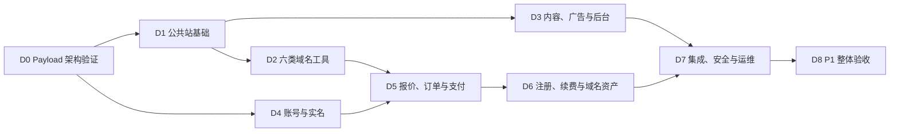

# Wanmi.AI P1 开发计划

> 文档版本：v2.2（P1 冻结执行版）
>
> 更新日期：2026-08-03
>
> 冻结基线：`P1-BASELINE-2026-08-03`；对应 Git 标签 `p1-docs-approved-2026-08-03`
>
> 状态：已批准作为 P1 开发执行计划；生产上线仍需通过独立门槛
>
> 执行主体：项目负责人一人 + ChatGPT/Codex
>
> 目标周期：12～16 周，全量一次交付
>
> 产品范围：Wanmi.net 中文域名工具与站内代理注册平台；Wanmi.ai 仅做 HTTPS 永久跳转
>
> 关联文档：[产品规划与商业评估](./Wanmi.AI-产品规划与商业评估.md) · [产品需求文档](./Wanmi.AI-产品需求文档-PRD.md) · [技术栈与工程规范](./Wanmi.AI-技术栈.md) · [现有阿里云资源](./Wanmi.AI-现有阿里云资源.md) · [App 技术规划](./Wanmi.AI-App技术规划.md)

本文是 Codex 执行 P1 开发时的任务顺序、交付标准和进度依据。它不重新定义产品范围：产品行为以 PRD 为准，工程实现以技术栈文档为准，部署条件以资源清单为准，商业优先级以产品规划与商业评估为准。

## 0. Codex 执行规则

### 0.1 文档优先级

遇到描述差异时按以下顺序处理：

1. 项目负责人当前明确指令；
2. 《产品需求文档》决定功能、状态、用户流程和验收；
3. 《技术栈与工程规范》决定架构、依赖、安全和工程边界；
4. 本计划决定开发顺序和阶段交付物；
5. 《现有阿里云资源》决定生产资源现状和上线门槛；
6. 《产品规划与商业评估》决定定位、商业优先级和阶段边界；
7. 《App 技术规划》只约束未来 App，不得据此扩大 Web P1。

如仍存在会改变产品范围、资金处理、实名责任或外部资源的冲突，Codex 必须暂停该项并询问项目负责人；不影响其他工作的任务继续推进。

### 0.2 每次开始开发前

Codex 必须：

- 阅读本计划及当前里程碑引用的批准文档章节；
- 检查 Git 状态、现有代码、测试、环境示例和未提交修改；
- 保留项目负责人已有修改，不覆盖无关内容；
- 确认当前最靠前且未完成的里程碑；
- 先列出本次准备完成的可验证任务，再开始修改；
- 缺少外部凭据时使用接口适配器、mock 和脱敏 fixture 继续开发，不把凭据写入仓库；
- 只有在项目负责人明确授权时，才执行生产部署、真实扣款、资源采购、备案申请或外部写接口操作。

### 0.3 每次开发结束前

Codex 必须：

- 运行与修改风险相匹配的格式化、静态检查、单元、集成或 E2E 测试；
- 说明完成内容、验证结果、未完成项和外部阻塞；
- 更新本文件第 12 节的进度，但只有满足里程碑退出条件后才能勾选整个里程碑；
- 新增架构决策时写入 `docs/adr/`，不得仅存在于聊天记录；
- 新增运行操作时同步更新 `infra/runbooks/`；
- 不因为测试环境缺少真实凭据而删除安全校验或绕过服务端确认。

### 0.4 完成定义

“代码已写”不等于完成。单项任务至少同时满足：

- 行为符合 PRD；
- Zod 接口 schema、Payload migrations 和生成类型保持同步；
- 正常、失败、越权、重试和降级路径有测试；
- 日志、埋点和错误不泄露敏感数据；
- 用户可见状态和后台人工处理入口完整；
- 文档、配置示例和 Runbook 已同步；
- `make check` 通过。

### 0.5 冻结与变更控制

`P1-BASELINE-2026-08-03` 冻结 P1 产品范围、固定架构、订单状态与合法迁移、退款规则、实名归属、12～16 周工期口径和生产上线门槛。开发过程中可以更新本计划的任务勾选、验证证据、阻塞、ADR 和 Runbook；不得借进度更新改变冻结基线。

需要改变冻结内容时，必须取得项目负责人明确指令，更新受影响文档版本与变更记录，完成跨文档一致性检查，并建立新的批准标签。D0 验证失败只触发延长、修正假设或重新提交架构决策，不自动解除冻结。

## 1. P1 开发基线

### 1.1 P1 必须交付

- M01～M12：公共站、六类域名工具、内容与 SEO、本地历史、广告导购、运营后台、分析反馈；
- M13：手机验证码登录、安全 Cookie Session、实名模板、私有证件存储；
- M14：价格报价、订单、微信支付 API v3 Native/H5、退款和对账；
- M15：西部数码代理注册、主动续费、异步履约和人工复核；
- M16：域名资产、到期提醒和 Name Server 修改；
- 小流量单 ECS 可部署方案、日志监控、备份恢复和必要 Runbook。

### 1.2 P1 明确不做

- 支付宝和微信 JSAPI；
- 域名转入转出、过户和完整 DNS 记录管理；
- 默认自动续费、余额钱包、充值账户和自动开票；
- 免费 SSL 签发、私钥托管；
- 社区、评论、会员、付费 API、企业监控和 AI 域名生成；
- iOS/Android App；
- Redis/Tair、独立消息队列、微服务、Kubernetes 和提前建设多节点架构；
- 未经批准的云资源采购和生产环境变更。

### 1.3 固定业务契约

核心链路：

```text
查询域名 → 获取价格报价 → 手机登录 → 选择已验证实名模板
→ 创建订单 → 微信支付 → 服务端确认到账 → 西部数码异步注册
→ 生成域名资产 → 短信通知
```

订单状态：

| 中文状态 | 内部状态 | 进入条件 |
| --- | --- | --- |
| 待支付 | `pending_payment` | 订单已创建，微信尚未确认到账 |
| 已支付 | `paid` | 微信服务端确认到账 |
| 履约中 | `fulfilling` | Payload `commerce` Job 已接管注册或续费任务 |
| 成功 | `succeeded` | 西部数码确认成功且资产已生成或更新 |
| 失败待退款 | `refund_pending` | 上游明确失败，需要原路全额退款 |
| 退款中 | `refunding` | 已向微信提交退款 |
| 已退款 | `refunded` | 微信确认退款成功 |
| 待人工处理 | `manual_review` | 上游状态不明、余额不足、退款失败或争议 |
| 已取消 | `cancelled` | 未支付超时或用户取消，且未进入履约 |

固定规则：

- 报价使用西部数码实时成本快照 + 后台按 TLD 配置的固定金额或比例，默认有效 5 分钟；
- 未配置加价规则或未通过能力验证的 TLD 不开放购买；
- 用户域名必须注册在用户选择并验证通过的实名模板名下，不得使用 Wanmi 公司模板；
- 注册成功不可退款；明确失败自动原路全额退款；状态不明禁止自动重复注册；
- 续费由用户主动付款，不默认自动续费；
- 发票和特殊退款由项目负责人通过现有财务流程处理，系统保存状态与处理备注；
- 微信支付资金、西部数码预充值余额和内部订单分别记录并进行三方对账。
- 合法订单状态迁移以《技术栈与工程规范》第 6.1 节矩阵为唯一工程基线；`manual_review` 只可按有证据、可审计的出口处理。

## 2. 交付路线与关键路径

P1 只在全部功能完成后做整体验收。下列里程碑是内部开发顺序，不代表批准分批生产上线。



| 里程碑 | 参考周期 | 主要范围 | 完成标志 |
| --- | ---: | --- | --- |
| D0 Payload 架构验证 | 第 1 周（建议 3～5 天，可延长） | Payload、认证、Jobs、OSS 和单 ECS 验证 | D0 全部退出条件通过 |
| D1 公共站基础 | 第 2～3 周 | Web 外壳、通用状态、管理基础 | 首页与后台骨架可运行 |
| D2 六类域名工具 | 第 3～5 周 | M02～M07、M09 | 工具正常/失败/降级测试通过 |
| D3 内容、广告与后台 | 第 5～7 周 | M08、M10～M12、M11 相关能力 | 内容与商业组件不影响工具 |
| D4 账号与实名 | 第 7～9 周 | M13 | 登录、模板、加密与删除闭环通过 |
| D5 报价、订单与支付 | 第 9～11 周 | M14 | 支付状态机和退款测试通过 |
| D6 注册、续费与资产 | 第 11～13 周 | M15、M16 | 幂等履约和资产闭环通过 |
| D7 集成、安全与运维 | 第 13～15 周 | 全链路、监控、恢复、Runbook | 关键故障演练通过 |
| D8 P1 整体验收 | 第 15～16 周 | M01～M16、上线门槛核对 | 开发验收通过；上线条件单列 |

外部权限确认、备案和生产资源核验从 D0 开始并行进行。它们不阻塞 mock 环境开发，但会阻塞真实收款上线。

## 3. 全局工程约束

### 3.1 固定技术栈

- 单一 TypeScript 代码库，Node.js 24 LTS；
- Next.js 16.2.6、React、TypeScript strict、Tailwind CSS、shadcn/ui；
- Payload 3.86.0；全部 `payload` 与 `@payloadcms/*` 包锁定同一精确版本；
- Payload 官方插件：`@payloadcms/plugin-seo`、`@payloadcms/plugin-redirects`、`@payloadcms/plugin-form-builder`，全部锁定 `3.86.0`；
- PostgreSQL Adapter、Payload migrations、`push: false`；
- Payload Jobs：`publishing`、`background`、`commerce`，独立 Worker；
- Payload `payload-types.ts` + 共享 Zod request/response schemas；
- 部署：Nginx + Next.js/Payload Web/Admin/API + Payload Jobs Worker + Who-Dat；
- 存储：RDS、OSS/CDN、KMS/Secrets Manager；公共媒体使用 `@payloadcms/storage-s3`，私有实名文件使用 `ali-oss`；
- 阿里云短信与 KMS 使用 Alibaba Cloud TypeScript SDK，不自行实现阿里云 API 签名；
- 不引入第二套业务后端、Redis、独立消息队列或微服务。

### 3.2 目标仓库结构

```text
wanmi/
├── apps/web/
│   ├── src/app/
│   ├── src/collections/
│   ├── src/access/
│   ├── src/services/
│   ├── src/jobs/
│   ├── src/providers/
│   ├── src/schemas/
│   └── src/payload.config.ts
├── infra/inventory/
├── infra/compose.prod.yml
├── infra/third-party/
├── infra/runbooks/
├── docs/adr/
├── docs/security/
├── docs/content/
├── docs/operations/
├── docker-compose.yml
├── Makefile
└── README.md
```

如现有仓库已经存在不同但合理的结构，Codex 应优先渐进适配，不为匹配示意图进行无价值的大规模移动。

### 3.3 稳定工程命令

D0 必须建立并维护以下命令；后续里程碑不得绕过：

| 命令 | 作用 |
| --- | --- |
| `make bootstrap` | 检查开发依赖并初始化本地配置，不写入真实密钥 |
| `make dev` | 启动本地 Web/Payload、PostgreSQL 和 Who-Dat |
| `make worker` | 启动独立 Payload Jobs Worker |
| `make generate` | 生成 Payload 类型并检查迁移 |
| `make verify-generated` | 检查生成类型和迁移没有漂移 |
| `make fmt` | 格式化 TypeScript、YAML、Markdown 等受控文件 |
| `make lint` | TypeScript、Payload 和配置静态检查 |
| `make test` | 单元和组件测试 |
| `make test-integration` | PostgreSQL、Payload Jobs 和 provider adapter 集成测试 |
| `make test-e2e` | Playwright 核心用户流程测试 |
| `make security` | Gitleaks、依赖与基础安全检查 |
| `make build` | 构建 Next.js/Payload 和容器产物 |
| `make smoke` | 对运行环境执行健康和核心路径冒烟测试 |
| `make check` | 汇总生成物检查、lint、测试、安全和构建的合适子集 |

若受本地环境限制无法运行某项，Codex 必须说明原因和替代验证，不得把“未运行”写成“通过”。

### 3.4 Provider 适配器

所有外部能力必须经过 `apps/web/src/providers` 接口适配器：

- `westdigital`：查询、价格、实名、注册、续费、资产同步、Name Server；
- `wechatpay`：Native/H5 下单、通知验签、主动查单、关单、退款、退款查询；
- `aliyunsms`：通过 Alibaba Cloud TypeScript SDK 发送验证码、重要订单状态和到期提醒；
- `oss-public`：通过 `@payloadcms/storage-s3` 管理内容图片与广告素材；
- `oss-realname`：通过 `ali-oss` 管理私有实名文件的上传、短时签名和删除；
- `kms`：通过 Alibaba Cloud TypeScript SDK 完成信封加密与密钥引用；
- `whodat`：RDAP/WHOIS。

每个适配器必须提供：

- 清晰的请求/响应领域模型，不向业务层泄漏未经处理的 provider 原始结构；
- 超时、限流、错误分类和脱敏日志；
- mock、fixture 和 contract test；
- 明确的读操作重试策略；
- 写操作幂等键和状态查询能力；
- 配置缺失时安全失败，不使用隐式默认生产凭据。

高风险业务逻辑放在 `src/services`，Hooks 只做规范化、审计和入队，禁止直接调用外部写接口。代表用户使用 Payload Local API 时必须传 `user` 和 `overrideAccess: false`；嵌套数据库操作传递同一个 `req`。

### 3.5 数据与安全底线

- 所有资金、履约、域名和实名状态由服务端决定；
- 浏览器不得直连西部数码、微信支付、RDS、私有 OSS 或 KMS；
- 手机号、验证码、证件、Cookie、支付密钥、provider token 不进入普通日志；
- 查询结果页默认 noindex，不长期保存不必要的完整查询域名；
- 实名证件进入私有 OSS，使用 KMS 加密、短时签名访问、最小权限和操作审计；
- 删除模板或注销账号后立即禁止继续使用，并在 30 天内清理主存储和备份；
- DNS/TLS 工具必须防 SSRF、内网探测和 DNS rebinding；
- 所有人工状态修改记录操作者、原状态、新状态、原因和时间；
- 数据库迁移向前兼容，生产发布不得依赖破坏性即时迁移；
- ECS 不保存唯一业务数据，节点必须可重建。

## 4. D0：Payload 架构验证（建议 3～5 天）

### 4.1 目标

验证单一 Next.js + Payload 主架构可以承担 CMS、认证、权限、业务数据和后台任务，再进入 M01～M16。3～5 天是架构决策时间盒；任一退出条件未满足时延长 D0 并记录原因，禁止为赶进度跳过验证。D0 节省的时间投入交易正确性、安全和恢复测试，不提前缩短 12～16 周对外承诺。

### 4.2 任务

- [ ] 建立或核对第 3.2 节仓库结构；
- [ ] 锁定 Node.js 24 LTS、Next.js 16.2.6、Payload 3.86.0 和全部 Payload 包精确版本；
- [ ] 安装并锁定 `@payloadcms/plugin-seo`、`@payloadcms/plugin-redirects`、`@payloadcms/plugin-form-builder` 为 `3.86.0`，验证启动、迁移和类型生成；
- [ ] 创建 Next.js/Payload Web、Admin、API 和独立 Jobs Worker 基线；
- [ ] 建立本地 Docker Compose：PostgreSQL、Who-Dat；
- [ ] 建立 `/healthz`、`/readyz`、请求 ID、结构化日志和统一错误格式；
- [ ] 建立 PostgreSQL Adapter、Payload migrations、`push: false` 和 `payload-types.ts` 漂移检查；
- [ ] 验证内容草稿、版本、定时发布和管理员角色权限；
- [ ] 验证管理员密码 + TOTP 原型；
- [ ] 验证普通用户短信 OTP mock、opaque Session 和全部会话撤销；
- [ ] 建立 `publishing`、`background`、`commerce` 队列，验证 commerce concurrency key、事务和订单事件；
- [ ] 验证代表用户的 Local API 全部使用 `overrideAccess: false`；
- [ ] 定义内容、广告、身份、实名、报价、订单、支付、退款、provider 操作、域名资产和审计 Collections；
- [ ] 通过 `@payloadcms/storage-s3` 验证公共媒体的 OSS 上传、读取、删除、签名地址和 ETag；
- [ ] 验证私有实名文件与公共 Media Collection 分离，并用 `ali-oss` 完成私有对象上传、读取、短时签名和删除原型；
- [ ] 使用 Alibaba Cloud TypeScript SDK 建立短信与 KMS adapters 的 mock、错误映射和最小权限配置边界；
- [ ] 建立 provider 接口、mock 和脱敏 fixture 目录；
- [ ] 建立 `.env.example`，只写变量名、用途和安全说明；
- [ ] 建立 Makefile 稳定命令和 CI；
- [ ] 建立测试框架：Vitest、React Testing Library、MSW、Playwright 和 PostgreSQL 集成测试；
- [ ] 建立 Gitleaks 和依赖扫描；
- [ ] 在单 ECS 规格下验证 Web/Worker 内存、独立重启、Jobs 恢复和节点重建；
- [ ] 编写首批 ADR：Payload 主架构、Local API 权限、opaque Session、commerce 幂等、OSS/KMS、单 ECS 可重建策略。
- [ ] 在 commerce ADR 中固化《技术栈与工程规范》第 6.1 节合法迁移矩阵，并测试全部 `manual_review` 出口。

### 4.3 退出条件

- 新环境按 README 能完成 `make bootstrap`、`make dev` 和 `make worker`；
- Next.js/Payload、PostgreSQL 和 Who-Dat 健康检查正常；
- 一次 Payload schema 变更可以生成类型、创建迁移并通过漂移检查；
- 一次 commerce Job 可在重复执行和 Worker 重启后保持幂等；
- 管理员 TOTP、customer OTP/session、权限矩阵和 Local API 防绕过原型通过；
- OSS S3 兼容性和单 ECS 资源验证有记录；
- `make check` 通过；
- 仓库中不存在真实密钥、手机号、证件或支付数据。

## 5. D1：公共站与管理基础（第 2～3 周）

### 5.1 目标

交付 M01 基础页面和后续模块共用的 Web、错误、权限与可观测能力。

### 5.2 任务

- [ ] 建立 Wanmi.net 主站布局、响应式导航、页脚、帮助和合规入口；
- [ ] 建立首页主查询、工具导航、内容入口和数据来源说明；
- [ ] 建立通用表单、加载、空状态、部分成功、失败、限流和降级组件；
- [ ] 建立统一 Result、Problem Details 和请求 ID 展示；
- [ ] 建立 canonical、robots、sitemap、Open Graph 和 noindex 基础能力；
- [ ] 配置 `@payloadcms/plugin-seo` 的共享字段与预览规则，并验证只读取已发布内容；
- [ ] 配置 `@payloadcms/plugin-redirects`，重定向写入受 RBAC 和审计保护，目标拒绝开放跳转；
- [ ] 建立 Wanmi.ai/www 只跳转的 Nginx 配置，不创建第二套页面；
- [ ] 完善管理员独立 Auth Collection、Payload Session、密码 + TOTP MFA 和 RBAC；
- [ ] 建立内容编辑、广告运营、分析、系统管理员角色边界；
- [ ] 建立审计事件公共组件和后台导航骨架；
- [ ] 建立第一方事件入口，默认不采集完整查询域名。

### 5.3 退出条件

- 首页和后台骨架在桌面、移动端可用；
- 无广告、无分析和 provider 失败时首页仍可使用；
- 未登录或权限不足不能访问后台；
- canonical、noindex 和错误页面有自动化测试；
- 管理员登录、MFA、Session 轮换和越权测试通过。

## 6. D2：六类域名工具（第 3～5 周）

### 6.1 目标

完成 M02～M07 和 M09，建立 Wanmi 的免费工具获客核心。

### 6.2 任务

- [ ] 实现域名标准化、Unicode/Punycode、长度和字符校验；
- [ ] 实现西部数码查询/价格适配器、限频、请求合并和有界缓存；
- [ ] 实现域名可注册查询，默认最多 10 个 TLD，支持部分成功和六种标准状态；
- [ ] 实现 Who-Dat/RDAP/WHOIS 查询与降级，和可售状态严格分离；
- [ ] 实现 A、AAAA、CNAME、MX、TXT、NS、SOA、CAA 只读查询；
- [ ] 实现 TLS/SSL/CAA 检查，固定 443 端口并阻断私有、保留和本地地址；
- [ ] 实现 TLD 注册价、续费价、1 年/3 年成本和快照追溯；
- [ ] 实现 IDN 双向转换、非法输入和同形异义风险提示；
- [ ] 实现浏览器本地历史与收藏：最多 30 条、90 天、可单项删除和全部清空；
- [ ] 建立工具间跳转、复制和分享入口，不默认分享完整查询结果；
- [ ] 建立工具请求量、成功率、P50/P95、provider 错误和限频监控；
- [ ] 为西部数码 429、队列满、Who-Dat 失败、DNS/TLS 超时建立降级测试。

### 6.3 退出条件

- M02～M07、M09 的 PRD 验收场景全部有自动化测试；
- 一个 TLD 或 provider 失败不会导致其他独立结果失败；
- WHOIS 不存在不会被包装为“可注册”；
- 工具不能用于 SSRF、内网扫描或任意端口探测；
- 结果显示来源、查询时间、缓存状态和明确错误；
- 工具页可收录，用户参数结果页默认 noindex；
- 公开工具无需登录即可完成核心任务。

## 7. D3：内容、广告、分析与运营后台（第 5～7 周）

### 7.1 目标

完成 M08、M10～M12 和相关 M11 后台能力，让内容和商业组件服务于工具增长且不破坏核心体验。

### 7.2 任务

- [ ] 建立轻量 CMS：文章、专题、分类、标签、TLD 页面、帮助页；
- [ ] 实现草稿、待审核、定时发布、发布、下线、归档和修订记录；
- [ ] 实现受控 Markdown/富文本清洗、OSS 图片、预览和来源字段；
- [ ] 实现 TLD 页面、工具与内容双向关联；
- [ ] 使用 `@payloadcms/plugin-seo` 实现 SEO 标题、描述和 Open Graph，并完成 canonical、收录开关和 sitemap 集成；
- [ ] 使用 `@payloadcms/plugin-redirects` 管理内容、工具和 TLD 页面改址后的 301，并验证循环和开放跳转防护；
- [ ] 建立广告主、素材、广告位、排期、状态和受控跳转；
- [ ] 所有商业内容显著显示“广告”，外部链接设置 `sponsored`、`nofollow`、`noopener`；
- [ ] 广告只在核心结果之后或内容自然位置展示，失败时折叠或显示自有内容；
- [ ] 实现广告请求、有效曝光、可见曝光、点击和基础转化事件；
- [ ] 建立广告到期自动下线和目标链接安全检查；
- [ ] 使用 `@payloadcms/plugin-form-builder` 建立联系、反馈和需求收集入口；只启用批准字段，不接订单、支付、实名或文件上传；
- [ ] 建立工具状态、内容、广告、TLD/价格、反馈和审计后台；
- [ ] 建立第一方事件聚合与基础运营仪表盘；
- [ ] 准备首批内容模板和发布 Runbook，内容本身由项目负责人持续补充。

### 7.3 退出条件

- 未发布内容不进入公开页面、搜索结果或 sitemap；
- 内容发布、修改、下线及来源可追溯；
- 广告关闭、过期或加载失败不影响工具；
- 广告不得伪装成工具结果或自然排序；
- 跳转不接受用户提供的任意 URL，不传递完整查询域名；
- 页面布局稳定，广告不遮挡输入或核心结果；
- M08、M10～M12 的关键验收测试通过。

## 8. D4：账号与实名（第 7～9 周）

### 8.1 目标

完成 M13，为购买、订单和域名资产建立安全用户身份与实名基础。

### 8.2 任务

- [ ] 使用 Alibaba Cloud TypeScript SDK 实现阿里云短信验证码申请、验证、回执和失败分类；
- [ ] 按手机号、IP、设备和全局额度限频，防短信轰炸与验证码重放；
- [ ] 实现普通用户短信 OTP、自定义 Payload Strategy、opaque PostgreSQL Session、退出全部会话和注销申请；
- [ ] 普通用户登录与管理员认证完全分离；
- [ ] 实现个人/组织实名模板领域模型和西部数码实名适配器；
- [ ] 模板状态至少支持未提交、审核中、已通过、未通过、待人工处理和已停用；
- [ ] 使用 `ali-oss` 实现私有 OSS 上传，并完成文件类型/大小检查和恶意文件检查；使用 Alibaba Cloud TypeScript SDK 调用 KMS 完成信封加密；
- [ ] 实现短时签名访问、最小权限和证件查看/下载/提交/删除审计；
- [ ] 后台列表、日志和错误不得显示证件内容；
- [ ] 只有西部数码确认通过的模板可用于注册；
- [ ] 实现模板删除与账号注销后的立即停用及 30 天清理任务；
- [ ] 建立实名失败、状态不明、修改重提和项目负责人人工复核路径。

### 8.3 退出条件

- 短信轰炸、验证码重放、会话固定、撤销和注销测试通过；
- 用户不能读取或使用他人实名模板；
- 未验证模板不能进入购买流程；
- OSS、日志、错误和后台列表不暴露证件或完整手机号；
- 删除任务和审计记录可复核；
- provider 不可用时保持明确状态，不误标为已通过。

## 9. D5：报价、订单与微信支付（第 9～11 周）

### 9.1 目标

完成 M14，以服务端确认和幂等状态机安全处理报价、订单、付款与退款。

### 9.2 任务

- [ ] 建立按 TLD 配置的固定金额/比例加价规则和发布审计；
- [ ] 建立 5 分钟报价快照：域名、年限、上游成本、规则、用户价、币种和失效时间；
- [ ] 未配置加价、能力未验证、价格异常或报价过期时禁止下单；
- [ ] 建立订单状态机和追加式 `order_events`；
- [ ] 实现微信 API v3 Native 下单与桌面二维码；
- [ ] 实现微信 API v3 H5 下单与移动浏览器流程；
- [ ] 发起支付前重新校验报价有效期，并使微信支付单失效时间不晚于报价失效时间；
- [ ] 实现支付通知验签、幂等入库、防重放、主动查单和超时关单；
- [ ] 前端只轮询/展示服务端订单状态，不以跳转结果标记支付成功；
- [ ] 实现退款任务、退款查询和失败告警；
- [ ] 建立支付通知重放与补单工具；
- [ ] 建立微信支付、内部订单和后续西部数码成本的对账数据结构；
- [ ] 建立特殊退款、发票备注和人工操作审计；
- [ ] 使用微信官方 fixture 和 mock 完成自动化测试；具备测试商户配置后再做小额联调。

### 9.3 退出条件

- 报价过期、成本变化和未配置加价不能按旧价下单；
- 重复、乱序、伪造和延迟支付通知不会重复推进状态；
- 未确认到账保持待支付，超时后进入已取消且不触发履约；
- 已取消订单收到迟到支付时进入人工复核，不直接履约；
- 微信服务端确认是进入已支付的唯一依据；
- 明确履约失败可进入自动全额退款路径；
- 退款失败进入待人工处理并告警；
- 订单状态迁移、金额计算和人工修改均有测试和审计。

## 10. D6：注册、续费与域名资产（第 11～13 周）

### 10.1 目标

完成 M15、M16，打通支付后的西部数码履约、域名资产和主动续费闭环。

### 10.2 任务

- [ ] 实现西部数码实名、注册、续费、资产查询和 Name Server 写适配器；
- [ ] 注册、续费和退款全部通过 Payload `commerce` 队列执行；
- [ ] provider 写操作建立唯一操作键、审计、有限重试和状态查询；
- [ ] 履约前重新核对已支付状态、冻结报价快照完整性、实名模板、域名状态和西部数码余额；支付确认后不得因报价时间过去而重新计价；
- [ ] 上游明确失败进入失败待退款；
- [ ] 超时、重复响应或状态不明进入待人工处理，只允许查状态，不自动重复提交；
- [ ] 余额不足时暂停受影响 TLD 新下单；已支付订单由项目负责人恢复履约或退款；
- [ ] 注册成功后查询确认并创建域名资产；
- [ ] 域名资产至少保存域名、所有者模板、注册商、注册时间、到期时间、状态、Name Server 和最后同步时间；
- [ ] 实现域名资产列表、详情和上游同步；
- [ ] 实现主动续费，沿用报价、支付、履约、退款和人工处理流程；
- [ ] 实现本人域名 Name Server 修改和变更审计；
- [ ] 实现站内与短信到期提醒，提醒失败不改变资产事实；
- [ ] 建立用户/订单/域名越权测试和项目负责人人工处理后台；
- [ ] 建立西部数码余额监控、阈值告警和紧急停售开关。

### 10.3 退出条件

- 支付后服务重启、任务重复执行和上游超时不会造成重复注册或续费；
- 用户域名始终注册在用户选择的已验证模板名下；
- 注册成功不可退款，明确失败自动退款，状态不明进入人工处理；
- 用户只能查看和操作本人域名资产；
- 主动续费和 Name Server 修改的成功、失败、超时、越权场景通过；
- 余额不足时安全停售，已支付订单不丢失；
- 注册、续费、退款、资产变更和人工处理可从审计记录还原。

## 11. D7～D8：集成、运维与整体验收（第 13～16 周）

### 11.1 D7 集成与硬化

- [ ] 对 M01～M16 执行全链路 E2E 和回归测试；
- [ ] 完成短信、微信支付、西部数码、OSS/KMS 的 staging contract test；
- [ ] 完成 DNS/TLS SSRF、开放跳转、CSRF、CORS、CSP、上传和越权安全测试；
- [ ] 完成 Gitleaks、Trivy 和 Node 依赖安全检查；
- [ ] 完成 k6/Lighthouse 或等价性能基线；
- [ ] 建立工具、短信、支付、订单、履约、退款、余额、证件访问和对账监控；
- [ ] 建立异常订单、退款失败、余额不足、实名泄露、provider 故障和紧急停售 Runbook；
- [ ] 完成静态资源先上传后发布、镜像 digest、数据库兼容迁移和回滚流程；
- [ ] 验证支付通知重放、ECS 重建、RDS 恢复、OSS 误删恢复和密钥轮换；
- [ ] 验证单 ECS 资源限制、日志轮转和 2 小时重建目标；
- [ ] 验证广告关闭、分析失败或 CMS 故障时工具仍完整可用；
- [ ] 完成微信、西部数码和内部订单三方对账演练。

### 11.2 D8 P1 开发验收

开发完成必须满足：

- [ ] M01～M16 全部实现并通过 PRD 验收；
- [ ] 六类工具、内容、广告、后台、账号、实名、支付、注册、续费和资产可在 staging 完成闭环；
- [ ] 所有关键状态都有用户展示、后台处理和审计；
- [ ] `make check`、`make test-integration`、`make test-e2e`、`make security`、`make build`、`make smoke` 通过；
- [ ] Zod schemas、Payload 生成类型、数据库迁移、配置示例、ADR 和 Runbook 同步；
- [ ] 不存在 P1.5/P2/P3 空模块、未使用基础设施或越界功能；
- [ ] 项目负责人完成产品、交易、安全和运营走查。

### 11.3 生产上线硬门槛

以下未完成时，可以判定“P1 开发完成”，但不得判定“可以生产上线”：

- [ ] 西部数码实名、注册、续费、Name Server 写接口及售后责任获得书面确认；
- [ ] 域名代理资质、Wanmi 与西部数码责任边界和页面披露方式经外部专业人员复核，页面显著标明所代理的域名注册服务机构；
- [ ] 西部数码生产账号余额、阈值告警和紧急停售可用；
- [ ] 微信支付 Native/H5、平台证书、API v3 密钥、退款和通知重放通过小额联调；
- [ ] Wanmi.net ICP 备案与公安联网备案完成；
- [ ] 隐私、实名、支付、Cookie、广告和使用条款完成审核；
- [ ] RDS 高可用、自动备份、PITR 和恢复演练通过；
- [ ] OSS 私有访问、KMS 加密、版本控制、30 天删除和误删恢复通过；
- [ ] 密钥最小权限、轮换和紧急恢复通过；
- [ ] 支付、退款、订单、余额、证件访问和对账告警可用；
- [ ] 生产 ECS 可重建，支付通知可重放，订单数据全部位于 RDS；
- [ ] 项目负责人明确批准真实收款和小流量上线。

## 12. 进度记录

Codex 在每个开发回合结束时更新本节。外部阻塞写在“阻塞/备注”，不要为了展示进度提前勾选。

### 12.1 总体里程碑

- [x] 文档与 P1 范围批准
- [ ] D0 Payload 架构验证
- [ ] D1 公共站与管理基础
- [ ] D2 六类域名工具
- [ ] D3 内容、广告、分析与运营后台
- [ ] D4 账号与实名
- [ ] D5 报价、订单与微信支付
- [ ] D6 注册、续费与域名资产
- [ ] D7 集成、安全与运维
- [ ] D8 P1 开发整体验收
- [ ] 生产上线硬门槛

### 12.2 当前执行记录

| 日期 | 里程碑 | 已完成 | 验证 | 阻塞/备注 |
| --- | --- | --- | --- | --- |
| 2026-08-02 | 计划建立 | 五份批准文档已统一，创建 P1 开发计划 | Markdown 标题、表格、代码围栏和本地链接检查通过 | 开发尚未开始 |
| 2026-08-02 | Payload 架构批准 | 七份文档统一为 Next.js + Payload + PostgreSQL + Payload Jobs；补充 D0 3～5 天验证 | 术语、版本、范围、状态和链接一致性检查 | 仅更新文档，D0 代码尚未开始 |
| 2026-08-03 | 通用能力选型批准 | 固定 Payload SEO/Redirects/Form Builder、ali-oss 和 Alibaba Cloud TypeScript SDK；同步技术、计划、PRD、资源与代理规范 | Markdown 结构、术语和本地链接一致性检查 | 仅更新方案文档，开发尚未开始 |
| 2026-08-03 | P1 文档基线冻结 | 修正 PRD 版本/广告表述和收入公式；补全订单迁移矩阵；明确 D0 可延长及代理合规上线门槛 | 跨文档、Markdown、本地链接与 Git 基线检查 | 文档审核通过；D0 尚未开始；生产上线仍附条件 |

## 13. 范围追踪矩阵

| PRD 模块 | 开发里程碑 | 核心验收焦点 |
| --- | --- | --- |
| M01 公共站与首页 | D1 | 主查询、响应式、单 canonical host |
| M02 域名可注册查询 | D2 | 六种状态、最多 10 TLD、部分成功 |
| M03 RDAP/WHOIS | D2 | 与可售状态分离、脱敏、降级 |
| M04 DNS/NS 查询 | D2 | 常见记录、错误解释、只读与防滥用 |
| M05 TLD 价格与成本 | D2、D5 | 快照、1/3 年成本、5 分钟报价 |
| M06 IDN/Punycode | D2 | 双向转换、非法输入、风险提示 |
| M07 SSL/CAA | D2 | 固定端口、证书状态、防 SSRF |
| M08 内容与 SEO | D3 | CMS、发布状态、来源、收录控制 |
| M09 本地历史与收藏 | D2 | 30 条、90 天、浏览器本地与可清除 |
| M10 广告与导购 | D3 | “广告”标识、受控跳转、不影响工具 |
| M11 运营后台 | D1、D3～D7 | 权限、配置、异常处理和审计 |
| M12 数据分析与反馈 | D3、D7 | 第一方事件、隐私、基础报表与告警 |
| M13 账号与实名 | D4 | 短信登录、模板归属、加密、删除 |
| M14 订单与微信支付 | D5 | 状态机、验签、幂等、退款、对账 |
| M15 代理注册与续费 | D6 | Payload commerce Jobs、写操作幂等、状态不明不重试 |
| M16 域名资产 | D6 | 资产字段、主动续费、NS、越权保护 |

## 14. 核心测试清单

### 14.1 工具与页面

- [ ] 多 TLD 查询部分失败；
- [ ] WHOIS 与可售状态独立；
- [ ] DNS 常见记录、NXDOMAIN、SERVFAIL、超时和无记录；
- [ ] TLS 有效、过期、不匹配、自签名、内网地址和 DNS rebinding；
- [ ] IDN 中文、混合字符、非法长度和非法标签；
- [ ] 西部数码限频、429、队列满和缓存降级；
- [ ] 查询结果 noindex、canonical、sitemap 和结构化数据；
- [ ] SEO 字段生成、草稿隔离、301 生效、重定向循环和开放跳转；
- [ ] 反馈表单字段白名单、限频、敏感信息拒绝和未授权导出；
- [ ] 广告关闭、过期、错误素材、恶意链接和布局稳定。

### 14.2 账号与实名

- [ ] 短信轰炸、验证码重放、错误次数和全局额度；
- [ ] Session 固定、轮换、撤销、退出全部会话和注销；
- [ ] 实名模板越权、审核失败、状态不明和修改重提；
- [ ] `ali-oss` 证件上传、恶意文件、KMS 加密、短时访问和审计；
- [ ] 模板删除、账号注销和 30 天清理。

### 14.3 交易与履约

- [ ] 报价过期、价格变化、溢价域名和未配置加价；
- [ ] 支付失败、页面中断、重复/乱序通知、伪造签名和主动查单；
- [ ] 支付成功后服务重启、Payload Job 重复执行和通知重放；
- [ ] 西部数码明确失败、超时、状态不明和重复响应；
- [ ] 余额不足、新订单停售和已支付订单人工处理；
- [ ] 注册成功不可退款、明确失败自动退款和退款失败；
- [ ] 域名资产越权、主动续费和 Name Server 修改；
- [ ] 微信、西部数码和内部订单三方对账。

### 14.4 发布与恢复

- [ ] ECS 重建；
- [ ] RDS PITR/恢复；
- [ ] OSS 版本与误删恢复；
- [ ] 支付通知重放与订单恢复；
- [ ] 静态资源回滚和镜像回滚；
- [ ] 密钥轮换与失效；
- [ ] provider、广告、分析、CMS 故障不拖垮公开工具。

## 15. 建议给 Codex 的启动指令

后续开始开发时，可以直接向 Codex 提交：

```text
请先完整阅读 Wanmi.AI-P1开发计划.md 以及其中引用的五份批准文档，
然后从最靠前且未完成的里程碑开始开发。

本次先完成该里程碑内能够安全完成的任务，使用 mock/fixture 处理缺少的外部凭据，
不要执行生产部署、真实扣款、资源采购、备案申请或未经授权的外部写操作。

开发前检查现有代码和 Git 状态；开发后运行计划要求的验证，
更新开发计划第 12 节进度，并报告完成项、测试结果、剩余项和外部阻塞。
满足里程碑退出条件前不要将整个里程碑标记完成。
```
