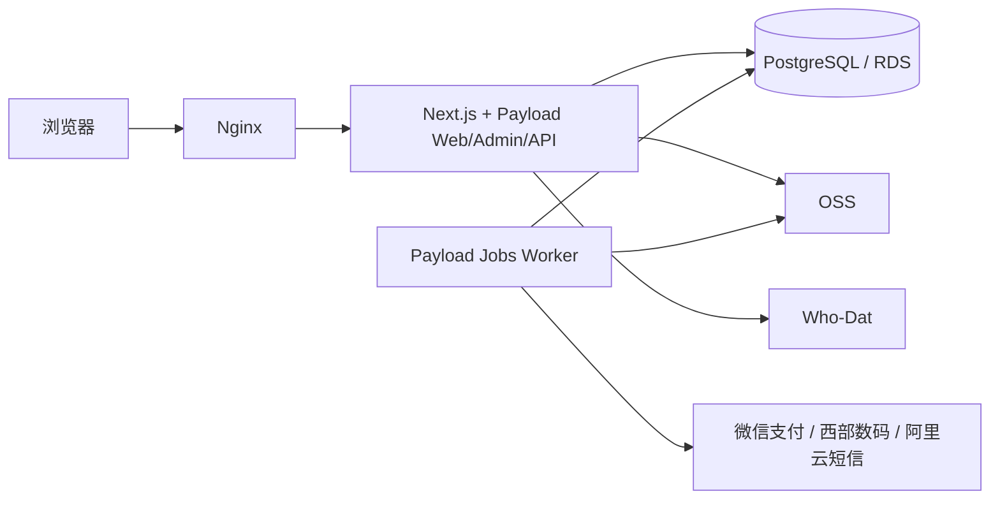

# Wanmi.AI 技术栈与工程规范

> 文档版本：v5.5（D5-03 支付安全澄清）
>
> 更新日期：2026-08-07
>
> 状态：P1 开发已批准；生产上线附条件批准
>
> 适用范围：Wanmi.AI P1 Web 域名工具与代理注册平台
>
> 冻结基线：`P1-BASELINE-2026-08-04.1`；批准标签 `p1-docs-approved-2026-08-04-1` 待本次批准变更提交后建立

## 1. 技术结论

P1 使用单一 TypeScript 代码库：

| 层级 | 固定方案 |
|---|---|
| Runtime | Node.js 24 LTS |
| Web | Next.js 16.2.11、React、TypeScript strict、App Router |
| 应用平台 | Payload 3.86.0；全部 `payload` 与 `@payloadcms/*` 包锁定相同精确版本 |
| Payload 官方插件 | `@payloadcms/plugin-seo`、`@payloadcms/plugin-redirects`、`@payloadcms/plugin-form-builder` |
| UI | Tailwind CSS、shadcn/ui |
| 数据库 | PostgreSQL；`@payloadcms/db-postgres`；Payload migrations；`push: false` |
| 后台任务 | Payload Jobs，独立 Worker 进程 |
| 对象存储 | 公共媒体使用 `@payloadcms/storage-s3`；实名私有文件使用 `ali-oss`；两者使用独立前缀与权限 |
| 注册信息 | Who-Dat 独立进程负责 RDAP/WHOIS |
| 阿里云接口 | Alibaba Cloud TypeScript SDK 调用短信与 KMS；`ali-oss` 操作实名私有对象 |
| 支付 | 微信支付 API v3，桌面 Native 二维码与移动 H5 |
| 域名上游 | 西部数码 provider adapter，只允许服务端调用 |
| 部署 | Nginx + Next.js/Payload Web + Payload Jobs Worker + Who-Dat |

不再保留第二套业务后端、迁移、认证、任务系统或跨语言接口生成链路。Payload 同时承担 CMS、后台、认证集合、业务数据、REST/Local API 和任务队列，但交易正确性仍由 Wanmi 自有 service 层保证。

## 2. 架构边界

### 2.1 进程与数据流



- 公开内容由 Server Components 通过 Payload Local API 读取已发布版本；
- 浏览器业务写操作统一经过 `/api/v1` 自定义 endpoint；
- Payload Web 与 Jobs Worker 使用同一镜像、代码和数据库，进程独立；
- Node 实现域名可售查询、DNS、TLS/CAA、IDN、报价和 provider adapters；
- Who-Dat 仅负责 RDAP/WHOIS，不负责可售状态或交易；
- 订单数据全部位于 RDS，应用节点必须可从镜像和配置重建。

### 2.2 Payload 管理范围

Payload 管理：

- 内容、专题、TLD 页面、导航、SEO、站点设置、草稿、版本和定时发布；
- 媒体、广告主、素材、广告位和排期；
- 管理员、普通用户、实名模板和用户会话；
- 价格规则、报价、订单、支付、退款、provider 操作、域名资产、续费、NS 变更、人工复核、对账和审计；
- 后台表单、权限、Local/REST API 和 Jobs。

以下通用能力直接使用 Payload 官方插件，不重复建设平行模型：

- `@payloadcms/plugin-seo`：内容和 TLD 页面的 SEO 标题、描述与 Open Graph 元数据；
- `@payloadcms/plugin-redirects`：内容、工具和 TLD 页面改址后的受控永久重定向；
- `@payloadcms/plugin-form-builder`：联系、反馈和需求收集表单。

表单插件不得用于订单、支付、退款、实名或证件上传；重定向目标只允许站内相对路径或经过后台白名单批准的 HTTPS 地址，禁止形成开放重定向。所有官方插件与 Payload 核心包锁定为 `3.86.0`，不得使用浮动版本。

Payload 不替代：

- 手机 OTP、管理员 TOTP；
- 微信支付验签、查单、退款和三方对账；
- 西部数码注册、续费、实名和 NS 适配；
- 实名文件的 OSS/KMS 安全流程；
- Wanmi 订单状态机和业务幂等。

不使用 Payload Ecommerce/Stripe 插件，不以通用商品、购物车或库存模型替代域名交易模型。

### 2.3 代码边界

建议目录：

```text
apps/web/
  src/app/                 # App Router、Payload Admin 与自定义 endpoints
  src/collections/         # Payload Collections
  src/globals/             # 导航和站点设置
  src/access/              # 可复用权限函数
  src/services/            # 认证、交易、provider、域名工具等业务逻辑
  src/jobs/                # Payload Jobs 任务与 workflows
  src/providers/           # 微信、西部数码、短信、Who-Dat、OSS/KMS adapters
  src/schemas/             # Zod 请求/响应 schema
  src/lib/                 # 纯函数与基础设施封装
  src/payload.config.ts
  src/payload-types.ts     # Payload 生成类型，不手改
```

高风险业务逻辑必须放在明确的 TypeScript service 模块。Collection Hooks 只允许字段规范化、审计、维护派生字段和入队，禁止在 Hook 中直接调用微信、西部数码或其他外部写接口。

## 3. Payload 数据与迁移

### 3.1 数据库所有权

- Payload 独占 Wanmi 业务数据库结构；
- 使用 `@payloadcms/db-postgres` 和 Payload migrations；
- 开发、测试、生产统一设置 `push: false`，禁止运行时自动修改 schema；
- 迁移文件必须进入版本控制，并在空库和上一版本快照上验证；
- 不维护第二套数据库迁移或手写平行 ORM 模型；
- 确认现有 RDS PostgreSQL 大版本后锁定测试矩阵。

### 3.2 事务要求

- 金额、订单状态、支付通知、provider 操作和事件追加应在同一事务内完成；
- 从 endpoint 或 Hook 发起嵌套 Payload 操作时传递同一个 `req`，避免事务边界断裂；
- 任务入队应与业务状态更新建立可恢复的一致性；
- 任何人工状态调整必须写入操作者、原状态、新状态、原因和时间。

### 3.3 核心 Collections

| 域 | Collections |
|---|---|
| 内容 | `articles`、`topics`、`tldPages`、`media`、`navigation`、`siteSettings` |
| 广告 | `advertisers`、`adCreatives`、`adPlacements`、`adSchedules` |
| 身份 | `admins`、`customers`、`smsChallenges`、`customerSessions` |
| 实名 | `realnameTemplates`、`realnameDocuments` |
| 交易 | `priceRules`、`quotes`、`orders`、`orderEvents`、`paymentNotifications`、`refunds` |
| 履约 | `providerOperations`、`domainAssets`、`renewals`、`nameserverChanges` |
| 运营 | `manualReviews`、`reconciliations`、`auditLogs`、`userFeedback` |

敏感 Collection 的通用 REST create/update/delete 默认关闭。订单创建、状态推进、退款、注册、续费和 NS 修改只允许通过业务 endpoint/service。

## 4. 权限与认证

### 4.1 Local API 安全规则

Payload Local API 默认可绕过访问控制，这是项目级高风险项：

- 代表匿名用户、普通用户或管理员操作时，必须传入对应 `user` 并设置 `overrideAccess: false`；
- 只有明确命名、审计并运行在系统任务上下文中的操作可以绕过权限；
- 系统绕过权限的 service 不得导出给浏览器 endpoint 直接调用；
- 权限测试必须覆盖匿名用户、customer、content_editor、ad_operator、analyst 和 system_admin；
- 字段级 access 用于手机号、证件、支付标识、内部成本和审计字段。

### 4.2 管理员

建立独立 `admins` Auth Collection：

- 使用 Payload 本地密码认证和 Payload Session；
- 角色为 `content_editor`、`ad_operator`、`analyst`、`system_admin`；
- Payload 不内置本项目角色模型，角色字段和权限函数由 Wanmi 定义；
- 登录密码验证后仍需通过 TOTP，才能进入 `/admin`；
- TOTP 密钥加密保存，恢复码只保存哈希；
- 高风险操作要求 `system_admin`，并写审计日志。

### 4.3 普通用户

建立独立 `customers` Auth Collection，手机号唯一，关闭密码登录。流程：

1. `POST /api/v1/auth/sms/request` 创建哈希验证码挑战并调用阿里云短信；
2. `POST /api/v1/auth/sms/verify` 验证挑战，创建或查找 customer；
3. 生成随机 256-bit opaque session，数据库只保存 token hash；
4. 返回 Secure、HttpOnly、SameSite Cookie；
5. Payload Custom Strategy 从 Cookie 恢复 customer；
6. logout 支持撤销当前会话或全部会话。

OTP 必须具备手机号、IP、设备和全局限频，防枚举响应，短有效期、有限尝试次数、一次性消费和审计。Session 登录后轮换，注销和敏感账户变更后立即撤销。

## 5. API 契约

### 5.1 对外接口

浏览器业务操作使用版本化 endpoint：

- `/api/v1/tools/*`
- `/api/v1/auth/*`
- `/api/v1/realname-templates/*`
- `/api/v1/quotes`
- `/api/v1/orders/*`
- `/api/v1/payments/wechat/notify`
- `/api/v1/domains/*`

请求和响应使用共享 Zod schemas。服务端组件和服务端操作优先使用 Payload Local API；前端需要的 Payload 类型由 `payload-types.ts` 提供。错误结构至少包含稳定 `code`、用户可读 `message` 和请求 `traceId`，不得泄露内部异常、密钥或证件信息。

### 5.2 核心链路

```text
查询域名 → 获取价格报价 → 登录 → 选择已验证实名模板
→ 创建订单 → 微信支付 → 服务端确认到账 → 西部数码注册
→ 生成域名资产 → 短信通知
```

- 默认一次最多查询 10 个 TLD；未验证 provider 能力的后缀不发布；
- 报价保存上游实时成本快照、加价规则快照和 5 分钟有效期；
- 未配置加价规则的 TLD 不开放购买；
- 用户域名必须注册在用户已验证实名模板名下；
- 前端支付跳转或轮询结果不能推进支付状态。

## 6. 订单、支付与履约

### 6.1 状态机

订单内部状态固定为 `pending_payment`、`paid`、`fulfilling`、`succeeded`、`refund_pending`、`refunding`、`refunded`、`manual_review` 和 `cancelled`。

合法迁移矩阵：

| 当前状态 | 目标状态 | 必要条件 |
|---|---|---|
| `pending_payment` | `paid` | 微信服务端验签并确认金额、商户订单号和交易号一致 |
| `pending_payment` | `manual_review` | 经验签通知触发的主动查单状态不明，或查单确认到账但金额、商户订单号、交易号不一致 |
| `pending_payment` | `cancelled` | 未支付超时或用户取消，且微信查单确认未支付/已关闭 |
| `paid` | `fulfilling` | 冻结报价快照、实名模板、域名状态、能力和余额检查通过，commerce Job 安全接管 |
| `paid` | `refund_pending` | provider 写请求确认未提交，且已明确无法提供服务 |
| `paid` | `manual_review` | 余额不足、校验冲突或无法证明可安全提交 |
| `fulfilling` | `succeeded` | provider 查询确认成功，域名资产已生成或更新 |
| `fulfilling` | `refund_pending` | provider 明确确认失败且未提供域名服务 |
| `fulfilling` | `manual_review` | 写请求发出后超时、结果不明或 provider 记录不一致 |
| `refund_pending` | `refunding` | 使用唯一退款号提交退款并被微信接受 |
| `refund_pending` | `manual_review` | 金额不一致、退款请求无法安全提交或有争议 |
| `refunding` | `refunded` | 微信通知、查单或账单确认退款成功 |
| `refunding` | `manual_review` | 退款失败、结果不明或有界重试耗尽 |
| `cancelled` | `manual_review` | 取消后收到经验证的迟到支付或出现资金不一致 |
| `manual_review` | `fulfilling` | 人工证据确认 provider 写请求从未提交，阻塞已解除，并创建新的受审计 Job |
| `manual_review` | `succeeded` | 只读状态查询或书面证据确认 provider 已成功，且资产完成对账 |
| `manual_review` | `refund_pending` | 证据确认未提供服务并批准原路全额退款 |
| `manual_review` | `refunding` | 微信查单确认唯一退款请求已被受理但尚未完成 |
| `manual_review` | `refunded` | 微信查单或账单已确认退款成功，证据与处理备注完整 |

`succeeded` 和 `refunded` 为终态；`cancelled` 除迟到支付/资金不一致外为终态。注册成功后的投诉或争议创建独立 `manualReviews` 记录，不改写 `succeeded`，也不突破“注册成功不可退款”。状态迁移只能由集中式 commerce service 执行，数据库同时保存当前状态和追加式 `orderEvents`；任何未定义跳转均拒绝并审计。

### 6.2 支付与退款

- 微信支付使用 API v3；P1 支持 Native 与 H5，不支持 JSAPI；
- 通知先验签，再按微信交易号唯一入库；重复、乱序和延迟通知不得重复推进状态；
- 必要时服务端主动查单，前端页面只展示服务端状态；
- 注册成功不可退款；明确失败自动原路全额退款；
- 退款使用唯一退款号、有界重试和结果查询；
- 状态不明、退款失败和履约成功前的争议订单进入 `manual_review`；履约成功后的争议使用独立人工复核记录；
- P1 不建设余额钱包；微信资金和西部数码预充值余额分别对账。

### 6.3 Provider 写操作

- 注册、续费、退款和 NS 写操作由 `commerce` 队列执行；
- 每个订单/provider 操作有唯一业务键和数据库唯一约束；
- 提交前核对已支付状态、冻结报价快照完整性、实名模板、域名状态和上游余额；创建订单和发起支付时校验 5 分钟有效期，支付确认后不得因 Job 启动时超期而重新计价；
- 明确证明请求未提交时可以重新执行；
- 请求已发出后超时或结果不明，立即进入 `manual_review`；
- 之后只能查询状态，禁止再次注册或续费；
- 成功后生成或更新域名资产并记录最后同步时间。

## 7. Payload Jobs

保留三个队列：

| 队列 | 用途 | 初始并发原则 |
|---|---|---|
| `publishing` | 定时发布、sitemap | 低并发 |
| `background` | 通知、同步、聚合、清理 | 有界并发 |
| `commerce` | 注册、续费、退款、NS、对账 | 从 1 开始，独立限流 |

- Web 进程不执行长任务；独立 Worker 消费 Jobs；
- Payload 的重试与 concurrency control 不替代业务幂等；
- commerce 任务必须通过 unique operation key、唯一约束和状态机防重；
- provider 超时任务不得依靠自动重试重新发送写请求；
- Worker 重启后任务应可恢复，失败任务有告警和人工入口；
- 工具实时查询不进入 Jobs。

## 8. 内容、媒体与 OSS

### 8.1 公共内容

- `articles`、`topics` 和 `tldPages` 启用 draft、versions 和 scheduled publish；
- 公开页面只读取 `_status=published`；
- SEO 字段和 Open Graph 元数据使用 `@payloadcms/plugin-seo`，canonical、robots、结构化数据和 sitemap 由应用层在此基础上生成并校验；
- 内容、工具和 TLD 页面改址使用 `@payloadcms/plugin-redirects` 管理 301；变更和发布必须受 RBAC 与审计约束；
- 联系、反馈和需求收集使用 `@payloadcms/plugin-form-builder`；只启用批准字段，不接支付、实名和文件上传；
- 查询结果页 `noindex`；
- 内容图片和广告素材使用独立 Payload Upload Collection。

### 8.2 阿里云 OSS

公共媒体通过 `@payloadcms/storage-s3` 接入 OSS S3 兼容 endpoint。OSS 仅兼容部分 S3 API且要求 virtual-hosted style，因此 D0 必须实测：

- 上传、读取、删除；
- 私有对象短时签名地址；
- ETag 与分片上传差异；
- endpoint、region、bucket 与 path-style 配置；
- CDN 回源和缓存失效。

### 8.3 实名文件

实名文件不得复用公共 `media` Collection：

- 使用 `realnameDocuments` 私有集合和 OSS 私有前缀；
- 使用 `ali-oss` 完成上传、读取、短时签名和删除，不自行实现 OSS 请求签名；
- 使用 Alibaba Cloud TypeScript SDK 调用 KMS 完成信封加密，密钥与数据分离，不自行实现阿里云 API 签名；
- 只提供短时签名访问；
- 上传、读取、下载、替换和删除全部审计；
- 文件类型、大小、内容嗅探和恶意文件校验；
- 保存至用户删除模板或注销账号，随后 30 天内完成主存储和备份清理；
- 删除失败进入告警和人工处理。

## 9. 域名工具安全

- 所有域名、主机名、URL、IP 和 TLD 输入集中规范化；
- Unicode 域名与 Punycode 同时展示，存储规范化 ASCII 与显示值；
- DNS/TLS/CAA 查询设置超时、响应大小、记录数和并发上限；
- 禁止访问 loopback、link-local、私网、云元数据地址和解析后落入受限网段的目标；
- TLS 只连接允许端口；重定向后重新验证目标；
- RDAP/WHOIS 与可售状态严格分离；
- 不长期保存完整查询域名；本地历史默认最近 30 条、90 天。

## 10. 质量与测试

### 10.1 必测范围

- Payload Local API 权限绕过防护；
- 管理员、编辑、广告运营、分析、普通用户和匿名用户权限矩阵；
- OTP 限频、重放、Session 固定、轮换、撤销和注销；
- 草稿、发布、下线、版本、定时发布、SEO 元数据、301 重定向和 sitemap；
- 反馈表单字段白名单、垃圾提交防护、越权读取和敏感信息拒绝；
- 报价过期和价格变化；
- 支付通知验签、重复、乱序、伪造和重放；
- Jobs 重复执行、Worker 重启、provider 明确失败、超时、状态不明和余额不足；
- 明确失败退款、退款失败、人工处理和三方对账；
- DNS/TLS SSRF、上传文件、公共 `storage-s3`、私有 `ali-oss`、KMS 和证件删除；
- Payload migrations、ECS 重建、Jobs 恢复和支付通知重放。

### 10.2 验证命令

仓库应提供统一命令：

| 命令 | 作用 |
|---|---|
| `pnpm dev` | 启动 Web；依赖服务由 Compose 提供 |
| `pnpm worker` | 启动独立 Payload Jobs Worker |
| `pnpm generate:types` | 生成 `payload-types.ts` |
| `pnpm migrate` | 执行正式 Payload migrations |
| `pnpm lint` | ESLint 与配置检查 |
| `pnpm typecheck` | TypeScript 类型检查 |
| `pnpm test` | 单元测试 |
| `pnpm test:integration` | PostgreSQL、Payload、Jobs 和 adapters 集成测试 |
| `pnpm build` | 生产构建 |

生成类型和迁移漂移需在 CI 阻断。外部 provider 测试默认使用 fixtures/mocks；没有项目负责人明确授权不得执行真实注册、续费、退款或短信群发。

## 11. 部署与运行

### 11.1 单 ECS 首发

开发和小流量首发可以继续使用现有单 ECS：

- Nginx；
- Next.js + Payload Web/Admin/API；
- 同一镜像的独立 Payload Jobs Worker；
- Who-Dat。

必须满足：

- 所有订单和任务状态位于 RDS；
- 支付通知原始报文可审计、可重放；
- Web 和 Worker 可独立重启；
- 节点可由镜像、迁移和密钥配置重建；
- 单 ECS 内存、并发和重启在 D0 实测；
- 第二台 ECS 和 ALB 按订单量与停机影响扩容，不作为 P1 开工前置。

### 11.2 配置与密钥

- 配置使用环境变量并提供无秘密的 `.env.example`；
- Payload secret、Session pepper、TOTP 加密密钥、微信 API v3 key、商户私钥、西部数码凭据、短信凭据和 OSS/KMS 凭据不得进入 Git；
- 支付与 provider 密钥通过 KMS/Secrets Manager 或等效受控方式保存；
- 启动时验证关键配置，缺失则拒绝启动相关写能力；
- 日志对手机号、身份证、证件、Cookie、验证码、支付报文和密钥脱敏。

## 12. D0 架构验证（建议 3～5 天）

D0 的 3～5 天是架构决策时间盒，不是强制截止日期。通常 D0 在进入完整 M01～M16 开发前完成；任一退出条件未满足时延长 D0、记录证据并修正假设：

- [ ] Next.js 16.2.11 + Payload 3.86.0 + PostgreSQL 启动；
- [ ] `@payloadcms/plugin-seo`、`@payloadcms/plugin-redirects`、`@payloadcms/plugin-form-builder` 与全部 Payload 包以 `3.86.0` 同版本启动、迁移和生成类型；
- [ ] 内容草稿、版本、定时发布和管理员角色权限；
- [ ] 管理员密码 + TOTP 原型；
- [ ] 普通用户短信 OTP mock、opaque Session 和全部会话撤销；
- [ ] `commerce` Job、concurrency key、事务和订单事件；
- [ ] 公共媒体通过 `@payloadcms/storage-s3` 完成 OSS S3 兼容上传、读取、删除、签名地址和 ETag 验证；
- [ ] 私有实名文件通过 `ali-oss` 完成上传、读取、短时签名和删除原型，并通过 Alibaba Cloud TypeScript SDK 完成 KMS mock/联调边界验证；
- [ ] 阿里云短信 adapter 使用 Alibaba Cloud TypeScript SDK 完成 mock、错误映射和签名边界验证；
- [ ] 单 ECS 内存与 Web/Worker 重启恢复测试；
- [ ] Payload Local API `overrideAccess: false` 回归测试。

D0 失败时先修正架构假设，不在业务模块中引入第二套后端作为临时补丁。项目负责人于 2026-08-04 批准 D0 条件通过并进入 D1：仅将共享 ECS 无法安全执行的 2 vCPU/4 GiB 内存、Web/Worker 独立重启、同 VPC Jobs 恢复、空节点重建和两小时 RTO 验证转入 D7，并继续作为开发整体验收和生产上线硬门槛。该例外不覆盖其他 D0 条件；D1 中出现架构假设失败时返回 D0。对外工期仍为 12～16 周。

## 13. 生产上线门槛

以下条件不阻塞开发，但阻塞真实收款和生产上线：

- 西部数码注册、续费、实名和 NS 写接口获得书面确认并完成联调；
- 域名代理资质、Wanmi 与西部数码责任边界和页面披露方式经外部专业人员复核，页面显著标明所代理的域名注册服务机构；
- Wanmi.net ICP 与公安联网备案完成或核验；
- RDS 高可用、PITR 和恢复验证通过；
- OSS 私有访问、KMS 加密、版本控制、删除和误删恢复通过；
- 密钥轮换、最小权限和审计通过；
- 支付告警、通知重放、退款和三方对账演练通过；
- ECS 重建、Payload migrations、Jobs 恢复和灾难恢复演练通过；
- 项目负责人完成最终上线批准。

## 14. 明确不进入 P1

- 转入转出、完整 DNS 托管、默认自动续费；
- 余额钱包、自动开票、社区、App；
- 微信 JSAPI；
- 第三方程序化广告；
- 微服务、独立消息队列或第二套业务后端；
- Payload Ecommerce/Stripe 插件。

## 15. 参考资料

- [Payload 安装要求](https://payloadcms.com/docs/getting-started/installation)
- [Payload 3.86.0](https://www.npmjs.com/package/payload)
- [Payload PostgreSQL Adapter](https://payloadcms.com/docs/database/postgres)
- [Payload Migrations](https://payloadcms.com/docs/database/migrations)
- [Payload Authentication](https://payloadcms.com/docs/authentication/overview)
- [Payload Custom Strategies](https://payloadcms.com/docs/authentication/custom-strategies)
- [Payload Local API 权限](https://payloadcms.com/docs/local-api/access-control)
- [Payload Jobs](https://payloadcms.com/docs/jobs-queue/overview)
- [Payload Jobs Concurrency](https://payloadcms.com/docs/jobs-queue/workflows)
- [Payload Storage Adapters](https://payloadcms.com/docs/upload/storage-adapters)
- [Payload SEO Plugin](https://payloadcms.com/docs/plugins/seo)
- [Payload Redirects Plugin](https://payloadcms.com/posts/blog/redirects-in-payload-retaining-seo-value-and-avoiding-404s)
- [Payload Form Builder Plugin](https://payloadcms.com/docs/plugins/form-builder)
- [阿里云 OSS S3 兼容性](https://www.alibabacloud.com/help/en/oss/developer-reference/compatibility-with-amazon-s3)
- [ali-oss](https://github.com/ali-sdk/ali-oss)
- [Alibaba Cloud TypeScript SDK](https://github.com/aliyun/alibabacloud-typescript-sdk)

## 16. 版本记录

| 版本 | 日期 | 结论 |
|---|---|---|
| v5.5 | 2026-08-07 | 按项目负责人 D5-03 资金安全指令，明确经验签通知触发的主动查单状态不明，或查单确认到账但金额/标识不一致时，允许 `pending_payment → manual_review`；其他交易状态、退款和上线门槛不变 |
| v5.4 | 2026-08-04 | 项目负责人批准 D0 条件通过并进入 D1；仅将共享 ECS 的资源、重启、同 VPC Jobs 恢复、重建和 RTO 验证转入 D7，其他架构和生产门槛不变 |
| v5.3 | 2026-08-03 | 项目负责人批准将 Next.js 从 16.2.6 更新至修复 4 个 high 安全公告的 16.2.11；Payload 与全部官方插件继续精确锁定 3.86.0，产品范围、交易规则、工期与上线门槛不变 |
| v5.2 | 2026-08-03 | 冻结 P1 技术基线；补全订单合法迁移矩阵、迟到支付与人工复核出口，并将 D0 明确为可延长的退出条件时间盒 |
| v5.1 | 2026-08-03 | 固定采用 Payload SEO、Redirects、Form Builder 官方插件；公共媒体继续使用 storage-s3，私有实名对象使用 ali-oss，短信与 KMS 使用阿里云 TypeScript SDK |
| v5.0 | 2026-08-02 | Payload 成为 P1 主架构；统一 TypeScript、迁移、认证集合、后台和 Jobs；保留交易与安全自定义 service |
| v4.0 | 2026-07-31 | 原模块化双后端技术基线，现已废止 |
